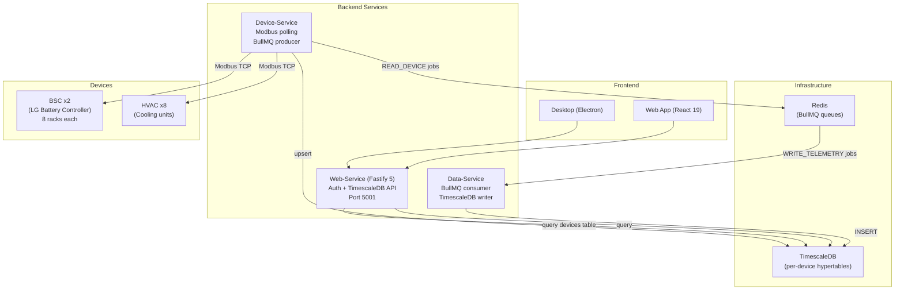
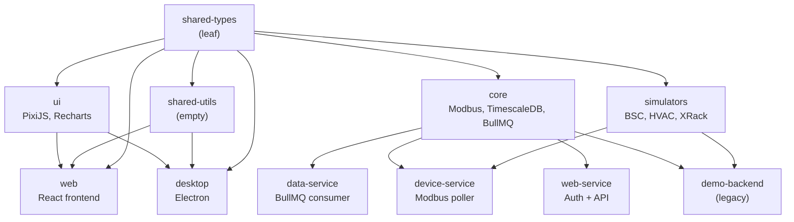

# Batarya EMS (Energy Management System)

Bun monorepo — 11 packages (3 apps, 3 microservices, 5 libraries). Nx build orchestration. TimescaleDB + Redis + BullMQ data pipeline. React frontend + Electron desktop.

---

## System Architecture



---

## Monorepo Structure

```
.
├── apps/
│   ├── web/              # React 19 SPA (Vite 8, TanStack Query, Zustand)
│   ├── desktop/          # Electron 39 + React 19 (electron-vite)
│   └── demo-backend/     # Legacy Fastify backend (XRack demo)
├── packages/
│   ├── shared-types/     # Pure TS types (telemetry, jobs, auth)
│   ├── shared-utils/     # Empty placeholder
│   ├── core/             # Backend logic (Modbus, BullMQ, TimescaleDB, SQL)
│   ├── simulators/       # Device simulators (BSC, HVAC, XRack)
│   ├── ui/               # Shared React components (PixiJS, Recharts, Emotion)
│   └── services/
│       ├── device-service/   # Modbus device poller + BullMQ producer
│       ├── data-service/     # BullMQ consumer + TimescaleDB writer
│       └── web-service/      # Auth/JWT + REST API (hexagonal architecture)
├── configs/              # Device configuration files (source of truth)
├── deployment/           # Docker Compose files (production + dev)
├── nx.json               # Nx build orchestrator
├── tsconfig.base.json    # Shared TS config + path aliases
└── package.json          # Bun workspaces
```

## Dependency Graph



### Build Order (Nx `^build`)

```
Level 0:  shared-types                          (leaf — no deps)
Level 1:  shared-utils, core, simulators         (depend on shared-types)
Level 2:  ui                                     (depends on shared-types)
Level 3:  data-service, device-service,
          web-service, demo-backend              (depend on core + shared-types)
Level 4:  web, desktop                           (depend on shared-types, ui)
```

## Package Inventory

| Package | Type | Stack | Key Dependencies |
|---------|------|-------|-----------------|
| `shared-types` | Library | Pure TS | — |
| `shared-utils` | Library | Placeholder | — |
| `core` | Library | Modbus, DB, MQ | `bullmq`, `pg`, `redis`, `jsmodbus` |
| `simulators` | Library | Device sims | BSC, HVAC, XRack models |
| `ui` | Library | React components | `pixi.js`, `recharts`, `@emotion/*` |
| `data-service` | Service | BullMQ consumer | `bullmq`, `pg` |
| `device-service` | Service | Modbus poller | `jsmodbus`, `pg` |
| **`web-service`** | **Service** | **Hexagonal Fastify** | **`fastify`, `jose`, `awilix`, `zod`** |
| `demo-backend` | App | Fastify dashboard | `fastify` |
| `web` | App | React SPA | `react-query`, `zustand`, `axios` |
| `desktop` | App | Electron | `electron-vite`, `electron-updater` |

## Web-Service Architecture (Hexagonal / Ports & Adapters)

```
src/
├── domain/                     Pure business — zero framework imports
│   ├── repositories/           IUserRepository (port)
│   ├── services/               ITokenService, IPasswordHasher (ports)
│   └── validation/             Zod schemas + inferred types
├── application/                Use-case orchestrators
│   ├── use-cases/              7 use cases (Login, Refresh, CRUD)
│   └── telemetry/              Pure data transformation functions
├── infrastructure/             Adapters implementing domain ports
│   ├── persistence/            PostgreSQL (UserRepository, DeviceRegistry)
│   └── auth/                   JWT (jose), password hashing (Bun.password)
├── presentation/               HTTP / Fastify layer
│   ├── routes/                 auth-routes, data-routes, unified-routes
│   └── middleware/             RBAC (JWT-based), global error handler
├── core/                       Shared kernel (Result<T> pattern)
├── config/                     Env-based configs + awilix DI container
└── index.ts                    15-line bootstrap
```

**Dependency rule**: `presentation → application → domain` only. Never reverse.

## Device Configurations

`configs/` is the master device config repository. Per-project copies go to `device-service/config/`.

```
configs/
├── bsc-1.json       # BSC #1 — 8 racks, 399 telemetry entries, 25 bitfield configs
├── bsc-2.json       # BSC #2 — 8 racks
├── hvac-1..8.json   # HVAC #1–8 — 56 telemetry entries each
└── service.json     # Redis + TimescaleDB connection, poll intervals
```

## Deployment

### Full Stack (docker compose)

```bash
# Production
docker compose -f deployment/docker-compose.yml up -d

# Development (hot-reload)
docker compose -f deployment/docker-compose.dev.yml up
```

| Service | Port | Purpose |
|---------|------|---------|
| `timescaledb` | 5432 | Time-series database + user/devices tables |
| `redis` | 6379 | BullMQ message queue |
| `device-service` | — | Modbus polling, job production |
| `data-service` | — | Job consumption, telemetry persistence |
| `web-service` | 5001 | Auth API + TimescaleDB data API |
| `web` | 80 | React SPA served via nginx |

### Legacy Demo Stack

```bash
docker compose -f deployment/docker-compose.demo-backend.yml up -d
```

| Service | Port |
|---------|------|
| `demo-backend` | 5000 |
| `web` | 80 |

## Quick Commands

```bash
bun install                         # Install deps (Bun only)
bun run dev                         # All apps in parallel (max 5)
bun run dev:web                     # Web only (Vite, port 5173)
nx run web-service:dev              # Web Service (Fastify, port 5001)
nx run device-service:dev           # Device Service
nx run data-service:dev             # Data Service
nx run demo-backend:dev             # Demo Backend (port 5000)
bun run build                       # Build all (Nx orders by ^build)
nx graph                            # Dependency graph visualizer
nx run <proj>:<target>              # Run any Nx target
```

### Per-project typecheck

```bash
cd packages/services/web-service && bun --bun tsc --noEmit
nx run web-service:typecheck
```

## Data Flow

```
[Device Config] → Device-Service reads config → connects ModbusDevice
    │
    ├── (simulator mode) → BSCSimulator / HvacSimulator ticks every 1s
    └── (real mode)      → Modbus TCP to physical hardware
    │
    ▼
Device-Service publishes READ_DEVICE job → Redis (BullMQ)
    │
    ▼
Data-Service worker picks up WRITE_TELEMETRY job → writes to TimescaleDB
    │
    │  Per-device hypertable: device_BSC_1, device_BSC_2, device_HVAC_1..8
    │  Telemetry columns: name, value, unit, tags (rack_id, zone), timestamp
    │
    ▼
Web-Service unified endpoints:
  GET /unified/racks/latest        → multi-BSC aggregation + rack offsets
  GET /unified/racks/downsampled   → time-bucketed data across devices
  GET /unified/hvac/latest         → all HVAC unit readings
  POST /auth/login, /auth/refresh  → JWT auth
  GET/POST/PUT/DELETE /auth/users  → admin user CRUD
    │
    ▼
Web App (React) → React Query (5s polling) → TelemetryChart, RackCards, Dashboard
```

## Tech Stack

| Layer | Technology |
|-------|-----------|
| Runtime | Bun (latest) |
| Monorepo | Nx v22 (build orchestrator) |
| Language | TypeScript 5.x |
| Backend | Fastify 5 |
| Frontend | React 19, Vite 8, TanStack Query 5, Zustand 5, React Router 7 |
| Desktop | Electron 39, electron-vite 5 |
| Database | TimescaleDB (PostgreSQL) |
| Message Queue | BullMQ + Redis |
| Auth | JWT (jose), Bun.password, zod validation |
| DI Container | awilix |
| UI Components | PixiJS 8, Recharts 3, Emotion CSS-in-JS |
| Deployment | Docker Compose (6 services) |
| Simulators | BSC (LG Battery Controller), HVAC (Cooling Units), XRack (legacy) |
