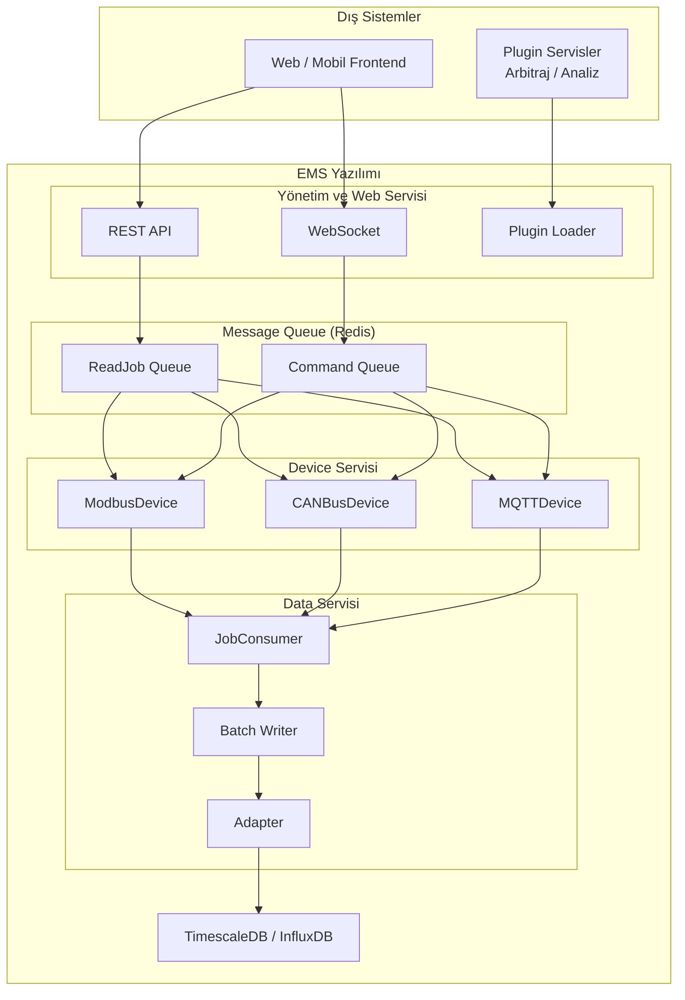

# Batarya EMS Yazılım Tasarım Dökümanı

## Genel Bakış

Yazılım 3 ana alt servisten oluşur:

| Servis | Görevi |
|:-------|:-------|
| **Device Servisi** | Modbus, CANbus, MQTT ve diğer protokollerden veri sağlayan cihazların konfigürasyonlarını okur, belirlenen zaman aralığında verileri çeker ve zaman damgalı veritabanına yazacak işlevi oluşturur. |
| **Data Servisi** | Cihazlardan alınan verileri, device servisinin yarattığı işlev üzerinden alır ve zaman damgalı veritabanına kaydeder. |
| **Yönetim ve Web Servisi** | Arbitraj benzeri yan servisleri plugin olarak yükler, zaman damgalı veritabanındaki verileri REST ve Websocket ile istemcilere iletir. |

---

## Veri Formatları

Servisler ve katmanlar arasında kullanılan temel veri formatı:

```typescript
interface BaseTelemetryData {
  name: string;           // "Voltage", "Current", "Power", "Temperature"
  description: string;    // İnsan tarafından okunabilir açıklama
  value: number | boolean | string;
  unit: string;           // "V", "A", "kW", "°C", "Hz", "%"
  timestamp: string;      // ISO 8601 formatında
  deviceId: string;       // Cihazın benzersiz kimliği
  tags?: Record<string, string>;  // rack_id, sensor_id, vs.
}
```

---

## Job Formatları

### ReadDeviceJob (Device Servisi → Data Servisi)

```typescript
interface ReadDeviceJob {
  jobId: string;
  type: "READ_DEVICE";
  deviceId: string;
  timestamp: string;
  priority?: number;
  retryCount?: number;
  telemetryNames?: string[];  // Yoksa tümü
}
```

### CommandDeviceJob (Panel → Cihazlar)

```typescript
interface CommandDeviceJob {
  jobId: string;
  type: "COMMAND_DEVICE";
  telemetries: TelemetryData[];  // Her biri kendi priority'sine sahip
  deviceId: string;
  timestamp: string;
  priority?: number;
  retryCount?: number;
  atomic?: boolean;  // true: hepsi başarılı olmazsa hiçbiri yazılmasın
}
```

---

## Sınıf Yapısı

### Device Sınıfları (Protokol Bazlı)

| Sınıf | Protokol | Durum |
|:------|:---------|:-----:|
| ModbusDevice | Modbus TCP/RTU | ✅ |
| CANBusDevice | CANbus | ❌ |
| MQTTDevice | MQTT | ❌ |

### Veritabanı Adaptörleri

| Sınıf | Veritabanı | Durum |
|:------|:-----------|:-----:|
| TimescaleDBAdapter | TimescaleDB | ✅ |
| InfluxDBAdapter | InfluxDB | ✅ |

### Yan Servisler

| Sınıf | Görevi | Durum |
|:------|:-------|:-----:|
| PluginLoader | Arbitraj, analiz gibi plugin'leri yükleme | ✅ |
| HTTPServer | REST API + Websocket sunucusu | ✅ |

---
## Batarya EMS Geliştirme Takip Tablosu

| No | Bileşen | Açıklama | Simülatör | Gerçek | Durum |
|:--:|:--------|:---------|:---------:|:------:|:-----:|
| **1** | **Temel Veri Formatları** | | | | |
| 1.1 | BaseTelemetryData | Tüm telemetry verilerinin temel interface'i | - [x] ✅ | - [ ] ❌ | ⏳ |
| 1.2 | ByteOrder tipi | BIG_ENDIAN, LITTLE_ENDIAN, *_SWAP | - [x] ✅ | - [ ] ❌ | ⏳ |
| 1.3 | ModbusTelemetryData | Modbus'a özel alanlar | - [x] ✅ | - [ ] ❌ | ⏳ |
| 1.4 | CanbusTelemetryData | CAN'a özel alanlar | - [x] ✅ | - [ ] ❌ | ⏳ |
| 1.5 | MqttTelemetryData | MQTT'ye özel alanlar | - [x] ✅ | - [ ] ❌ | ⏳ |
| 1.6 | TimescaleDbData | Veritabanı için tableName | - [x] ✅ | - [ ] ❌ | ⏳ |
| 1.7 | VoltageData | Voltaj ölçümü tipi | - [x] ✅ | - [ ] ❌ | ⏳ |
| 1.8 | CurrentData | Akım ölçümü tipi | - [x] ✅ | - [ ] ❌ | ⏳ |
| 1.9 | PowerData | Güç ölçümü tipi | - [x] ✅ | - [ ] ❌ | ⏳ |
| 1.10 | TemperatureData | Sıcaklık ölçümü tipi | - [x] ✅ | - [ ] ❌ | ⏳ |
| 1.11 | StateOfChargeData | Şarj durumu (SoC) | - [x] ✅ | - [ ] ❌ | ⏳ |
| 1.12 | StateOfHealthData | Sağlık durumu (SoH) | - [x] ✅ | - [ ] ❌ | ⏳ |
| 1.13 | ChargeStatusData | Şarj/Deşarj durumu | - [x] ✅ | - [ ] ❌ | ⏳ |
| 1.14 | InsulationResistanceData | Yalıtım direnci | - [x] ✅ | - [ ] ❌ | ⏳ |
| **2** | **Device Sınıfları** | | | | |
| 2.1 | ModbusDevice | Modbus TCP/RTU driver | - [x] ✅ | - [ ] ❌ | ⏳ |
| 2.2 | CANBusDevice | CANbus driver | - [ ] ❌ | - [ ] ❌ | ❌ |
| 2.3 | MQTTDevice | MQTT driver | - [ ] ❌ | - [ ] ❌ | ❌ |
| **3** | **Veritabanı Adaptörleri** | | | | |
| 3.1 | TimescaleDBAdapter | TimescaleDB yazma/okuma | - [x] ✅ | - [ ] ❌ | ⏳ |
| 3.2 | InfluxDBAdapter | InfluxDB yazma/okuma | - [x] ✅ | - [ ] ❌ | ⏳ |
| **4** | **Servisler** | | | | |
| 4.1 | Device Servisi | Veri okuma, job üretme | - [x] ✅ | - [ ] ❌ | ⏳ |
| 4.2 | Data Servisi | Job consumer, batch yazma | - [x] ✅ | - [ ] ❌ | ⏳ |
| **5** | **Yan Servisler** | | | | |
| 5.1 | PluginLoader | Plugin yükleme | - [x] ✅ | - [ ] ❌ | ⏳ |
| 5.2 | HTTPServer | REST + WS sunucu | - [x] ✅ | - [ ] ❌ | ⏳ |
| **6** | **Simülatörler** | | | | |
| 6.1 | BSC Simülatörü | Batarya Sistemi Kontrolörü | - [x] ✅ | N/A | ✅ |
| 6.2 | IMD Simülatörü | Insulation Monitoring Device | - [ ] ❌ | N/A | ❌ |
| 6.3 | TMS Simülatörü | Termal Yönetim Sistemi | - [ ] ❌ | N/A | ❌ |
| **7** | **BSC Komutları** | | | | |
| 7.1 | Charge | Sürekli şarj | - [x] ✅ | - [ ] ❌ | ⏳ |
| 7.2 | Decharge | Sürekli deşarj | - [x] ✅ | - [ ] ❌ | ⏳ |
| 7.3 | Timer Charge | Süreli şarj | - [x] ✅ | - [ ] ❌ | ⏳ |
| 7.4 | Timer Decharge | Süreli deşarj | - [x] ✅ | - [ ] ❌ | ⏳ |
| 7.5 | Zaman bazlı Charge | Tarih/saatli şarj | - [ ] ❌ | - [ ] ❌ | ❌ |
| 7.6 | Zaman bazlı Decharge | Tarih/saatli deşarj | - [ ] ❌ | - [ ] ❌ | ❌ |
| 7.7 | Stop | Tüm işlemleri durdur | - [x] ✅ | - [ ] ❌ | ⏳ |
| **8** | **IMD Komutları** | | | | |
| 8.1 | Set threshold | Eşik değeri set et | - [ ] ❌ | - [ ] ❌ | ❌ |
| 8.2 | Get threshold | Eşik değeri oku | - [ ] ❌ | - [ ] ❌ | ❌ |
| 8.3 | Get resistance | Yalıtım direnci oku | - [ ] ❌ | - [ ] ❌ | ❌ |
| 8.4 | Start measurement | Ölçüm başlat | - [ ] ❌ | - [ ] ❌ | ❌ |
| 8.5 | Stop measurement | Ölçüm durdur | - [ ] ❌ | - [ ] ❌ | ❌ |
| 8.6 | Reset alarm | Alarm sıfırla | - [ ] ❌ | - [ ] ❌ | ❌ |
| 8.7 | Self test | Kendi kendine test | - [ ] ❌ | - [ ] ❌ | ❌ |
| **9** | **TMS Geliştirmeleri** | | | | |
| 9.1 | TMS Hardware | PLC/ kart üzerinde | - [ ] ❌ | - [ ] ❌ | ❌ |
| 9.2 | Modbus Server | Komut alma | - [ ] ❌ | - [ ] ❌ | ❌ |
| 9.3 | Analog Input | Sensör okuma | - [ ] ❌ | - [ ] ❌ | ❌ |
| 9.4 | Analog Output | Fan/pompa kontrol | - [ ] ❌ | - [ ] ❌ | ❌ |
| 9.5 | Digital Input | Buton/switch okuma | - [ ] ❌ | - [ ] ❌ | ❌ |
| 9.6 | Digital Output | Röle/alarm kontrol | - [ ] ❌ | - [ ] ❌ | ❌ |
| 9.7 | Set temperature | Hedef sıcaklık | - [ ] ❌ | - [ ] ❌ | ❌ |
| 9.8 | Get temperature | Anlık sıcaklık | - [ ] ❌ | - [ ] ❌ | ❌ |
| 9.9 | Set fan speed | Fan hızı ayarı | - [ ] ❌ | - [ ] ❌ | ❌ |
| 9.10 | Alarm yönetimi | Yangın/sıcaklık | - [ ] ❌ | - [ ] ❌ | ❌ |
| 9.11 | Emergency stop | Acil durdurma | - [ ] ❌ | - [ ] ❌ | ❌ |
| **10** | **Ön Yüz Bileşenleri** | | | | |
| 10.1 | TelemetryChart | Grafik bileşeni | - [x] ✅ | - [ ] ❌ | ⏳ |
| 10.2 | BSC Graphic | BSC görselleştirme | - [x] ✅ | - [ ] ❌ | ⏳ |
| 10.3 | IMD Graphic | IMD görselleştirme | - [ ] ❌ | - [ ] ❌ | ❌ |
| 10.4 | TMS Graphic | TMS görselleştirme | - [ ] ❌ | - [ ] ❌ | ❌ |
| 10.5 | Command Panel | Komut paneli | - [x] ✅ | - [ ] ❌ | ⏳ |
| 10.6 | Command History | Komut geçmişi | - [x] ✅ | - [ ] ❌ | ⏳ |
| 10.7 | Agenda Panel | Zamanlanmış komut | - [ ] ❌ | - [ ] ❌ | ⏳ |
| 10.8 | BSC Command Panel | BSC özel komut | - [x] ✅ | - [ ] ❌ | ⏳ |
| 10.9 | IMD Command Panel | IMD özel komut | - [ ] ❌ | - [ ] ❌ | ❌ |
| 10.10 | TMS Command Panel | TMS özel komut | - [ ] ❌ | - [ ] ❌ | ❌ |

---

## Durum Legend

| Sembol | Anlam |
|:------:|:------|
| ✅ | Tamamlandı / Çalışıyor |
| ⏳ | Kısmen tamam / Geliştirme aşamasında |
| ❌ | Yapılmadı / Başlanmadı |
| N/A | Uygulanabilir değil |

---

## Özet İstatistik

| Kategori | Toplam | ✅ | ⏳ | ❌ |
|:---------|:------:|:--:|:--:|:--:|
| Temel Veri Formatları | 26 | 26 | 0 | 0 |
| Device Sınıfları | 3 | 1 | 0 | 2 |
| Veritabanı Adaptörleri | 2 | 2 | 0 | 0 |
| Servisler | 2 | 2 | 0 | 0 |
| Yan Servisler | 2 | 2 | 0 | 0 |
| Simülatörler | 3 | 1 | 0 | 2 |
| BSC Komutları | 9 | 5 | 0 | 4 |
| IMD Komutları | 7 | 0 | 0 | 7 |
| TMS Geliştirmeleri | 12 | 0 | 0 | 12 |
| Ön Yüz Bileşenleri | 10 | 5 | 1 | 4 |
| **TOPLAM** | **76** | **44** | **1** | **31** |


## Sistem Mimarisi



