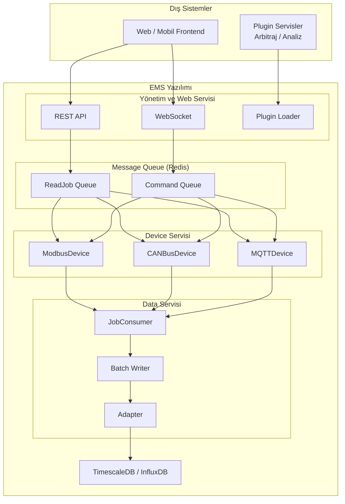

# Batarya EMS Yazılım Tasarım Dökümanı

## Genel Bakış

Yazılım 3 ana alt servisten oluşur:

| Servis | Görevi |
|:-------|:-------|
| **Device Servisi** | Modbus, CANbus, MQTT ve diğer protokollerden veri sağlayan cihazların konfigürasyonlarını okur, belirlenen zaman aralığında verileri çeker ve zaman damgalı veritabanına yazacak işlevi oluşturur. |
| **Data Servisi** | Cihazlardan alınan verileri, device servisinin yarattığı işlev üzerinden alır ve zaman damgalı veritabanına kaydeder. |
| **Yönetim ve Web Servisi** | Arbitraj benzeri yan servisleri plugin olarak yükler, zaman damgalı veritabanındaki verileri REST ve Websocket ile istemcilere iletir. |

---

## Veri Formatları

Servisler ve katmanlar arasında kullanılan temel veri formatı:

```typescript
interface BaseTelemetryData {
  name: string;           // "Voltage", "Current", "Power", "Temperature"
  description: string;    // İnsan tarafından okunabilir açıklama
  value: number | boolean | string;
  unit: string;           // "V", "A", "kW", "°C", "Hz", "%"
  timestamp: string;      // ISO 8601 formatında
  deviceId: string;       // Cihazın benzersiz kimliği
  tags?: Record<string, string>;  // rack_id, sensor_id, vs.
}
```

---

## Job Formatları

### ReadDeviceJob (Device Servisi → Data Servisi)

```typescript
interface ReadDeviceJob {
  jobId: string;
  type: "READ_DEVICE";
  deviceId: string;
  timestamp: string;
  priority?: number;
  retryCount?: number;
  telemetryNames?: string[];  // Yoksa tümü
}
```

### CommandDeviceJob (Panel → Cihazlar)

```typescript
interface CommandDeviceJob {
  jobId: string;
  type: "COMMAND_DEVICE";
  telemetries: TelemetryData[];  // Her biri kendi priority'sine sahip
  deviceId: string;
  timestamp: string;
  priority?: number;
  retryCount?: number;
  atomic?: boolean;  // true: hepsi başarılı olmazsa hiçbiri yazılmasın
}
```

---

## Sınıf Yapısı

### Device Sınıfları (Protokol Bazlı)

| Sınıf | Protokol | Durum |
|:------|:---------|:-----:|
| ModbusDevice | Modbus TCP/RTU | ✅ |
| CANBusDevice | CANbus | ❌ |
| MQTTDevice | MQTT | ❌ |

### Veritabanı Adaptörleri

| Sınıf | Veritabanı | Durum |
|:------|:-----------|:-----:|
| TimescaleDBAdapter | TimescaleDB | ✅ |
| InfluxDBAdapter | InfluxDB | ✅ |

### Yan Servisler

| Sınıf | Görevi | Durum |
|:------|:-------|:-----:|
| PluginLoader | Arbitraj, analiz gibi plugin'leri yükleme | ✅ |
| HTTPServer | REST API + Websocket sunucusu | ✅ |

---

## Geliştirme Durumu - Detaylı Tablo

| No | Bileşen | Açıklama | Simülatör Testi | Gerçek Senaryo Testi | Durum |
|:--:|:--------|:---------|:---------------:|:-------------------:|:-----:|
| **1** | **Temel Veri Formatları** | | | | |
| 1.1 | BaseTelemetryData | Tüm telemetry verilerinin temel interface'i | ✅ | ❌ | ✅ |
| 1.2 | ByteOrder tipi | BIG_ENDIAN, LITTLE_ENDIAN, *_SWAP | ✅ | ❌ | ✅ |
| 1.3 | ModbusTelemetryData | Modbus'a özel registerAddress, slaveId, byteOrder | ✅ | ❌ | ✅ |
| 1.4 | CanbusTelemetryData | CAN'a özel canId, startBit, length, isExtendedId | ✅ | ❌ | ✅ |
| 1.5 | MqttTelemetryData | MQTT'ye özel topic, qos, retain, payloadType | ✅ | ❌ | ✅ |
| 1.6 | TimescaleDbData | Veritabanı için tableName | ✅ | ❌ | ✅ |
| 1.7 | VoltageData | Voltaj ölçümü tipi (V, mV, kV) | ✅ | ❌ | ✅ |
| 1.8 | CurrentData | Akım ölçümü tipi (A, mA, kA) | ✅ | ❌ | ✅ |
| 1.9 | PowerData | Güç ölçümü tipi (W, kW, MW) | ✅ | ❌ | ✅ |
| 1.10 | TemperatureData | Sıcaklık ölçümü tipi (°C, °F, K) | ✅ | ❌ | ✅ |
| 1.11 | StateOfChargeData | Şarj durumu (SoC) tipi (%) | ✅ | ❌ | ✅ |
| 1.12 | StateOfHealthData | Sağlık durumu (SoH) tipi (%) | ✅ | ❌ | ✅ |
| 1.13 | ChargeStatusData | Şarj/Deşarj durumu tipi | ✅ | ❌ | ✅ |
| 1.14 | InsulationResistanceData | Yalıtım direnci ölçümü (kΩ, MΩ) | ✅ | ❌ | ✅ |
| 1.15 | TelemetryData union | Generic + Domain tiplerini birleştiren union | ✅ | ❌ | ✅ |
| 1.16 | TelemetryDataWithProtocol | Backend ↔ Driver katmanı arası union | ✅ | ❌ | ✅ |
| 1.17 | Device tipi | Cihaz tanımı (id, name, manufacturer, model) | ✅ | ❌ | ✅ |
| 1.18 | TelemetryMapping | Telemetry verisi ile protokol bilgisi eşleme | ✅ | ❌ | ✅ |
| 1.19 | BatchTelemetryData | Toplu veri taşıma yapısı | ✅ | ❌ | ✅ |
| 1.20 | CommandRequest | Komut gönderme formatı (WRITE/READ/EXECUTE) | ✅ | ❌ | ✅ |
| 1.21 | CommandResponse | Komut cevap formatı (SUCCESS/FAILED/PENDING) | ✅ | ❌ | ✅ |
| 1.22 | NormalizedTelemetry | Frontend için normalize edilmiş format | ✅ | ❌ | ✅ |
| 1.23 | BaseJob | Temel job interface'i | ✅ | ❌ | ✅ |
| 1.24 | ReadDeviceJob | Veri okuma job'u | ✅ | ❌ | ✅ |
| 1.25 | WriteTelemetryJob | Telemetry yazma job'u | ✅ | ❌ | ✅ |
| 1.26 | CommandDeviceJob | Komut gönderme job'u (atomic destekli) | ✅ | ❌ | ✅ |
| **2** | **Device Sınıfları** | | | | |
| 2.1 | ModbusDevice | Modbus TCP/RTU cihaz driver'ı | ✅ | ❌ | ✅ |
| 2.2 | CANBusDevice | CANbus cihaz driver'ı | ❌ | ❌ | ❌ |
| 2.3 | MQTTDevice | MQTT broker üzerinden cihaz driver'ı | ❌ | ❌ | ❌ |
| **3** | **Veritabanı Adaptörleri** | | | | |
| 3.1 | TimescaleDBAdapter | TimescaleDB'ye yazma/okuma | ✅ | ❌ | ✅ |
| 3.2 | InfluxDBAdapter | InfluxDB'ye yazma/okuma | ✅ | ❌ | ✅ |
| **4** | **Servisler** | | | | |
| 4.1 | Device Servisi | Veri okuma, job üretme, komut işleme | ✅ | ❌ | ✅ |
| 4.2 | Data Servisi | Job consumer, batch yazma, DB adaptör yönetimi | ✅ | ❌ | ✅ |
| **5** | **Yan Servisler** | | | | |
| 5.1 | PluginLoader | Arbitraj, analiz gibi plugin'leri yükleme | ✅ | ❌ | ✅ |
| 5.2 | HTTPServer | REST API + Websocket sunucusu | ✅ | ❌ | ✅ |
| **6** | **Simülatörler** | | | | |
| 6.1 | BSC Simülatörü | Batarya Sistemi Kontrolörü simülasyonu | ✅ | N/A | ✅ |
| 6.2 | IMD Simülatörü | Yalıtım İzleme Cihazı (Insulation Monitoring Device) simülasyonu | ❌ | N/A | ❌ |
| 6.3 | TMS Simülatörü | Termal Yönetim Sistemi simülasyonu | ❌ | N/A | ❌ |
| **7** | **BSC Komutları** | | | | |
| 7.1 | Charge komutu | Komut çalıştığı sürece şarj eder | ✅ | ❌ | ✅ |
| 7.2 | Decharge komutu | Komut çalıştığı sürece deşarj eder | ✅ | ❌ | ✅ |
| 7.3 | Timer Charge komutu | Süre seçilir, o kadar saniye/dakika şarj eder | ✅ | ❌ | ✅ |
| 7.4 | Timer Decharge komutu | Süre seçilir, o kadar saniye/dakika deşarj eder | ✅ | ❌ | ✅ |
| 7.5 | Zaman bazlı Charge komutu | Tarih/saat seçilir, o zamanda şarj başlar | ❌ | ❌ | ❌ |
| 7.6 | Zaman bazlı Decharge komutu | Tarih/saat seçilir, o zamanda deşarj başlar | ❌ | ❌ | ❌ |
| 7.7 | Süreli Zaman bazlı Charge | Belirtilen süre kadar şarj, yoksa sürekli | ❌ | ❌ | ❌ |
| 7.8 | Süreli Zaman bazlı Decharge | Belirtilen süre kadar deşarj, yoksa sürekli | ❌ | ❌ | ❌ |
| 7.9 | Stop komutu | Tüm şarj/deşarj işlemlerini durdur | ✅ | ❌ | ✅ |
| **8** | **IMD Komutları (Insulation Monitoring Device)** | | | | |
| 8.1 | IMD Set threshold | Yalıtım direnci eşik değeri set etme | ❌ | ❌ | ❌ |
| 8.2 | IMD Get threshold | Yalıtım direnci eşik değerini okuma | ❌ | ❌ | ❌ |
| 8.3 | IMD Get resistance | Anlık yalıtım direnci değerini okuma | ❌ | ❌ | ❌ |
| 8.4 | IMD Start measurement | Yalıtım ölçümünü başlatma | ❌ | ❌ | ❌ |
| 8.5 | IMD Stop measurement | Yalıtım ölçümünü durdurma | ❌ | ❌ | ❌ |
| 8.6 | IMD Reset alarm | Yalıtım alarmını sıfırlama | ❌ | ❌ | ❌ |
| 8.7 | IMD Self test | Cihaz kendi kendine test | ❌ | ❌ | ❌ |
| **9** | **TMS Geliştirmeleri (Termal Yönetim Sistemi)** | | | | |
| 9.1 | TMS Hardware | PLC/geliştirme kartı üzerinde termal yönetim | ❌ | ❌ | ❌ |
| 9.2 | TMS Modbus Server | Modbus server ile komut alma | ❌ | ❌ | ❌ |
| 9.3 | TMS Analog Input | Yangın sensörü, sıcaklık sensörü analog okuma | ❌ | ❌ | ❌ |
| 9.4 | TMS Analog Output | Fan, pompa, yangın söndürme kontrolü | ❌ | ❌ | ❌ |
| 9.5 | TMS Digital Input | Acil durum butonu, limit switch okuma | ❌ | ❌ | ❌ |
| 9.6 | TMS Digital Output | Röle, kontaktör, alarm kontrolü | ❌ | ❌ | ❌ |
| 9.7 | TMS Set temperature | Hedef sıcaklık set değeri atama | ❌ | ❌ | ❌ |
| 9.8 | TMS Get temperature | Anlık sıcaklık değerlerini okuma | ❌ | ❌ | ❌ |
| 9.9 | TMS Set fan speed | Fan hızı set etme (0-100%) | ❌ | ❌ | ❌ |
| 9.10 | TMS Alarm yönetimi | Yangın, aşırı sıcaklık alarmları | ❌ | ❌ | ❌ |
| 9.11 | TMS Modbus telemetry | Modbus üzerinden TMS verilerini okuma | ❌ | ❌ | ❌ |
| 9.12 | TMS Emergency stop | Acil durum butonu ile tüm sistem durdurma | ❌ | ❌ | ❌ |
| **10** | **Ön Yüz Bileşenleri** | | | | |
| 10.1 | TelemetryChart | Gerçek zamanlı telemetry grafik bileşeni | ✅ | ❌ | ✅ |
| 10.2 | BSC Graphic | BSC cihaz grafik görselleştirmesi | ✅ | ❌ | ✅ |
| 10.3 | IMD Graphic | IMD cihaz grafik görselleştirmesi | ❌ | ❌ | ❌ |
| 10.4 | TMS Graphic | TMS cihaz grafik görselleştirmesi | ❌ | ❌ | ❌ |
| 10.5 | Command Panel | Komut gönderme paneli (temel) | ✅ | ❌ | ✅ |
| 10.6 | Command History Terminal | Komut geçmişi terminal ekranı | ✅ | ❌ | ✅ |
| 10.7 | Agenda Command Panel | Zamanlanmış komut paneli (tarih/saat seçimi) | ❌ | ❌ | ⏳ |
| 10.8 | BSC Command Panel | BSC'ye özel komut paneli | ✅ | ❌ | ✅ |
| 10.9 | IMD Command Panel | IMD'ye özel komut paneli | ❌ | ❌ | ❌ |
| 10.10 | TMS Command Panel | TMS'ye özel komut paneli | ❌ | ❌ | ❌ |

---

## Durum Legend

| Sembol | Anlam |
|:------:|:------|
| ✅ | Tamamlandı / Çalışıyor |
| ⏳ | Kısmen tamam / Geliştirme aşamasında |
| ❌ | Yapılmadı / Başlanmadı |
| N/A | Uygulanabilir değil |

---

## Özet İstatistik

| Kategori | Toplam | ✅ | ⏳ | ❌ |
|:---------|:------:|:--:|:--:|:--:|
| Temel Veri Formatları | 26 | 26 | 0 | 0 |
| Device Sınıfları | 3 | 1 | 0 | 2 |
| Veritabanı Adaptörleri | 2 | 2 | 0 | 0 |
| Servisler | 2 | 2 | 0 | 0 |
| Yan Servisler | 2 | 2 | 0 | 0 |
| Simülatörler | 3 | 1 | 0 | 2 |
| BSC Komutları | 9 | 5 | 0 | 4 |
| IMD Komutları | 7 | 0 | 0 | 7 |
| TMS Geliştirmeleri | 12 | 0 | 0 | 12 |
| Ön Yüz Bileşenleri | 10 | 5 | 1 | 4 |
| **TOPLAM** | **76** | **44** | **1** | **31** |


## Sistem Mimarisi



