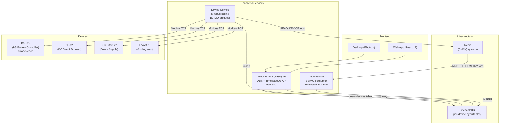
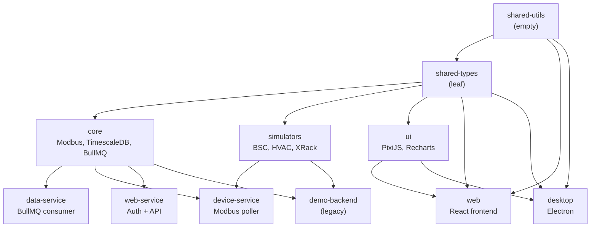

# Batarya EMS (Energy Management System)

Bun monorepo — 11 packages (3 apps, 3 microservices, 5 libraries). Nx build orchestration. TimescaleDB + Redis + BullMQ data pipeline. React frontend + Electron desktop.

---

## System Architecture



---

## Monorepo Structure

```
.
├── apps/
│   ├── web/              # React 19 SPA (Vite 8, TanStack Query, Zustand)
│   ├── desktop/          # Electron 39 + React 19 (electron-vite)
│   └── demo-backend/     # Legacy Fastify backend (XRack demo)
├── packages/
│   ├── shared-types/     # Pure TS types (telemetry, jobs, auth)
│   ├── shared-utils/     # Empty placeholder
│   ├── core/             # Backend logic (Modbus, BullMQ, TimescaleDB, SQL)
│   ├── simulators/       # Device simulators (BSC, HVAC, XRack)
│   ├── ui/               # Shared React components (PixiJS, Recharts, Emotion)
│   └── services/
│       ├── device-service/   # Modbus device poller + BullMQ producer
│       ├── data-service/     # BullMQ consumer + TimescaleDB writer
│       └── web-service/      # Auth/JWT + REST API (hexagonal architecture)
├── configs/              # Device configuration files (source of truth)
├── deployment/           # Docker Compose files (production + dev)
├── nx.json               # Nx build orchestrator
├── tsconfig.base.json    # Shared TS config + path aliases
└── package.json          # Bun workspaces
```

## Dependency Graph



### Build Order (Nx `^build`)

```
Level 0:  shared-types                                    (leaf — no deps)
Level 1:  shared-utils, core, simulators                   (depend on shared-types)
Level 2:  ui                                               (depends on shared-types)
Level 3:  data-service, device-service,
          web-service, demo-backend                        (depend on core + shared-types;
                                                           device-service also on simulators)
Level 4:  web, desktop                                     (depend on shared-types, shared-utils, ui)
```

## Package Inventory

| Package | Type | Stack | Key Dependencies |
|---------|------|-------|-----------------|
| `shared-types` | Library | Pure TS | — |
| `shared-utils` | Library | Placeholder | — |
| `core` | Library | Modbus, DB, MQ | `bullmq`, `pg`, `redis`, `jsmodbus` (CANbus/MQTT are stubs) |
| `simulators` | Library | Device sims | BSC, HVAC, CB, DC-Output, XRack models |
| `ui` | Library | React components | `pixi.js`, `recharts`, `@emotion/*` |
| `data-service` | Service | BullMQ consumer | `bullmq`, `pg` |
| `device-service` | Service | Modbus poller | `jsmodbus`, `pg` |
| **`web-service`** | **Service** | **Hexagonal Fastify** | **`fastify`, `jose`, `awilix`, `zod`** |
| `demo-backend` | App | Fastify dashboard | `fastify` |
| `web` | App | React SPA | `react-query`, `zustand`, `axios` |
| `desktop` | App | Electron | `electron-vite`, `electron-updater` |

## UI Design Tokens

The `ui` package provides centralized design tokens consumed by all frontend packages (`web`, `desktop`, and `ui` itself).

### Icons
- `import { SCADA_ICONS, type ScadaIconName } from "@gd-monorepo/ui"`
- 35 named SCADA icons (dashboard, battery, control, charts...) mapped to Tabler Icons (`react-icons/tb`)
- Use `<SCADA_ICONS.dashboard size={18} />` — never import `react-icons` directly
- Adding an icon: update `types.ts` union + `nav-icons.tsx` mapping

### Colors
- `import { COLORS, COLOR, hexToNumber } from "@gd-monorepo/ui"`
- 104 semantic color tokens (status, surface, border, text, gradient, chart, alpha variants)
- Dual-format: `COLORS.success` → `"#10b981"` (CSS/Emotion) and `COLOR.success` → `0x10b981` (PixiJS)
- `hexToNumber()` for dynamic PixiJS color conversion
- **No hardcoded hex values anywhere** — all colors reference tokens
- Adding a token: add entry to `tokens` object in `tokens.ts`; `COLOR` and types auto-derive
- **[Storybook](https://ilterisyucel.github.io/monorepo-bun-starter/)** — visual gallery of all tokens and components

Full details: see [AGENTS.md](./AGENTS.md).

## Web-Service Architecture (Hexagonal / Ports & Adapters)

```
src/
├── domain/                     Pure business — zero framework imports
│   ├── repositories/           IUserRepository (port)
│   ├── services/               ITokenService, IPasswordHasher (ports)
│   └── validation/             Zod schemas + inferred types
├── application/                Use-case orchestrators
│   ├── use-cases/              7 use cases (Login, Refresh, CRUD)
│   └── telemetry/              Pure data transformation functions
├── infrastructure/             Adapters implementing domain ports
│   ├── persistence/            PostgreSQL (UserRepository, DeviceRegistry)
│   └── auth/                   JWT (jose), password hashing (Bun.password)
├── presentation/               HTTP / Fastify layer
│   ├── routes/                 auth-routes, data-routes, unified-routes
│   └── middleware/             RBAC (JWT-based), global error handler
├── core/                       Shared kernel (Result<T> pattern)
├── config/                     Env-based configs + awilix DI container
└── index.ts                    15-line bootstrap
```

**Dependency rule**: `presentation → application → domain` only. Never reverse.

## Device Configurations

Device configs live in `packages/services/device-service/config/` (local dev) and `deployment/config-docker/` (Docker). Each JSON defines telemetry registers, optional simulator settings, and optional command definitions.

```
config/
├── service.json           # Shared: Redis, Postgres, poll intervals
├── bsc-1.json             # BSC-1: ~300 telemetry registers + charge/discharge/stop commands
├── bsc-2.json             # BSC-2 (same structure, port 504)
├── cb-1.json              # CB-1: COIL writes (open/close/reset)
├── cb-2.json              # CB-2
├── dc-output-1.json       # DC Output 1: COIL writes (on/off)
├── dc-output-2.json       # DC Output 2
├── hvac-1.json..hvac-8    # 8 HVAC units: HOLDING_REGISTER writes (on/off/force_cool/force_heat)
```

All configs have `simulator.type` matching a simulator in `SimulatorProvider` (`bsc`, `hvac`, `cb`, `dc-output`, `xrack`). Commands use the `"commands"` section to define named operations with write registers, optional params, and post-write validation reads.

## Frontend Architecture (Data-Source Agnostic)

All UI components in `packages/ui` are transport-agnostic. They consume data through **contract interfaces** — never through direct WebSocket, fetch, or state library calls.

### Layered Data Flow

```
┌── packages/shared-types ────┐
│ ITelemetryTransport          │  ← Strategy interface (all transports implement this)
│ TelemetryData (canonical)    │
└──────────────────────────────┘
              ↑
┌── packages/ui ───────────────┐
│ transports/                  │  ← Concrete implementations
│  WebSocketTransport          │
│  HttpPollingTransport        │
│  MockTransport               │
│                              │
│ hooks/useRealtimeTelemetry   │  ← Consumes ITelemetryTransport, provides data to React
│ core/DeviceTelemetryProvider │  ← Compound component (isolated per-device data context)
│ interfaces/                  │  ← Provider contracts (TelemetryProvider, LogProvider, …)
│ components/                  │  ← Pure presentational (TelemetryChart, LogTerminal, BSC, TMS, …)
└──────────────────────────────┘
              ↑
┌── apps/web ──────────────────┐
│ contexts/TransportContext    │  ← App-level transport selection (WS → prod, Mock → dev)
│ hooks/useTelemetryProvider   │  ← Implements TelemetryProvider via TanStack Query
│ hooks/useChargeStatus        │  ← Domain-specific hooks
│ stores/                      │  ← Zustand (LogStore implements LogProvider)
└──────────────────────────────┘
```

### Key Contracts

| Contract | Layer | Purpose |
|----------|-------|---------|
| `ITelemetryTransport` | `shared-types` | Real-time data transport (WS, HTTP, SSE, Mock — swappable) |
| `TelemetryProvider` | `ui/interfaces` | Time-series data + range/points controls for `TelemetryChart` |
| `LogProvider` | `ui/interfaces` | Log entries for `LogTerminal` |
| `EventAnnotationsProvider` | `ui/interfaces` | Event markers for chart annotations |
| `DeviceTelemetryProvider` | `ui/core` | Isolated real-time data context per device (Grafana-style panel isolation) |

### Transport Strategy

```tsx
// App-level: choose your transport
<TransportProvider>                          // Holds WS + HTTP transports
  <RealtimeProvider>                         // Single WS stream for SCADA
    <DeviceTelemetryProvider deviceId="bsc-1" transport={useTransport('ws')}>
      <DeviceTelemetryProvider.Gauge metric="Voltage" />
      <DeviceTelemetryProvider.StatusBadge />
    </DeviceTelemetryProvider>
    <TelemetryChart provider={telemetryProvider} />  // HTTP + WS merged
  </RealtimeProvider>
</TransportProvider>
```

**Adding a new transport:** implement `ITelemetryTransport`, export from `@gd-monorepo/ui/transports`, inject into `TransportProvider`. Zero component changes needed.

### Runtime Stability (24/7 Operation)

The codebase includes 10+ optimizations for Chrome SIGILL crash prevention during continuous operation (8+ hours, container monitor):

| Fix | Impact |
|-----|--------|
| WS batch: 2,700 msg/s → 10 msg/s (99.6% reduction) | `web-service/src/index.ts` |
| Client rAF batch: N state updates/frame → 1/frame | `useRealtimeTelemetry.ts` |
| PIXI WebGL leak: ref callback destroys old app on resize | `BSC.tsx`, `TMS.tsx` |
| PIXI ticker: 60fps → 6fps React state updates | `BSCGraphic.hooks.ts`, `TMSGraphic.hooks.ts` |
| WS ping/pong: 30s interval, dead connection detection | `server.ts` (both services) |
| Dead socket sweep: 60s cleanup cycle | `realtime-manager.ts` |
| localStorage throttle: 2s debounce | `LogStore.ts` |
| Token auto-refresh: breaks reconnect loop | `RealtimeContext.tsx` |
| Error Boundary: WebGL/React crash fallback | `ErrorBoundary.tsx` |
| Electron crash handlers: auto-reload on renderer crash | `apps/desktop/src/main/index.ts` |

### Full Stack (docker compose)

```bash
# Production
docker compose -f deployment/docker-compose.yml up -d

# Development (hot-reload)
docker compose -f deployment/docker-compose.dev.yml up
```

| Service | Port | Purpose |
|---------|------|---------|
| `timescaledb` | 5432 | Time-series database + user/devices tables |
| `redis` | 6379 | BullMQ message queue |
| `device-service` | — | Modbus polling, job production |
| `data-service` | — | Job consumption, telemetry persistence |
| `web-service` | 5001 | Auth API + TimescaleDB data API |
| `web` | 80 | React SPA served via nginx |

### Legacy Demo Stack

```bash
docker compose -f deployment/docker-compose.demo-backend.yml up -d
```

| Service | Port |
|---------|------|
| `demo-backend` | 3000 (prod) / 5000 (dev) |
| `web` | 80 |

## Quick Commands

```bash
bun install                         # Install deps (Bun only)
bun run dev                         # All apps in parallel (max 5)
bun run dev:web                     # Web only (Vite, port 5173)
bun run dev:desktop                 # Desktop only (Electron)
nx run ui:storybook                 # Storybook dev (port 6006)
nx run web-service:dev              # Web Service (Fastify, port 5001)
nx run device-service:dev           # Device Service
nx run data-service:dev             # Data Service
nx run demo-backend:dev             # Demo Backend (port 5000)
bun run build                       # Build all (Nx orders by ^build)
bun run build:web                   # Build Web only
bun run build:desktop               # Build Desktop only
bun run clean                       # Clean all build outputs
bun run graph                       # Dependency graph visualizer
nx run <proj>:<target>              # Run any Nx target
```

### Per-project typecheck

```bash
cd packages/services/web-service && bun --bun tsc --noEmit
nx run web-service:typecheck
```

## Data Flow

```
[Device Config] → Device-Service reads config → connects ModbusDevice
    │
    ├── (simulator mode) → BSCSimulator / HvacSimulator ticks every 1s
    └── (real mode)      → Modbus TCP to physical hardware
    │
    ▼
Device-Service publishes READ_DEVICE job → Redis (BullMQ)
    │
    ▼
Data-Service worker picks up WRITE_TELEMETRY job → writes to TimescaleDB
    │
    │  Per-device hypertable: device_BSC_1, device_BSC_2, device_HVAC_1..8
    │  Telemetry columns: name, value, unit, tags (rack_id, zone), timestamp
    │
    ▼
Web-Service unified endpoints:
  GET /unified/racks/latest        → multi-BSC aggregation + rack offsets
  GET /unified/racks/downsampled   → time-bucketed data across devices
  GET /unified/hvac/latest         → all HVAC unit readings
  POST /auth/login, /auth/refresh  → JWT auth
  GET/POST/PUT/DELETE /auth/users  → admin user CRUD
    │
    ▼
Web App (React) → React Query (5s polling) → TelemetryChart, RackCards, Dashboard
```

## Maneuver System

The Control page uses a card-based maneuver UI. 18 named maneuvers cover startup, shutdown, calibration, thermal management, safety, fault protection, and maintenance — derived from `.drawio` flow diagrams (FL-01 through FL-11). Each maneuver is a `ManeuverConfig` — a multi-device command chain executed via `POST /api/commands/execute-multi`.

### File map

| File | Role |
|------|------|
| `apps/web/src/features/control/maneuvers.ts` | `MANEUVERS` (18 entries) + `MANEUVER_CONTROLS` (inputs, timerConfig, transform) |
| `apps/web/src/features/control/components/ManeuverPanel.tsx` | Masonry grid of cards, per-maneuver state tracking |
| `packages/ui/src/components/ManeuverCard/` | Stateless card component — inputs, timer checkbox, schedule, step status |

### Card layout

```
┌───────────────────────────────────┐
│ ⚡ Şarj                     2 · ∥ │  ← header: title + step count + parallel/sequential
│ BSC'leri şarj moduna alır.        │  ← description
│                                   │
│ ── GİRDİLER ──────────────────── │
│ Toplam Güç: ──●── 3000 kW        │  ← TelemetryInput (single input)
│ ☐ Zamanlı                        │  ← timer checkbox (auto-stop on expiry)
│                                   │
│ ── ADIMLAR ────────────────────│
│ ○ BSC-1  charge                  │  ← pending (no result yet)
│ ✅ BSC-2  charge                 │  ← success
│ ❌ BSC-3  charge                 │  ← failed
│                                   │
│          [▶ Çalıştır ▾]          │  ← split button: Şimdi / 📅 Zamanla
└───────────────────────────────────┘
```

### State machine

| State | Buttons shown |
|-------|--------------|
| `idle` | `▶ Çalıştır ▾` (Şimdi / 📅 Zamanla schedule) |
| `running` | `Çalışıyor...` (disabled) |
| `success` | `▶ Çalıştır` (re-run) |
| `failed` | `Tekrar Dene` + `Geri Al` (if `rollbackSteps` defined) |

### Power distribution (ManeuverTransform)

Charge/discharge cards use a single "Toplam Güç" input. `ManeuverTransform` divides it across N BSC devices:

```ts
transform: (values, steps) => {
  const perDevice = Math.round(values.powerKw / steps.length);
  return steps.map(() => ({ powerKw: perDevice }));
}
// 3000 kW → BSC-1: 1500, BSC-2: 1500
```

### Emergency Stop

`Sidebar.tsx` emergency button calls `MANEUVERS.fl03_emergency_stop`:
```ts
const m = MANEUVERS.fl03_emergency_stop;
await controlApi.executeMulti(m.steps, m.mode);  // sequential: stop BSCs → off DCs → open CBs
```

## Tech Stack

| Layer | Technology |
|-------|-----------|
| Runtime | Bun (latest) |
| Monorepo | Nx v22 (build orchestrator) |
| Language | TypeScript 5.x |
| Backend | Fastify 5 |
| Frontend | React 19, Vite 8, TanStack Query 5, Zustand 5, React Router 7 |
| Desktop | Electron 39, electron-vite 5 |
| Database | TimescaleDB (PostgreSQL) |
| Message Queue | BullMQ + Redis |
| Auth | JWT (jose), Bun.password, zod validation |
| DI Container | awilix |
| UI Components | PixiJS 8, Recharts 3, Emotion CSS-in-JS |
| Deployment | Docker Compose (6 services) |
| Simulators | BSC (LG Battery Controller), HVAC (Cooling Units), XRack (legacy) |
