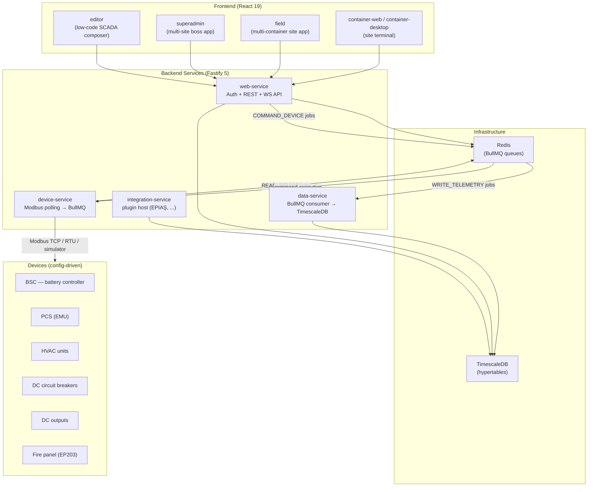

# GD-PMS — Battery EMS (Energy Management System)

Bun + Nx monorepo for a BESS/EMS platform: three-tier frontend (container / field / boss), four backend services, shared packages, and a self-hosted documentation wiki. TimescaleDB + Redis + BullMQ telemetry pipeline, config-driven devices, maneuver system, and a low-code SCADA editor.

---

## Quick Start

```bash
bun install                       # Install deps (Bun only, no npm/pnpm/yarn)
bun run dev                       # All apps in parallel (max 5)
bun run dev:container-web         # Web only (Vite, port 5173)
bun run dev:container-desktop     # Electron only
bun run dev:container             # Full stack (Docker dev mode)
bun run start:container           # Full stack (Docker prod mode)
bun run stop:container            # Stop container stack
nx run demo-backend:dev           # Demo Backend (Fastify, port 5000)
nx run web-service:dev            # Web Service (Fastify, port 5001)
nx run device-service:dev         # Device Service (Modbus poller)
nx run data-service:dev           # Data Service (BullMQ consumer)
bun run build                     # Build all (Nx orders by ^build deps)
bun run test                      # All unit/component/integration tests (vitest workspace)
bun run test:coverage             # With coverage report
bun run test:e2e                  # Playwright (requires docker stack)
bun run test:perf                 # k6 smoke tests
nx run <proj>:test                # Single project tests
nx graph                          # Dependency graph visualizer
```

Full command reference and development rules: **[AGENTS.md](./AGENTS.md)**.

---

## System Architecture


```mermaid
flowchart TB
    subgraph FRONTEND["Frontend (React 19)"]
        CW["container-web / container-desktop\n(site terminal)"]
        FLD["field\n(multi-container site app)"]
        SUP["superadmin\n(multi-site boss app)"]
        ED["editor\n(low-code SCADA composer)"]
    end

    subgraph BACKEND["Backend Services (Fastify 5)"]
        WS["web-service\nAuth + REST + WS API"]
        DEV["device-service\nModbus polling → BullMQ"]
        DATA["data-service\nBullMQ consumer → TimescaleDB"]
        INT["integration-service\nplugin host (EPIAŞ, ...)"]
    end

    subgraph INFRA["Infrastructure"]
        TSDB["TimescaleDB\n(hypertables)"]
        REDIS["Redis\n(BullMQ queues)"]
    end

    subgraph DEVICES["Devices (config-driven)"]
        BSC["BSC — battery controller"]
        EMU["PCS (EMU)"]
        HVAC["HVAC units"]
        CB["DC circuit breakers"]
        DCO["DC outputs"]
        FP["Fire panel (EP203)"]
    end

    CW --> WS
    FLD --> WS
    SUP --> WS
    ED --> WS
    DEV -->|READ_DEVICE jobs| REDIS
    REDIS -->|WRITE_TELEMETRY jobs| DATA
    DATA --> TSDB
    WS --> TSDB
    WS --> REDIS
    INT --> TSDB
    DEV -->|Modbus TCP / RTU / simulator| DEVICES
    WS -->|COMMAND_DEVICE jobs| REDIS
    REDIS -->|command execution| DEV
```

- Three-tier product model: **container** (single site terminal) → **field** (site) → **boss** (multi-site) — composed from the same capabilities via config (`SERVICE_TIER`).
- Remote container UI access runs over the container→field outbound tunnel (session gateway + RBAC): `docs/architecture/KONTEYNER-UZAKTAN-ERISIM-MIMARISI.md`.

---

## Repository Layout

```
apps/
  container-web/          React 19 SPA — site terminal UI
  container-desktop/      Electron 39 wrapper of container-web
  field/                  React app — multi-container site management
  superadmin/             React app — multi-site (boss) management
  editor/                 Low-code SCADA editor (ReactFlow)
  desktop/                Electron app (legacy wrapper)
  demo-backend/           Legacy Fastify backend (XRack demo)
packages/
  shared-types/           Pure TS types (telemetry, jobs, auth, transport contracts)
  shared-utils/           ConfigLoader, env sources (currently empty — see TESTING.md)
  core/                   Backend logic: Modbus, TimescaleDB, BullMQ (CANbus/MQTT stubs)
  plugin-sdk/             Plugin framework: IPlugin, PluginContext, PluginRegistry
  epias-client/           EPIAŞ HTTP client (CAS TGT lifecycle)
  plugins/                Built-in plugin packages (epias-market-prices)
  simulators/             Register-accurate device simulators (BSC, HVAC, ...)
  ui/                     Shared React components, PixiJS graphics, transports, tokens
  eslint-plugin-energy/   Custom ESLint security rules (e.g. no-math-random)
services/
  web-service/            Hexagonal Fastify 5 API — auth/JWT, RBAC, TimescaleDB queries
  device-service/         Modbus poller — device configs, TelemetryTagger, BullMQ producer
  data-service/           BullMQ consumer — telemetry writer
  integration-service/    Plugin host — periodic data collection (BullMQ repeatable)
deployment/               Docker Compose stacks (product layer) + wiki/ + k6/
docs/                     Classified documentation (see docs/README.md)
tools/                    Build/import/measurement scripts (import-wiki, sprites, docx)
```

Dependency graph: `bun run graph` (Nx). Build order is implicit via Nx `^build` — see AGENTS.md.

---

## Package Inventory

| Package | Type | Purpose |
|---------|------|---------|
| `shared-types` | Library | Telemetry, jobs, device interfaces, auth, integration contracts |
| `shared-utils` | Library | ConfigLoader, env sources (empty — to be filled) |
| `core` | Library | Modbus, TimescaleDB, BullMQ, transport adapters |
| `plugin-sdk` | Library | Plugin framework + domain-agnostic HttpClient |
| `epias-client` | Library | EPIAŞ HTTP client (TGT lifecycle, typed helpers) |
| `plugins/*` | Library | Built-in plugins (epias-market-prices) |
| `simulators` | Library | Device simulators (BSC, HVAC, XRack, CB, DC-Output) |
| `ui` | Library | PixiJS graphics, Recharts, Emotion, transports, color/icon tokens |
| `web-service` | Service | Auth/JWT + RBAC + REST/WS API (hexagonal) |
| `device-service` | Service | Modbus poller, TelemetryTagger, command execution |
| `data-service` | Service | BullMQ consumer, telemetry persistence |
| `integration-service` | Service | Plugin host (EPIAŞ collection) |
| `container-web` / `field` / `superadmin` | Apps | Three-tier frontend |
| `editor` | App | Low-code SCADA composer |
| `container-desktop` / `desktop` | Apps | Electron builds |
| `demo-backend` | App | Legacy demo backend |

---

## Key Concepts (pointers)

| Concept | Where |
|---------|-------|
| Three-layer model (platform / capabilities / products) | AGENTS.md |
| Command config system (device JSONs, validation reads, atomic writes) | AGENTS.md + `docs/architecture/MANEVRA-SISTEMI-MIMARISI.md` |
| Maneuver system (18 named multi-device chains, rollback) | `docs/architecture/MANEVRA-SISTEMI-MIMARISI.md` |
| Device transport strategy (`transport.kind`: tcp/rtu/simulator, Strategy pattern) | `docs/architecture/DEVICE-SERVICE-TRANSPORT-MIMARISI.md` |
| Telemetry tagging & canonical metrics (`tags.canonical`, TelemetryTagger) | AGENTS.md |
| Plugin architecture (integration-service, EPIAŞ client) | `docs/architecture/PLUGIN-MIMARISI.md` |
| Editor architecture (product-layer composer) | `docs/architecture/EDITOR-MIMARISI.md` |
| Remote container UI access (tunnel, session, audit) | `docs/architecture/KONTEYNER-UZAKTAN-ERISIM-MIMARISI.md` |
| Sprite pipeline (AI-generated PixiJS sprites) | `docs/process/SPRITE-URETIMI.md` + `docs/process/SPRITE-STYLE-KIT.md` |
| Frontend data-source contracts (`ITelemetryTransport` etc.) | AGENTS.md |
| Color & icon token system (104 colors, 35 icons) | AGENTS.md + Storybook |

Full documentation classification: **[docs/README.md](./docs/README.md)**.

---

## Security

- **Target standard:** OWASP ASVS **Level 2** — category → check mapping, gates and release checklist: `docs/standards/owasp-asvs-level2.md`.
- **Compliance:** NIS2 (`docs/standards/nis-2.md`), ISO 27001 (`docs/standards/iso-27001.md`), TEİAŞ (`docs/standards/teias-uyumluluk-degerlendirmesi.md`).
- **Auth:** JWT (jose) + Argon2id password hashing (`Bun.password`); 4 roles (admin / teknik / boss / guest) + `fieldIds` claim, route-based RBAC middleware.
- **Logging:** Tamper-evident logger (hash chain + signature) for backend audit/security channels — NIS2 Adım 5–7.
- **SAST:** SonarQube/SonarCloud "NIS2 Compliance" profile + quality gate on every PR/release.
- **Known gaps (tracked):** JWT stored in localStorage (XSS risk — migration planned), security headers not yet applied to all endpoints (see `docs/standards/iso-27001.md` Adım 8), rate limiting partially planned (see `docs/standards/nis-2.md`).

---

## Deployment Stacks

All stacks are Docker Compose files in `deployment/` — the **product layer** (capabilities composed via config). Docs are not bundled into product images.

| Stack | Compose file | Exposed ports |
|-------|--------------|---------------|
| Container (prod) | `docker-compose.container.yml` | timescaledb 5432, redis 6379, web-service 5001 |
| Container (dev) | `docker-compose.container.dev.yml` | same + hot-reload |
| Field | `docker-compose.field.yml` / `.dev.yml` | timescaledb 5434, redis 6381, web-service 5002 |
| Boss | `docker-compose.boss.dev.yml` | timescaledb 5435, redis 6382, web-service 5003, superadmin 5175 |
| Demo backend (legacy) | `docker-compose.demo-backend.yml` | demo-backend 3000 |
| **Wiki (docs)** | `docker-compose.wiki.yml` | wiki 8090, postgres 5436 |

```bash
bun run start:container       # container stack (prod)
bun run dev:container         # container stack (dev)
bun run dev:field-stack       # field stack
bun run dev:boss-stack        # boss stack
bun run wiki:up               # documentation wiki (Wiki.js)
```

---

## Documentation Wiki (Wiki.js)

Self-hosted, open-source documentation platform (markdown + mermaid, search, tags, permissions). Mirrors the `docs/` classification; import via `tools/import-wiki.ts`.

```bash
bun run wiki:up
WIKI_URL=http://localhost:8090 WIKI_API_KEY=<key> bun run wiki:import
bun run wiki:backup           # pg_dump + data volume tar
```

Details: `deployment/wiki/README.md`.

---

## Testing & CI

- **Testing:** Vitest workspace (unit/component/integration), Playwright (E2E), k6 (performance). Strategy, layers and gates: **[TESTING.md](./TESTING.md)**. TDD is mandatory for new code (see AGENTS.md).
- **CI/CD:** GitHub Actions workflows — `e2e.yml`, `perf.yml`, `sonar.yml`, `storybook.yml`. PR-level unit-test workflow is not yet added (tracked in AGENTS.md "What's missing").

---

## Tech Stack

| Layer | Technology |
|-------|-----------|
| Runtime | Bun (latest) |
| Monorepo | Nx v22 |
| Language | TypeScript 5.x |
| Backend | Fastify 5, awilix (DI), zod (validation) |
| Frontend | React 19, Vite 8, TanStack Query 5, Zustand 5, React Router 7 |
| Desktop | Electron 39, electron-vite 5 |
| Database | TimescaleDB (PostgreSQL) |
| Message Queue | BullMQ + Redis |
| Auth | JWT (jose), Argon2id (Bun.password) |
| Graphics | PixiJS 8, Recharts 3, Emotion CSS-in-JS, Mermaid |
| Docs | Wiki.js (markdown + mermaid, self-hosted) |
| CI/CD | GitHub Actions + SonarCloud quality gates |
