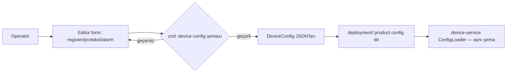

# Editör Mimarisi (Editor — Product Layer Composer)

Tarih: 2026-08-19
Durum: Aktif yol haritası — P1 tamamlandı (device-library migrasyonu), P2+ planlı
İlişkili: [AGENTS.md](../AGENTS.md) (üç katman modeli), [field-superadmin-architecture.md](./field-superadmin-architecture.md), [KONTEYNER-UZAKTAN-ERISIM-MIMARISI.md](./KONTEYNER-UZAKTAN-ERISIM-MIMARISI.md)
Superseded: `editor-phase-2-config-engine.md`, `editor-phase-3-runtime.md`, `editor-phase-4-builder.md` (bu üç dokümanın önerdiği `config-engine`/`runtime-engine`/`app-builder` platform paketleri iptal edildi)

## 1. Rol ve Amaç

Editör, üç katman modelinin (AGENTS.md) **ürün katmanı bestecisidir**:

> "The editor generates the product layer (compose compositions + configs); capabilities stay generic; customer-specific behavior belongs in product configs/plugins — never in the platform."

Kullanıcı hikayeleri:

| # | Kullanıcı hikayesi |
|---|--------------------|
| H1 | Operatör, kendi cihazının config'ini editörde tanımlar (register haritası, protokol, alarmlar) — kod yazmadan |
| H2 | Tanımlanan config'ler device-service'in okuyacağı **aynı formatta** JSON olarak üretilir |
| H3 | Operatör manevralarını (komut zincirleri) tanımlar |
| H4 | Operatör tek hat şeması çizer; kart, gauge, chart ve ikonları dashboard'a yerleştirir |
| H5 | Ürün (config'ler + şema + manevralar) deployment/product katmanına export edilir |

**Editör ne DEĞİLDİR:** runtime motoru değildir (runtime = `core` + device/data/web-service'lerin mevcut bileşimi); platform paketi üreticisi değildir (yeni `packages/*` çıkarmaz).

## 2. Mevcut Durum (2026-08-19)

- ReactFlow tabanlı tek hat şeması çizim aracı (~1.500 LOC): palet (drag&drop), canvas, property panel (isim/protokol/bağlantı), proje kaydetme (backend `/projects` API + localStorage + JSON download).
- `packages/device-library` **migre edildi** → `apps/editor/src/features/editor/device-catalog/` (P1, aşağıda). Paket monorepo'dan kaldırıldı.
- Config üretimi, manevra editörü ve dashboard tasarımcısı **henüz yok** — bu dokümanın P2-P5 yol haritasıdır.

### 2.1 Katalog dosya yapısı (P1 sonrası)

```
apps/editor/src/features/editor/device-catalog/
├── index.ts            # barrel + getDeviceDefinition
├── types.ts            # DeviceType, DeviceDefinition, DefaultRegister, ...
├── registry.ts         # DEVICE_LIBRARY (built-in seed'ler) + DEVICE_TYPES
├── catalog.test.ts     # registry invariant testleri
└── definitions/        # battery-bank, pcs, breaker, solar-panel, hvac
```

## 3. Katalog Modeli: Config-Driven (tek kaynak kuralı)

**İlke:** Katalog **veridir, kod değildir** — kullanıcılar runtime'da cihaz eklediği için hardcoded TS registry'si mimari olarak yanlıştır.

### 3.1 Üç katmanlı katalog

| Katman | İçerik | Kaynak |
|--------|--------|--------|
| **Built-in seed'ler** | BSC/HVAC/CB/DC-Output/PCS/EMU gibi bilinen cihazların register-accurate tanımları | `services/device-service/config/*.json` (mevcut gerçek config'lerden üretilir — placeholder değil) |
| **Kullanıcı cihazları** | Operatörün tanımladığı cihazlar (H1) | Editör içi `DeviceCatalogStore` (Zustand, persist); CRUD |
| **Görsel meta** | icon, defaultSize, connectionPoints | Editor-local eşleme tablosu; kullanıcı cihazlarında kategori bazlı **fallback ikon** (ikon upload P6+) |

### 3.2 Tek kaynak: shared-types şemaları

Kullanıcının girdiği cihaz config'i **`shared-types/src/schemas/device-config.ts`** zod şemalarıyla doğrulanır — device-service `ConfigLoader`'ın tükettiği şemanın aynısı. Sonuç: "editörde geçen config sahada da geçer" garantisi; çift kaynak (TS registry vs JSON config) yoktur.



### 3.3 Alarm kuralları

- `AlarmRuleDefinition.condition` string'i (`"SOC < 20"`) **sürüm 1'dir**: küçük, güvenli bir ifade alt kümesi (karşılaştırma + min/max) yazılır; zod ile doğrulanır; **asla `eval` edilmez**.
- Değerlendirme motoru editörde değil, alarmların tüketildiği serviste/konfigürasyonda çalışır (README E1 ile uyumlu).

## 4. Cihaz Config Üretimi (P2)

- Canvas'taki her node → bir `DeviceConfig` JSON'u: `type, name, connection (transport), telemetry[] (register haritası: address, table type, byte order, scale, offset, canonical), bitfields[], commands[], alarms[]`.
- **ConfigValidator** (editör feature'ı): register çakışması, geçersiz byte order, aynı isim, IP/port çakışması, dead-end bağlantı, zorunlu alan eksikleri. Tümü `Result<T, DomainError>` döner (Faz 0 ek 2 hibrit modeli — editör beklenen hataları throw ile değil Result ile taşır).
- Export: proje → `deployment/` product katmanındaki config dizinine yazılabilir JSON dosyaları (sürümlü `ProjectFile`).

## 5. Manevra Editörü (P3)

- `shared-types`'taki mevcut `ManeuverConfig` kontratı kullanılır: `name, label, mode (parallel|sequential), onFailure (stop|continue), steps (deviceId+command/telemetries/params), rollbackSteps`.
- UI: adım listesi editörü (cihaz seçimi katalogdan, komut seçimi o cihazın `commands[]` tanımından), transform/param önizleme.
- Çıktı: product config'teki maneuver dosyası — container-web/field `MANEUVERS` kalıbının config-driven karşılığı.

## 6. Dashboard Tasarımcısı (P4)

- Tek hat şeması (mevcut canvas) + widget yerleşimi: kart (`RackCard`/`ContainerCard` kalıpları), gauge (`DeviceGauges`), chart (`TelemetryChart`), ikon (`SCADA_ICONS`), log terminali (`LogTerminal`) — hepsi `@gd-monorepo/ui`'dan reuse, yeni paket yok.
- Veri bağlama: widget → `deviceId + telemetry name` (canonical etiketleme kuralları geçerlidir — AGENTS.md "Telemetry tagging & canonical metrics").
- Çıktı: `ScreenConfig` benzeri render config'i (README'nin öngördüğü `ScreenConfig/WidgetDefinition` tipleri `shared-types`'ta doğar) → container-web/field uygulamaları config-driven render eder.

## 7. Mimari Kararlar

| Konu | Karar |
|------|-------|
| Editör mantığının yeri | `apps/editor/src/features/` — **yeni platform paketi yok** (`config-engine`/`runtime-engine`/`app-builder` iptal) |
| Cihaz kataloğu | `apps/editor` içi config-driven veri (seed + kullanıcı + görsel meta) |
| Validasyon | `shared-types` zod şemaları — device-service ile aynı |
| Runtime | Mevcut `core` + `device-service`/`data-service`/`web-service`; editörde yeniden icat edilmez |
| Depolama | Backend `/projects` (Postgres, mevcut) + JSON export; localStorage yalnızca taslak katmanı |
| Hata taşıma | Beklenen → `Result<T,E>`; beklenmeyen → `DomainError` (Faz 0 ek 2) |
| TDD | Tüm yeni editör modülleri test-önce (AGENTS.md TDD); katalog testleri mevcut (`catalog.test.ts`) |

## 8. Yol Haritası

| Faz | İçerik | Kapsam |
|-----|--------|--------|
| **P1** ✅ | device-library → `device-catalog` migrasyonu; paket kaldırıldı; registry invariant testleri; import/alias/workspace temizliği | Bu dokümanla birlikte tamamlandı |
| **P2** | Cihaz config editörü: `DeviceCatalogStore` (kullanıcı CRUD), register haritası formu, zod validasyonu, `ConfigValidator` (Result tabanlı), seed'lerin gerçek config JSON'larından üretimi | TDD: şema + validator testleri önce |
| **P3** | Manevra editörü (`ManeuverConfig` kontratıyla) | TDD |
| **P4** | Dashboard tasarımcısı: widget yerleşimi + veri bağlama + `ScreenConfig` tipleri (shared-types) | TDD |
| **P5** | Export/builder: `ProjectFile` → deployment product config'lerine sürümlü üretim; `/editor/:projectId` load UI tamamlanır | Entegrasyon testi: editör çıktısı device-service `ConfigLoader`'dan geçer |
| **P6** | i18n (ASCII Türkçe temizliği), ikon upload/fallback politikası, alarm ifade alt kümesi genişletme, editor e2e | — |

**P5 kabul kriteri:** Editörden export edilen bir `DeviceConfig` seti, hiçbir elle düzeltme olmadan device-service tarafından yüklenip poll edilir (tek kaynak garantisi).

## 9. Test Stratejisi

- P1: `catalog.test.ts` — registry invariant'leri (tip sayısı, key/type eşleşmesi, ikon/protokol varlığı).
- P2+: AGENTS.md TDD döngüsü — `DeviceCatalogStore` CRUD, `ConfigValidator` kuralları, schema doğrulama (kırmızı → yeşil). `shared-types` device-config şemasının testleri mevcut; editör onları genişletmez, tüketir.
- TESTING.md §8.5 eşlemesi: editor satırı — "JSON schema validation, graph node operations, device-catalog registry".
