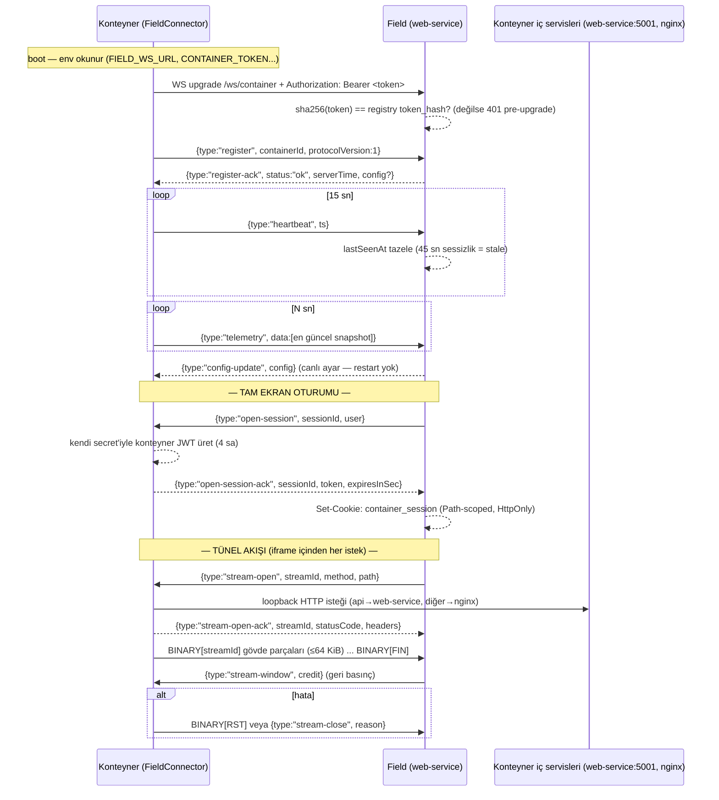

# Faz 5 Özeti + Konteyner Bağlantı Anatomisi

> Tarih: 2026-08-25 · Kapsam: Faz 5 teslimatı ve "bir konteyner field'a bağlanırken
> hangi aşamalardan geçiyor" sorusunun uçtan uca anlatımı.
> İlgili dokümanlar: [KONTEYNER-UZAKTAN-ERISIM-MIMARISI.md](./KONTEYNER-UZAKTAN-ERISIM-MIMARISI.md),
> [KONTEYNER-UZAKTAN-ERISIM-DOGRULAMA.md](./KONTEYNER-UZAKTAN-ERISIM-DOGRULAMA.md)

---

## 1. Faz 5: Ne yaptık, neden bu kadar sürdü

### 1.1 Amaç

Faz 5'in hedefi tek cümleyle: **field uygulamasındaki sahte (mock) verileri gerçek
uçlara bağlamak ve operatörün bir konteynerin ekranına "Tam Ekran" ile girebildiği
uçtan uca akışı (kart → özet → tam ekran → konteynerde komut → audit) çalışır hale
getirmek.**

### 1.2 Neden uzun sürdü (dürüst özet)

Kodun büyük kısmı hızlı yazıldı; süre **canlı ortam hata ayıklamasına** gitti.
Birim testlerin yakalayamadığı şeyler, iki docker stack'i (field + container)
gerçek WS/HTTP/tarayıcıyla birlikte çalıştırdığımızda ortaya çıktı. Tablo, bu
dersin tamamıdır — her satır "belirti → kök neden → düzeltme":

| # | Belirti (canlıda) | Kök neden | Düzeltme |
|---|-------------------|-----------|----------|
| S6 | İlk log yazımında servis çöküyordu (`logger.log is not a function`) | awilix v11 async factory'leri await'lemiyor — `cradle.logger` bir **Promise**'tu | Logger `buildTamperLogger` ile main()'de kurulup `asValue` kaydediliyor |
| S7 | Login "Denetim kaydi tutulamadi" ile reddediliyordu | `/var/log/gd-pms` dizini imajda yok → FileSink fail-closed | FileSink ilk yazımda dizini oluşturur + Dockerfile'da `mkdir` |
| S8 | Konnektör sürekli 401 alıyordu | `.env`'deki `FIELD_WS_URL`'de `/ws/container` yolu yoktu | Compose default'larına ve `.env`'e tam yol eklendi |
| S9 | WS upgrade 500 veriyordu | İmaj `oven/bun:latest` (1.4.0 regresyonu) + fastify 5.10/websocket 11.3 | `oven/bun:1.3.14`, fastify `5.8.5` + websocket `11.2.0` pinlendi |
| S10a | Büyük dosya tünelde 249856 baytta kilitleniyordu | Kredi eşiği pencereyle hizalıydı (flow-control deadlock'u) | Kredi **yarı pencere** eşiğinde yenileniyor |
| S10b | 16 akıştan sonra her şey 503 alıyordu (22x `max-streams`) | Konteyner FIN sonrası stream state'ini temizlemiyordu (sızıntı) | FIN sonrası `closeStream` |
| S10c | İframe'de API 401 veriyordu | Tünel isteğine `container_session` cookie'si iletilmiyordu | `tunnelHeaders` — yalnızca o cookie iletilir |
| S10d | Tünelden POST sonsuza dek asılı kalıyordu | **Çift yönlü bekleme:** konteyner fetch'i gövde FIN'inden sonra başlatıp ack'i yanıt başında üretiyor; field ise gövdeyi ack'ten sonra gönderiyordu | Field gövdeyi **ack'ten önce** gönderir (`sendStreamOpen`/`raceAck`) |
| S10e | POST gövdesi `undefined` geliyordu | Fastify v5 `rawBody`'u kaldırmış; built-in json parser wildcard'la çakışıyor | Tünel rotası kapsamında `parseAs: "buffer"` (application/json + wildcard) |
| S10f | Tarayıcı `ERR_CONTENT_DECODING_FAILED` veriyordu | undici gzip'i oto-dekomprese ediyor ama `content-encoding: gzip` başlığı ack'e taşınıyordu | `content-encoding`/`content-length` hop-by-hop sayılıp strip edildi |
| S10g | Aynı hata bir de sıkıştırma katmanından geliyordu | @fastify/compress global onSend'i ham tünel baytlarını damgalıyordu | Tünel rotasında `config.compress: false` |
| S10h | Oturum açışı 409/takılma üretiyordu | axios 302 yönlendirme quirk'i + Vite proxy opaque-redirect + limit-1 oturum | fetch-takipli openSession + **replace semantiği** (eskisi "replaced" ile kapanır) |
| S10i | UI `default-field` sahte kimliğine gidiyordu (geçersiz UUID → 500) | LoginPage admin için sahte field fallback'i kullanıyordu | Gerçek saha listesinden yönlendirme |

Ders: **birim/integration testleri protokol mantığını kanıtlar; canlı ortam ise
çalışma zamanının (DI kapsayıcısı, imaj sürümleri, proxy'ler, tarayıcı
davranışları) katmanlarını test eder.** İkisi birlikte gerekli — canlı tur
olmadan bu hataların yarısı üretimde patlardı.

### 1.3 Teslim edilenler (T5.1–T5.5)

| Görev | Ne yapıldı | Dosyalar |
|-------|-----------|----------|
| T5.1 | Konteyner kartları gerçek API'ye bağlandı (5 sn tazeleme); `summarizeContainer`/`statusForContainer` saf fonksiyonları kanonik metrik eşlemesi yapar (mock kaldırıldı) | `features/containers/services/containersApi.ts`, `hooks/useContainerData.ts` (+test), `useContainerTelemetry.ts`, `pages/LoginPage.tsx` |
| T5.2 | Özet sayfası gerçek snapshot'tan; PCS kartı PCS-* telemetrisinden türetilir | `pages/ContainerDetailPage.tsx`, `components/PcsCard.tsx` |
| T5.3 | "Tam Ekran": oturum aç → iframe → Kapat (`DELETE .../session` — session-end + audit kapanışı) | `components/ContainerFrame.tsx`, `pages/ContainerFramePage.tsx`, `session-routes.ts`, `session-gateway.ts` |
| T5.4 | Mock temizliği: olaylar → gerçek `/api/logs` (imzalı), cihazlar → `/unified/devices` + latest, grafikler → downsampled/summary | `features/field-{events,devices,charts}/**` |
| T5.5 | i18n: `container.fullscreen`, `frame.*` anahtarları | `i18n/tr.ts`, `i18n/en.ts` |

### 1.4 Kanıtlar

- **K5.1 E2E** (`e2e/field-flow.spec.ts`, canlı dev çifti): login → kart →
  özet → Tam Ekran → iframe'de konteyner SPA render → tünelden `POST
  /api/commands/execute` (BSC-1 stop) → `{"success":true,"validated":true}` →
  Kapat → saha Olaylar sayfasında imzalı `session_open`/`session_end`. **1/1 PASS (5.1 sn).**
- Audit: `session_audit` satırları (açılış + `operator-end` kapanışı) psql'de;
  konteyner device-service'te imzalı `command_executed`.
- `bun run test`: **994/994 yeşil** (95 dosya); 7 proje build ✅.
- Faz 4 regresyonu: `e2e/tunnel.spec.ts` 2/2 ✅.

---

## 2. Bir konteyner field'a bağlanırken neler oluyor

### 2.1 Uçtan uca akış (diyagram)

### 2.2 Aşama aşama (her biri: ne olur → neden var → literatürdeki karşılığı)

**Aşama 1 — Bootstrap.** Konteyner açılırken yalnızca dört env değeri okunur:
`FIELD_CONNECT_ENABLED`, `FIELD_WS_URL` (virgüllü liste = ana + yedek),
`CONTAINER_TOKEN`, `CONTAINER_ID`. Eksik/zorunlu alan varsa açılış fail-fast
reddedilir — "sessizce bağlı değil görünme" yasaktır.
*Karşılık:* 12-factor uygulamalarda dış yapılandırma; istemci tarafı connection
string'leri (JDBC URL, AMQP URI).

**Aşama 2 — WS upgrade + Bearer.** Konteyner tek bir **outbound** WebSocket açar
(`GET /ws/container`). Bu, NAT/DHCP arkasından çalışmanın anahtarıdır: bağlantıyı
hep konteyner kurar, field'a inbound kapı açılmaz. Upgrade anında `Authorization:
Bearer <token>` gönderilir; field token'ın SHA-256'sını kurulumda kaydedilen
`field_containers.token_hash` ile karşılaştırır. Eşleşmezse 101 yerine **401**
döner (pre-upgrade ret — el sıkışma hiç tamamlanmaz).
*Karşılık:* TLS el sıkışması + istemci sertifikası; HTTP Basic/Bearer auth;
OAuth2 client-credentials akışı.

**Aşama 3 — `register` / `register-ack`.** Bağlantı açılınca konteyner kendini
tanıtır: `{type:"register", containerId, protocolVersion:1}`. Field bunu
**register-ack** ile onaylar — ack ayrıca operational config taşıyabilir.
`protocolVersion` ileri uyumluluk için vardır. Ack gelmezse (10 sn) konteyner
bağlantıyı geçersiz sayar ve backoff'a geçer.
*Karşılık:* TCP 3-way handshake (SYN/SYN-ACK); MQTT `CONNECT`/`CONNACK`; SIP
`REGISTER`/`200 OK`. "Ack" kavramı için bkz. §2.4.

**Aşama 4 — `heartbeat` + stale.** Kayıt tamamlanınca konteyner 15 sn'de bir
`{type:"heartbeat", ts}` gönderir. Field bunu `lastSeenAt`'e yazar; son
işaretten **tam 45 sn** geçerse konteyner **"stale"** (yarı-ölü) sayılır — üç
kalp atışı kaçmış demektir. WS düzgün kapandıysa durum "idle" olur (kayıt ve son
telemetri korunur). Konteyner tarafında da ping/pong ile bağlantı canlılığı
denetlenir.
*Karşılık:* TCP keepalive; MQTT `PINGREQ`/`PINGRESP`; BGP keepalive + hold
timer (dead peer detection).

**Aşama 5 — `telemetry` snapshot.** Konteyner her N saniyede (varsayılan 15 sn)
en güncel cihaz değerlerini `{type:"telemetry", data:[...]}` olarak iter.
Kaynak `RealtimeSnapshotSource`: cihaz listesi (`devices` tablosu,
`status='online'`) + her cihazın Redis ring buffer başı (en yeni kayıt).
Bu sayede field UI kartları (PPC, SoC, güç) canlı beslenir.
*Karşılık:* event-carried state transfer; pub/sub snapshot (Redis Streams,
Kafka compacted topics).

**Aşama 6 — `config-update` (canlı ayar).** Field, bağlı konteynerin
heartbeat/telemetri aralıklarını `config-update` frame'iyle değiştirebilir;
konteyner bunu **restart'sız** uygular (zod doğrulamalı; geçersizse eski ayar
korunur). Bu, saha ziyareti gerektirmeden ayar değiştirmenin yoludur.
*Karşılık:* hot-reload; dinamik konfigürasyon (Spring Cloud Config,
etcd/Consul watch).

**Aşama 7 — Oturum (`open-session` / `open-session-ack`).** Operatör "Tam
Ekran" dediğinde field, konteynere `open-session` gönderir. Konteyner **kendi
JWT_SECRET'iyle** 4 saatlik bir JWT üretir (`type:"container-session"` — normal
access token'la karışmaz) ve `open-session-ack` ile geri verir. Field bu JWT'yi
tarayıcıya `container_session` cookie'si olarak basar (Path-scoped, HttpOnly).
Konteyner tarafında cookie → bellek içi oturum store'u → kullanıcı rolü; kullanıcı
konteyner DB'sine **asla** yazılmaz. Rol eşlemesi field'da: admin/teknik→admin,
boss→guest.
*Karşılık:* OIDC oturum cookie'si; Kerberos ticket'ı ve **delegation** (temsilci
yetki — field, operatörün yetkisini konteynere "devreder").

**Aşama 8 — Tünel HTTP (`stream-open` / `stream-open-ack` + BINARY).** İframe'in
her isteği field'a gelir; field bir **streamId** atayıp `stream-open` gönderir.
Konteyner isteği loopback'ten kendi servisine yapar (`/api/*` → web-service:5001,
diğer her şey → nginx SPA) ve yanıt başlayınca `stream-open-ack {statusCode,
headers}` üretir; gövde ≤64 KiB'lık **BINARY frame**'lerle akar, bitince `FIN`.
*Karşılık:* HTTP/2 stream multiplexing (tek bağlantıda paralel istekler);
QUIC stream'leri; HTTP CONNECT proxy. Bizimki aynı fikrin WS üzerindeki özel
uygulaması — hazır ürün karşılıkları: rathole, frp, ngrok (reverse tunnel),
SSH `-L`/`-R` port yönlendirme.

**Aşama 9 — Akış kontrolü (`stream-window`).** Konteyner yalnızca kredisi olan
baytı gönderir; field tüketilen her yarım pencerede (128 KiB) 256 KiB kredi
gönderir. Kredi yoksa gövde **durur** — bellek şişmez. Bu mekanizmada tam-pencere
eşiği kullanılırsa deadlock oluşur (S10a) — ders niteliğinde bir hata.
*Karşılık:* TCP sliding window (receive window); HTTP/2 `WINDOW_UPDATE`;
QUIC flow control.

**Aşama 10 — Hata ve kapanış (`RST`, `stream-close`).** Hata olursa taraflar
`RST` bayraklı frame veya `stream-close` kontrol mesajı gönderir; WS koparsa o
konteynerin tüm akışları kapanır (idle/max-age sweep'leri de vardır).
*Karşılık:* TCP `RST`/`FIN` bayrakları; HTTP/2 `RST_STREAM`.

**Aşama 11 — WS köprüsü (iframe içi gerçek zamanlı veri).** İframe'deki
`/ws/telemetry` isteği tünelde `upgrade:"websocket"` olarak açılır: 101 ack
sonrası WS mesajları `WS_OP` bayrağıyla taşınır — **mesaj sınırları ve
opcode'lar (text/binary/close/ping/pong) korunur**; JSON kontrol mesajları
bozulmaz.
*Karşılık:* RFC 6455 opcode'ları; WebSocket over WebSocket köprüleme (websocat).

### 2.3 Bütünün literatürdeki adı

Bu mimari, **reverse tunnel / outbound-only bağlantı** ailesindendir:
konteyner (NAT arkası, genellikle statik IP'siz) bağlantıyı **kendisi kurar**,
merkez asla inbound kapı açmaz. Aynı problemi çözen hazır araçlar: **ngrok**,
**frp**, **rathole** (tasarımımızda fallback olarak durur — §12.1), SSH
`-R` port yönlendirme, Cloudflare Tunnel. Bizimkinin farkı: telemetri, PPC,
oturum, RBAC eşlemesi ve audit ile **ürüne özel tek protokol** olması ve
tamper-imzalı log zinciriyle (TamperLogger) NIS-2 denetimine uygunluğu.

### 2.4 "Ack" neden var — kavramın özü

Tek bir full-duplex WS kanalında aynı anda yüzlerce mantıksal işlem yürür
(register, oturumlar, akışlar). **Ack** bu kanalda istek-yanıt **eşleştirmesi**
sağlar:

1. **Korelasyon:** her istek bir kimlik taşır (`sessionId`, `streamId`) ve ack
   aynı kimlikle döner — hangi ack'in hangi isteğe ait olduğu bilinir.
2. **Güvenilirlik:** ack gelmezse gönderen taraf timeout ile hata verir
   (register: 10 sn, stream-open: 10 sn, open-session: 5 sn) — "sessizce
   başarılı sanma" önlenir.
3. **Sıra/yaşam döngüsü:** ack, kaynağın durumunu tanıtır (register-ack = ben
   hazırım; stream-open-ack = yanıt başladı, statusCode burada).
4. **Bayat olay koruması:** soket yeniden kurulduğunda eski bağlantının ack'i
   yeni durumu bozamaz (generation sayaçları).

Literatürde bu desen her yerde: TCP SYN-ACK, MQTT CONNACK, HTTP 200, SIP 200 OK,
DNS yanıtları — hepsi aynı fikrin protokol düzeyindeki görünümleri. Bizim
ack'lerimiz bunların uygulama katmanındaki karşılığıdır.

### 2.5 Terim sözlüğü (bizim ad → genel karşılık)

| Bizim terim | Genel karşılık | Tek cümle |
|-------------|----------------|-----------|
| FieldConnector | reverse tunnel agent (frp/ngrok client) | Konteynerde çalışıp outbound bağlantıyı kuran süreç |
| `register`/`register-ack` | TCP handshake / MQTT CONNECT-CONNACK | Kimlik + sürüm anlaşması |
| `heartbeat` | keepalive (TCP/MQTT/BGP) | Canlılık sinyali |
| `stale` (45 sn) | dead peer detection | Üç kaçan kalp = yarı-ölü |
| `telemetry` push | pub/sub snapshot | En güncel durumun yayını |
| `config-update` | hot reload / dynamic config | Restart'sız ayar değişimi |
| `open-session`/`open-session-ack` | OIDC oturum + Kerberos delegation | Temsilci yetkiyle geçici oturum |
| `stream-open`/`stream-open-ack` | HTTP/2 stream açılışı | Mantıksal akış başlatma |
| `stream-window` (kredi) | TCP sliding window / HTTP/2 WINDOW_UPDATE | Geri basınç |
| `FIN` / `RST` | TCP FIN / RST | Normal bitiş / hatalı iptal |
| `WS_OP` | RFC 6455 opcode | WS mesaj sınırlarını koruma |
| exponential backoff + jitter | exponential backoff (AWS/Google) | Yeniden bağlanma fırtınasını önleme |
| `container_session` cookie | OIDC session cookie | Path-scoped, HttpOnly oturum taşıyıcı |

---

### Dosya haritası (konuşulan her şeyin koddaki yeri)

| Parça | Dosya |
|-------|-------|
| Konnektör (durum makinesi, backoff, heartbeat) | `services/web-service/src/infrastructure/field-connector/field-connector.ts` |
| Frame codec (9 bayt başlık) | `packages/core/src/tunnel/frame-codec.ts` |
| Konteyner tarafı multiplexer | `.../field-connector/tunnel-client.ts` |
| Konteyner oturum store'u + JWT | `.../field-connector/session-store.ts`, `container-session-server.ts` |
| Field tarafı kayıt + PPC + stale | `.../container-proxy/container-proxy.ts` |
| Field oturum + audit + tünel proxy | `.../container-session/{session-gateway,tunnel-proxy,session-audit,field-session-store}.ts` |
| Route'lar (session + tünel) | `services/web-service/src/presentation/routes/session-routes.ts` |
| Tam Ekran UI | `apps/field/src/features/containers/components/ContainerFrame.tsx` |
| Gerçek veri hook'ları | `apps/field/src/features/containers/{hooks,services}/**` |
| E2E kanıtları | `e2e/field-flow.spec.ts` (K5.1), `e2e/tunnel.spec.ts` (K4) |
