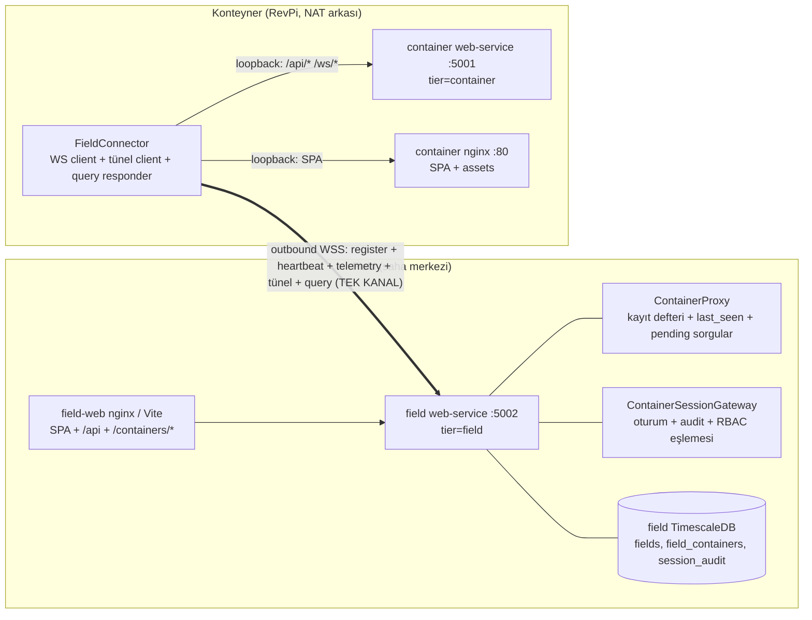
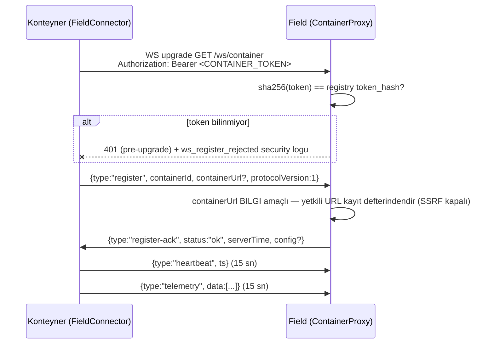
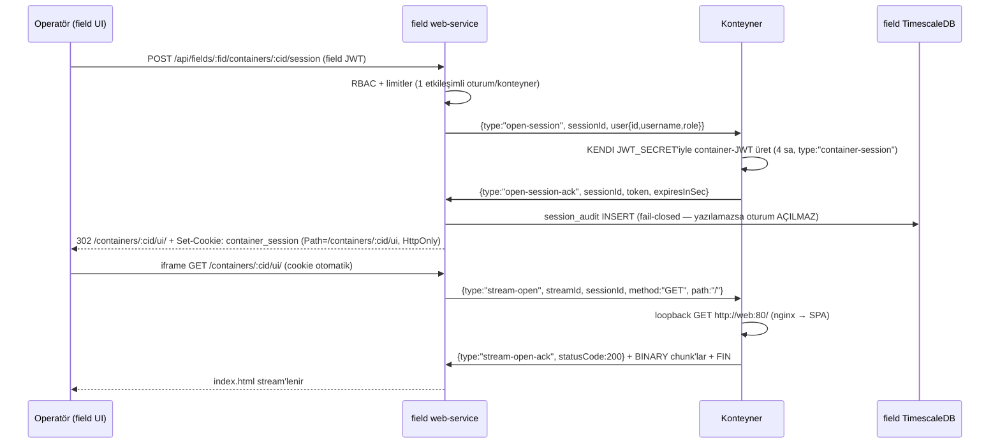

# Konteyner–Field Bağlantı Raporu

**Bağlam:** Bu rapor, konteyner ile field arasındaki bağlantının nasıl kurulduğunu, iki yönlü akışın hangi mekanizmalarla taşındığını, aradaki protokolü ve monorepo'nun "yalnızca config değiştirilerek" çok sayıda projeye yayılması durumunda ortaya çıkabilecek kırılganlıkları özetler. Kaynaklar: [KONTEYNER-UZAKTAN-ERISIM-MIMARISI.md](./KONTEYNER-UZAKTAN-ERISIM-MIMARISI.md) (tasarım), [KONTEYNER-UZAKTAN-ERISIM-DOGRULAMA.md](./KONTEYNER-UZAKTAN-ERISIM-DOGRULAMA.md) (faz kanıtları), canlı dev stack doğrulamaları (2026-08-25/26).

---

## 0. Yönetici özeti

Konteyner **field'ı keşfeder**; field konteynere **asla inbound TCP/HTTP açmaz**. İki taraf arasındaki TEK kanal, konteynerden field'a kurulan **tek bir outbound WebSocket'tir** (`/ws/container`). Kayıt (register), canlılık (heartbeat), telemetri push, uzaktan ekran (tünel) ve tarihsel veri sorguları — hepsi bu tek kanaldan geçer. Uzaktan erişimde field yalnızca kontrol mesajları (JSON frame) gönderir; konteyner bu mesajları kendi iç ağına loopback istek olarak çevirir (SSRF yüzeyi kapalı, NAT/DHCP/IP değişiminden etkilenmeyen model). Güvenlik katmanları: service-token kayıt defteri (hash'li), field JWT + RBAC, kısa ömürlü container-session JWT (Path-scoped cookie), MFA (Faz 6) ve imzalı `session_audit`/log zinciri.



---

## 1. Konteyner → field'a nasıl bağlanır

### 1.1 Bootstrap (env — saha kurulumunda yazılır)

| Env | Varsayılan | Açıklama |
|---|---|---|
| `SERVICE_TIER` | — | `container` olmalı |
| `FIELD_CONNECT_ENABLED` | `false` | FieldConnector'ı aktif eder |
| `FIELD_WS_URL` | — | Field adresi — **virgüllü liste** (ana + yedek); DNS adı önerilir (saha ağında yeniden işaretleme yeterlidir) |
| `CONTAINER_TOKEN` | — | Kurulumda field'a kaydedilen service token (secret) |
| `CONTAINER_ID` | — | Konteynerin tekil kimliği |

`FIELD_CONNECT_ENABLED=true` iken zorunlu env'lerden biri eksikse servis **fail-fast açılışı reddeder** (`fieldConnectorConfig`).

### 1.2 Kayıt akışı (register)



- Token **düz metin tutulmaz**: field DB'de yalnızca `token_hash = SHA-256(token)` vardır; karşılaştırma hash üzerinden yapılır.
- Aynı `CONTAINER_ID` ile ikinci bağlantı gelirse eski soket kapatılır (replace semantiği).

### 1.3 Durum makinesi ve canlılık

```
offline → connecting → registered → connected ↔ backoff
```

- `register-ack` ok + ilk heartbeat → `connected`; hata / 401 / register-timeout → `backoff`.
- Backoff: `exp(2^n·1s) + jitter`, tavan **60 sn** (reconnect fırtınası olmaz). `stop()` → `offline`.
- **Generation koruması:** bayat soketin olayları (açılma/kapanma/mesaj) yok sayılır.
- **Liveness:** her heartbeat'te ping atılır; 60 sn pong yoksa bağlantı "yarı-ölü" sayılır → kapat + backoff.
- Field tarafı: heartbeat ile `lastSeenAt` güncellenir; **45 sn** sessizlik → `"stale"`; WS kapanırsa `"idle"` (kayıt + son telemetri korunur — kademeli bozulma).

### 1.4 Telemetri push

`RealtimeSnapshotSource`: konteynerin `devices` tablosunda `status='online'` cihazlar + RealtimeManager ring buffer'ının başı → (deviceId, name) başına en yeni kayıt → `{type:"telemetry", data:[...]}`. Hata durumunda **boş dizi** gönderilir (kanal kopmaz). Snapshot'a config'ten tag YAZILMAZ — `device_id`/`container_id`/`field_id`/`canonical` yalnızca device-service `TelemetryTagger`'ı üretir.

---

## 2. Field → konteynere nasıl bağlanır

Field'ın konteynere **açtığı hiçbir TCP/HTTP bağlantısı yoktur**. Tüm "erişim" aynı outbound WS üzerinden **kontrol frame'leriyle** taşınır:

### 2.1 Oturum açılışı (uzaktan ekran — iframe)



### 2.2 HTTP/WS köprüleme (tünel)

- `stream-open` frame'i (method, path, headers, upgrade?) → konteyner **loopback** olarak çalıştırır: `/api/*` ve `/ws/*` → `TUNNEL_API_UPSTREAM` (container web-service), diğer her şey → `TUNNEL_STATIC_UPSTREAM` (SPA).
- Yanıt: `stream-open-ack {statusCode, headers}` + **BINARY** gövde parçaları (≤64 KiB) + `FIN` (veya hata → `RST`).
- **Gövde ack'ten ÖNCE gider** — konteyner fetch'i gövde FIN'inden sonra başlatır; aksi sıra karşılıklı bekleme deadlock'u üretiyordu (canlı üreme, S10/d).
- WS akışları için `WS_OP` bayrağı: opcode'lar korunur (JSON kontrol mesajları bozulmadan taşınır); 101 → tarayıcıya 101.
- **Akış kredisi:** pencere 256 KiB; kredi **yarı eşikte** yenilenir; kredi yoksa gövde durur (deadlock koruması + idle sweep).

### 2.3 Yetki ve sınırlar

| Field rolü | Konteyner rolü |
|---|---|
| admin, teknik | admin (veri + komut) |
| boss | guest (salt-okunur) |
| guest | oturum AÇILAMAZ |

- **Allowlist:** `/api/*`, `/ws/*`, `/assets/*`, `/favicon*`, `/`. **Yasaklılar:** `/api/auth/login`, `/api/auth/refresh`, `/api/auth/users` (tünelden brute-force ve hesap yönetimi kapalı).
- **Limitler:** 1 etkileşimli + 1 sistem oturumu/konteyner; TTL 4 sa; idle 15 dk; ≤16 eşzamanlı stream; pencere 256 KiB.
- Field kullanıcısı konteyner DB'sine **asla yazılmaz** — oturum geçicidir.
- Kapatma: `session-end` → store'dan düşer + cookie `Max-Age=0`; field restart'ta bilinen oturumlar için `session-end` yayınlanır; konteyner TTL sweep ile orphan temizler.

### 2.4 Tarihsel veri (Faz 5.1 eki)

Field grafikleri konteynere HTTP açmaz; aynı kanaldan sorar: `telemetry-query {queryId, from, to, points}` → konteyner `telemetry-result {queryId, data[]}` (hata → `telemetry-query-error`). Field tarafı 10 sn bekler; aşımda **boş dizi** (kademeli bozulma — bkz. §4.2 S11).

### 2.5 Canlı config

`register-ack.config` veya `config-update` frame'i ile heartbeat/telemetry aralıkları **restart'sız** uygulanır (zod; bilinmeyen anahtar strip; geçersiz → `field_config_rejected` + eski config korunur).

---

## 3. Protokol — madde madde

1. **Tek uç nokta:** `GET /ws/container` (field tier). Transport WSS; TLS field'da sonlanır.
2. **İki frame sınıfı:** text = JSON kontrol mesajları; binary = akış verisi.
3. **Binary başlık (9 bayt):** `streamId (u32 BE) | seq (u32 BE) | flags` — flags: `FIN 0x01`, `RST 0x02`, `WS_OP 0x04`; WS_OP varken yüksek 4 bit opcode (0x0 veri, 0x1 text, 0x2 binary, 0x8 close, 0x9 ping, 0xA pong).
4. **streamId** field atar (monoton); **seq** her iki tarafça AYRI sayaçtır (teşhis amaçlı).
5. **Kontrol mesajları:**

| type | Yön | Alanlar |
|---|---|---|
| `register` | C→F | `containerId`, `containerUrl?`, `protocolVersion` |
| `register-ack` | F→C | `status`, `serverTime`, `config?` |
| `config-update` | F→C | `config` |
| `heartbeat` | C→F | `ts` (15 sn; 45 sn yok = stale) |
| `telemetry` | C→F | `data: TelemetryData[]` |
| `open-session` | F→C | `sessionId`, `user{id,username,role}` |
| `open-session-ack` | C→F | `sessionId`, `token`, `expiresInSec` |
| `session-end` | F→C | `sessionId`, `reason` |
| `stream-open` | F→C | `streamId`, `sessionId`, `method`, `path`, `headers`, `upgrade?` |
| `stream-open-ack` | C→F | `streamId`, `statusCode`, `headers` |
| `stream-window` | F↔C | `streamId`, `credit` |
| `stream-close` | F↔C | `streamId`, `reason` |
| `error` | F↔C | `code`, `message` |
| `telemetry-query` | F→C | `queryId`, `from`, `to`, `points` (Faz 5.1) |
| `telemetry-result` | C→F | `queryId`, `data[]` (Faz 5.1) |
| `telemetry-query-error` | C→F | `queryId`, `message` (Faz 5.1) |

6. **Sıralama kuralları:** register → ack → ilk heartbeat (`connected`); oturum: `open-session` → ack → cookie → stream-open; HTTP akışı: gövde FIN → ack (deadlock koruması); WS köprüsü: 101 → çift yönlü WS_OP.
7. **Backpressure:** `stream-window` kredisi tükenince gövde durur; kredi yarı eşikte yenilenir; kredisiz takılan akışları idle sweep kapatır.
8. **Hata yayılımı:** WS kopması = o konteynerin tüm oturum/stream'lerine RST + iframe'e hata sayfası; PPC anında güncellenir.
9. **Güvenlik:** service-token hash karşılaştırması (pre-upgrade 401), field JWT + RBAC (Faz 1), container-session JWT (konteynerin KENDİ secret'i — field içeriği görmez), MFA + hesap kilidi (Faz 6), imzalı `session_audit`.
10. **Geriye uyumluluk:** `protocolVersion` ile sürümlü; rathole fallback aynı yol için tasarlandı (`TUNNEL_BACKEND` anahtarı — §12.1).

---

## 4. Çoklu-proje kırılganlıkları ("config-only" yayılım riskleri)

Üç grup: **(A)** config ile tetiklenen, **(B)** ölçek/davranışla tetiklenen (config'den bağımsız), **(C)** operasyonel.

### 4.1 A — Yapılandırma kaynaklı kırılganlıklar

| # | Belirti | Kök neden | Azaltma / öneri |
|---|---|---|---|
| A1 | Container-session JWT'lerinin taklit edilebilmesi | Container tier `JWT_SECRET` için fail-fast YOK (field/boss'ta var) — default `dev-secret-change-in-production` tüm konteynerlerde aynı kalırsa, bir konteynerin secret'ini bilen başka konteyner için de session JWT üretebilir | Her projede container tier'a da özgü `JWT_SECRET` zorunluluğu (field/boss fail-fast deseni container tier'a taşınmalı — Faz 6.1 adayı) |
| A2 | Zayıf başlangıç parolaları | Container tier seed şifreleri env'siz çalışır (admin123); T1.6 zorunlu değişim var ama kurulum ile değişim arasında pencere açık | Kurulum şablonunda `SEED_*_PASSWORD` container tier'da da zorunlu kılınsın |
| A3 | Yanlış sahaya veri / bağlantı kaçırma | Aynı `CONTAINER_ID` iki konteynerde: registry tek satır, eski bağlantı replace ile kapanır; kullanıcı hangisini gördüğünü bilmez | Register sırasında saha/token çakışma uyarısı + kurulumda ID benzersizlik kontrolü |
| A4 | Tünel sessizce çalışmaz | Bayat `FIELD_WS_URL`/`TUNNEL_STATIC_UPSTREAM` (canlı vaka: ölü 5199 portu → `fetch-error`; Vite dev sunucusu subpath'te çalışmaz — mutlak modül URL'leri) | Kurulum smoke script'i (register → heartbeat → tünel `GET /` 200) + upstream erişilebilirliğinin `/health`'e yansıması |
| A5 | UI alanları sessizce boş kalır | `canonical` tag sözleşmesi config YAZARININ insafında: canonical verilmez/yanlışsa grafikler ve kartlar boş (canlı: SOC/Power gibi mock adları gerçek config'te yok) | Config şema/doğrulama aracı canonical'ı bilinen adlar için zorunlu tutmalı (veya kurulum doğrulama aracı uyarı üretsin) |
| A6 | Yanlış MFA/kilit profili | `AUTH_MFA_REQUIRED_ROLES` container'da boş, field'da `admin,teknik`; `AUTH_LOGIN_*` değerleri kiosk/ortak terminal senaryosunda operatörü kilitleyebilir | Müşteri profiline göre rol/güvenlik ayarları şablonu; kilitli hesabı açma prosedürü dokümante edilmeli |
| A7 | Bildirim sessizce YOK | `LOG_EXTRA_SINKS`/`LOG_SMTP_*`/`LOG_SMS_*` boşsa bildirim üretilmez — fail-closed değil, sessiz eksiklik | Kurulum kabul listesine "uyarı testi" adımı (sentetik `login_locked` olayı → mail/SMS doğrulaması) |
| A8 | E2E yeni projede çalışmaz | `e2e/field-flow.spec.ts` ve `tunnel.spec.ts` içindeki `FIELD_ID`/`CONTAINER_ID` bu projeye özgü sabitler (env override var ama varsayılan sabit) | Tüm e2e kimlikleri env zorunlu (varsayılan yok) yapılsın |
| A9 | İmaj pinleri bayatlar/kırılır | T6.4 digest'leri bu repo'nun tarihli sürümleri; yeni projede farklı registry/builder kullanılırsa pinler geçersiz | Pin güncelleme politikası (renovate benzeri) + `security.yml` her projeye taşınmalı |

### 4.2 B — Ölçek/davranış kaynaklı kırılganlıklar

| # | Belirti | Kök neden | Azaltma / öneri |
|---|---|---|---|
| B1 | Asılı istekler / deadlock / stream tavanı | Custom multiplexing en riskli bileşen; canlıda üremiş hatalar: kredi eşiği pencereyle hizalı (S10a), FIN sonrası state temizlenmiyordu → 16 tavan dolunca `max-streams` (S10b) | Testli + düzeltildi; ama N konteyner canlı yük kanıtı yok → k6 perf/kaos paketi üretime girmeden genişletilmeli |
| B2 | Yarım oturumlar / orphan session | Field restart → session state kaybı; konteynerde orphan (kırılganlık #3) | İki taraflı TTL sweep + açılışta `session-end` yayını var; çok sahalı üretim doğrulaması yapılmalı |
| B3 | Oturum erken biter / açılmaz | Saat kayması → container-JWT TTL yanlış değerlendirilir (kırılganlık #5) | NTP dokümanı (T6.3) prosedür; otomatik sapma izleme eklenmeli (heartbeat `ts` ile field saati farkı) |
| B4 | Session/auth kırılması | Tünelde localStorage anahtar çakışması (kırılganlık #1) — hash router + sessionStorage ile kapatıldı; ama pathname/hash karışması canlıda regresyon üretti (`/change-password` 404 vakası) | Yeni proje route yapısı değiştiğinde api-base/tünel tespiti testleri mutlaka koşulmalı (regresyon seti mevcut) |
| B5 | Grafikler boş — "veri yok" | **S11:** ham downsampled sorgu hypertable'ı tarıyor (BSC ~59M satır/24 sa; `DISTINCT name` ~80 sn; bucket sorgusu 9–12 sn/cihaz); field'ın 10 sn timeout'u boş dizi döndürüyor. Daha hızlı poll / daha çok cihaz = daha kötü | CA view yolu (`getDownsampledData` → `selectView`) veya `(name,unit)` index'i — **Faz 5.2'de öncelikli**; çoklu-proje ölçeklemesinden önce mutlaka kapatılmalı |
| B6 | Büyük frame'lerde bellek/parçalama riski | Telemetri snapshot büyük (BSC ~960 isim ≈ 500 KB tek `telemetry` frame'i); `@fastify/websocket` soketi `maxPayload: 0` (SINIRSIZ) kuruyor — isim sayısı/cihaz arttıkça tek frame MB'lere çıkar, Redis fan-out ve tarayıcı tarafı yükü artar | Bilinçli `maxPayload` sınırı + isim sayısı başına sağlık metriği + snapshot'ı parçalı gönderme değerlendirmesi |
| B7 | Redis bellek büyümesi | Ring buffer trim'i `Math.max(299, dataList.length)` — isim × cihaz × saha kadar Redis'ta tutulur; Redis tek nokta (AOF var) | Saha başına boyut hesabı + maxmemory politikası dokümante edilsin |
| B8 | "Cihazlarım kayboldu" şikayeti | Field tier'da `devices` tablosu YOK (B3): liste yalnızca snapshot'tan türetilir — **offline cihazlar hiç görünmez** | Offline cihazların da listelenmesi (son görülme ile) Faz 5.2 adayı |
| B9 | Operatör giriş yapamaz | Login throttle Redis'e bağlı: Redis down → tüm girişler reddedilir (bilinçli fail-closed) — kesinti penceresinde kilitlenme | Redis HA/uyarı + acil durum yerel bypass prosedürü |
| B10 | Yeni cihaz tipi UI'da "unknown" | Tip önek eşlemesi (`DEVICE_TYPE_BY_PREFIX`) ve i18n (tr/en) sabit; yeni cihaz/dil eklenince eksik görünüm | Önek tablosu config'e taşınabilir; dil paketi genişletme prosedürü |
| B11 | Komutlar sessizce kırılır | `commands.telemetries[].name` cihaz config'teki telemetri ADLARINA bağlı; ad yeniden adlandırılırsa yazım başarısız olur ama kurulumda yakalanmaz | Config yüklemede komut→telemetri referans doğrulaması (device-service açılışında) |
| B12 | Yalancı kırmızı test | `field-connector.spec.ts` gerçek-WS zamanlama testi paralel koşuda flaky (2026-08-26 gözlendi) | CI'da bu spec için retry/izolasyon |

### 4.3 C — Operasyonel kırılganlıklar

| # | Belirti | Kök neden | Azaltma / öneri |
|---|---|---|---|
| C1 | Tek field N konteyneri taşır mı bilinmiyor | 30 konteyner reconnect kaosu test düzeyinde; canlı yük/ölçek testi YOK (perf hedefleri: 1 MB asset, 16 stream — k6 paketi var ama müşteri senaryosu koşulmadı) | Proje başına konteyner tavanı belirle + yük testi kabul kriteri |
| C2 | Saha ziyareti gerektiren güncellemeler | OTA (pull-tabanlı imaj güncelleme) plan aşamasında (tasarım 6.1) — N projede bakım maliyeti artar | OTA'yı üretim öncesi planlamak (Faz 6.1/6.2) |
| C3 | Denetim izi şişmesi | `log_events`/`session_audit` için retention politikası telemetri tabloları kadar açık değil | Log tabloları için retention/compression politikası + depolama hesabı |
| C4 | Çift arayüz modu hazır değil | WAF yalnızca dokümantasyon (T6.6 — kullanıcı onaylı); VPN'siz yayın istenirse ön koşul tamamlanmamış | Domain yayını kararı öncesi `waf-onerisi.md` uygulama planına çevrilmeli |

---

## 5. Referanslar

- `docs/architecture/KONTEYNER-UZAKTAN-ERISIM-MIMARISI.md` — tasarım (fazlar, güvenlik modeli §3, protokol §4, oturum §5, kırılganlık tablosu §12.2)
- `docs/architecture/KONTEYNER-UZAKTAN-ERISIM-DOGRULAMA.md` — faz kanıtları + S4–S11 canlı sapma kayıtları
- `docs/architecture/FAZ5-OZET-VE-BAGLANTI-ANATOMISI.md` — bağlantı anatomisi özeti
- `docs/standards/owasp-asvs-level2.md`, `docs/standards/nis-2.md` — güvenlik standartları eşlemesi
- `TESTING.md` §8 — test katmanları ve faz kapıları
- `AGENTS.md` — FieldConnector/tünel/canonical/alarm sözleşmeleri (kod kısıtları)
