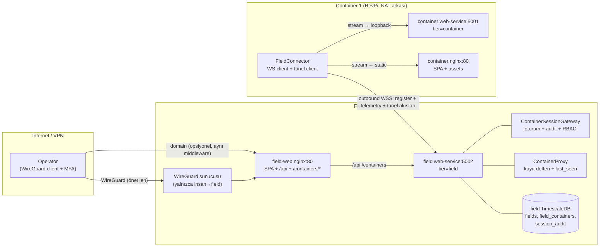
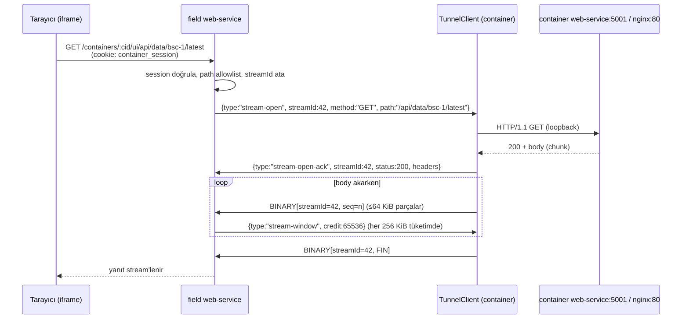
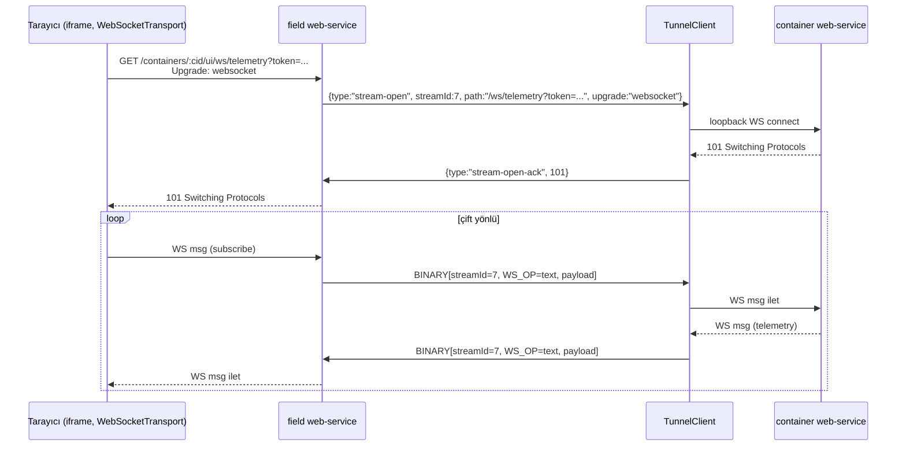
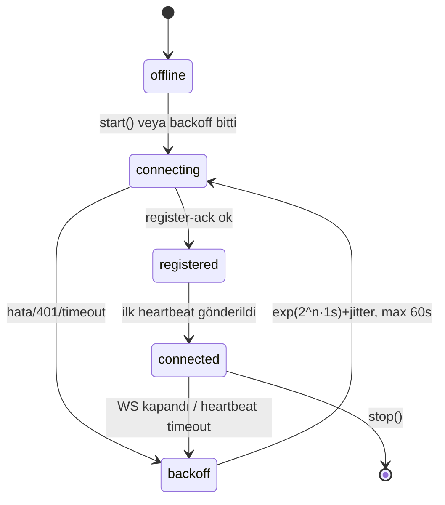
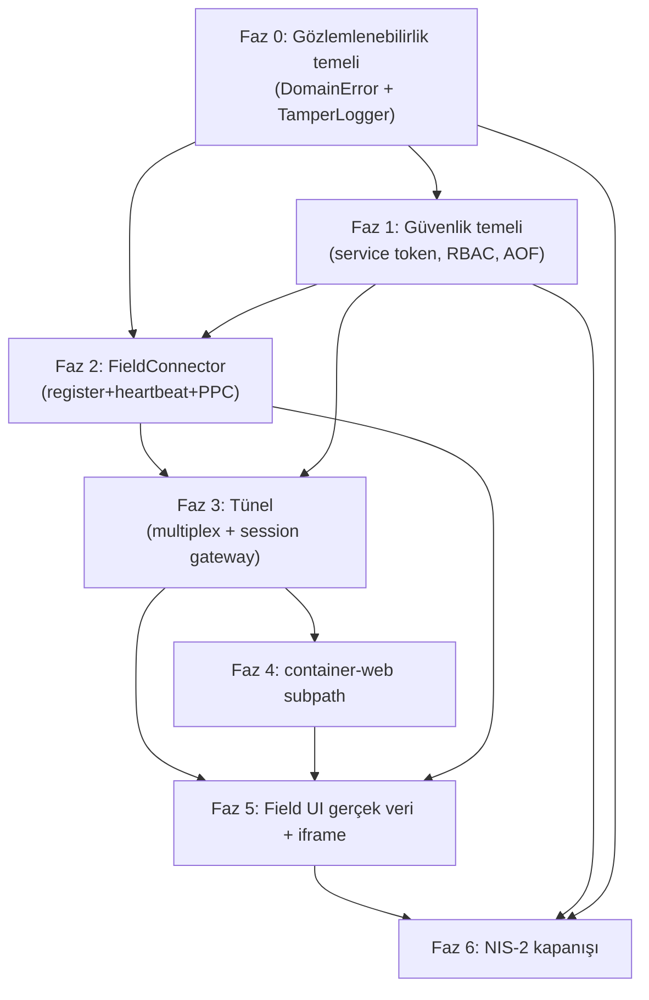
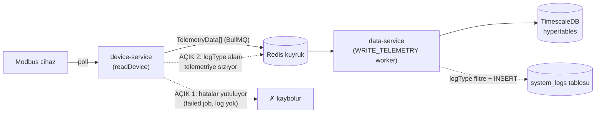

# Konteyner Uzaktan Erişim Mimarisi (Remote Container UI)

Tarih: 2026-08-19
Durum: Onaylanmış tasarım — uygulama bekliyor
İlgili dokümanlar: [KONTEYNER-FIELD-MIMARI-DEGERLENDIRMESI.md](./KONTEYNER-FIELD-MIMARI-DEGERLENDIRMESI.md), [field-superadmin-architecture.md](./field-superadmin-architecture.md)

## 1. Amaç ve Gereksinimler

Sahalar genellikle personelsiz çalışır. Operatör, field uygulaması üzerinden konteyner ekranlarını (container-web SPA) uzaktan görüntüleyip kullanabilmelidir — konteyner uygulaması yerinde kalarak.

| # | Gereksinim |
|---|------------|
| R1 | Field UI'da keşfedilmiş konteynerler kart olarak listelenir (PPC + özet) |
| R2 | Karta tıklayınca özet sayfa: gauge'ler, grafikler, durum |
| R3 | "Tam Ekran" butonu ile konteyner UI'sının tamamı field içinde alt uygulama olarak açılır (Grafana dashboard benzeri UX) |
| R4 | Konteyner backend/frontend'i field'a taşınmaz — konteynerde kalır |
| R5 | "Konteyner field'ı keşfeder" (outbound-only) modeli korunur |
| R6 | Erişim yetkili kullanıcılara açıktır; VPN önerilen ağ katmanıdır ama zorunlu değildir (çift arayüz modu — bkz. 3.4) |
| R7 | NIS-2 (Enerji — essential entity) uyumu: kimlik doğrulama, yetkilendirme, audit, MFA, tedarik zinciri |

## 2. Mimari Özet1



**Temel ilke:** Konteyner→field arasında tek bir outbound WebSocket vardır; telemetri, PPC heartbeat ve uzaktan erişim tüneli **aynı kanaldan** geçer. Field'dan konteynere inbound TCP/HTTP yoktur — NAT/DHCP/IP değişiminden etkilenmeyen model korunur.

## 3. Güvenlik Modeli

### 3.1 Katmanlar

| Katman | Mekanizma |
|--------|-----------|
| Ağ | Konteynerler internete hiç açılmaz; field'a yalnızca WireGuard ile insanlar ulaşır; konteynerler VPN'e girmez |
| Servis-servis | Her konteynere kurulumda verilen service token (hash'li saklanır); `/ws/container` register'ı doğrular |
| Kullanıcı | Field JWT (`fieldIds`'li) + RBAC; oturum açarken rol eşlemesi |
| Uygulama | Kısa ömürlü container-JWT cookie (Path-scoped); konteyner kendi RBAC'ini uygular |
| Hesap | MFA (TOTP) + başarısız giriş kilidi |
| İzleme | `session_audit` + yapılandırılmış log |

### 3.2 Service token doğrulama

- Kurulumda: `POST /api/fields/:fieldId/containers/:containerId/register {containerUrl, token}` → field DB `field_containers.container_url` + `token_hash = SHA-256(token)` yazar.
- Bağlanırken: konteyner WS upgrade'inde `Authorization: Bearer <token>` gönderir; field `sha256(presented) == token_hash` karşılaştırır.
- `register` mesajındaki `containerUrl` bilgi amaçlıdır; **yetkili URL kayıt defterindendir** — self-reported URL trust edilmez (SSRF yüzeyi kapatılır).

### 3.3 NIS-2 Madde 21(2) eşlemesi

| NIS-2 şartı | Uygulama |
|-------------|----------|
| (a) Risk analizi ve güvenlik politikaları | Bu doküman + tehdit modeli |
| (b) Olay müdahalesi | `session_audit` + TamperLogger (Faz 0), 24/72 saat bildirim prosedürü, dış SIEM (T6.2) |
| (c) İş sürekliliği | Redis AOF, container edge otonomisi, yedekleme |
| (d) Tedarik zinciri güvenliği | Image pinleme, bağımlılık/CVE tarama, üçüncü taraf envanteri |
| (e) Geliştirme güvenliği | PR süreci, vuln yönetimi, CI test workflow'u |
| (f) Etkinlik değerlendirmesi | Audit log periyodik incelemesi, `verify-log.mjs` doğrulama, sızma testi |
| (g) Hijyen ve eğitim | Kullanıcı eğitim programı |
| (h) Kripto | TLS (WSS), JWT, token rotasyonu, SHA-256 |
| (i) Erişim kontrolü | RBAC tamiri (Faz 1), `fieldIds` JWT'de, rol eşlemesi |
| (j) MFA / güvenli iletişim | WireGuard + TOTP, WSS |

### 3.4 VPN'siz çalışma (çift arayüz modu)

Mimari VPN'e bağımlı değildir — VPN yalnızca ağ katmanıdır; tünel, auth, RBAC ve oturum modeli onsuz da çalışır. Field web-service aynı güvenlik middleware'iyle hem VPN ağında hem internet domain'inde dinleyebilir; konteynerler yine inbound almaz (outbound-only bozulmaz).

VPN'siz modda **zorunlu ek önlemler:** rate-limit + hesap kilidi, MFA (TOTP), TLS, WAF, düzenli bağımlılık güncellemesi. NIS-2 açısından halka açık essential entity = artan denetim yükü; mimari buna hazır fakat VPN önerilen mod olarak kalır.

## 4. WS Kontrol Kanalı Protokolü

**Uç nokta:** `GET /ws/container` (field tier). Transport: WSS (TLS field uç noktasında sonlanır).

**İki frame sınıfı:**
- **Text frames** = kontrol mesajları (JSON)
- **Binary frames** = akış verisi (ham bayt, 9 bayt başlık)

### 4.1 Kontrol mesajları (JSON)

| type | Yön | Alanlar | Açıklama |
|------|-----|---------|----------|
| `register` | C→F | `containerId`, `containerUrl?`, `protocolVersion` | İlk mesaj; auth header ile |
| `register-ack` | F→C | `status`, `serverTime`, `config?` | Doğrulama sonucu + opsiyonel operational config |
| `config-update` | F→C | `config` | Canlı operational config push — yeniden başlatma gerektirmez |
| `heartbeat` | C→F | `ts` | 15 sn'de bir; 45 sn sessizlik = stale |
| `telemetry` | C→F | `data: TelemetryData[]` | En güncel snapshot |
| `open-session` | F→C | `sessionId`, `user{id,username,role}` | Oturum isteği |
| `open-session-ack` | C→F | `sessionId`, `token`, `expiresInSec` | Kısa ömürlü container JWT'si |
| `session-end` | F→C | `sessionId`, `reason` | Oturum kapat |
| `stream-open` | F→C | `streamId`, `sessionId`, `method`, `path`, `headers`, `upgrade?` | Yeni HTTP/WS akışı |
| `stream-open-ack` | C→F | `streamId`, `statusCode`, `headers` | Yanıt başladı |
| `stream-window` | her iki yön | `streamId`, `credit` | Akış kredisi (backpressure) |
| `stream-close` | her iki yön | `streamId`, `reason` | Akış sonu |
| `error` | her iki yön | `code`, `message` | Protokol hatası |

### 4.2 Binary akış frame'i (9 bayt başlık)

```
 0        4        8   9
┌────────┬────────┬───┬────────────────────────┐
│ streamId (u32 BE) │ seq (u32 BE) │flags│ payload (ham bayt)
└────────┴────────┴───┴────────────────────────┘
  flags: 0x01 FIN · 0x02 RST · 0x04 WS_OP
  WS_OP varken sonraki 4 bit opcode: 0x0 veri, 0x1 text, 0x2 binary,
                                     0x8 close, 0x9 ping, 0xA pong
```

- `streamId`: oturum açan taraf (field) atar, monoton artan.
- `seq`: akış içi sıra (güvenilir WS üzerinde kayıp olmaz; teşhis amaçlı).
- `WS_OP`: tünel WS akışlarında mesaj sınırları ve opcode'lar korunur (JSON kontrol mesajları bozulmadan taşınır).

### 4.3 Register + heartbeat akışı

```mermaid
sequenceDiagram
  participant C as Container (FieldConnector)
  participant F as Field (ContainerProxy)

  C->>F: WS upgrade /ws/container<br/>Authorization: Bearer &lt;token&gt;
  F->>F: sha256(token) == registry token_hash?
  alt token geçersiz
    F--xC: 401 kapat
  end
  C->>F: {type:"register", containerId, containerUrl, protocolVersion:1}
  F->>C: {type:"register-ack", status:"ok", serverTime}
  loop 15 sn
    C->>F: {type:"heartbeat", ts}
    F->>F: lastSeenAt = now()
  end
  loop N sn
    C->>F: {type:"telemetry", data:[...]}
    F->>F: RAM'de latest güncelle + observer'ları tetikle
  end
  Note over F: 45 sn heartbeat yoksa → status=stale<br/>WS kapanırsa → status=idle (PPC false)
```

## 5. Oturum Tüneli (Session Tunnel)

### 5.1 Oturum açılışı ve iframe akışı

```mermaid
sequenceDiagram
  participant U as Operatör (field UI)
  participant F as field web-service
  participant C as Container (TunnelClient + web-service)
  participant DB as field TimescaleDB

  U->>F: POST /api/fields/:fid/containers/:cid/session (JWT)
  F->>F: RBAC: admin/teknik/boss? fieldIds içeriyor mu?<br/>limitler: 1 etkileşimli oturum/konteyner
  F->>C: {type:"open-session", sessionId, user}
  C->>C: kendi JWT_SECRET ile container-JWT üret (4h TTL)<br/>in-memory session kaydet
  C->>F: {type:"open-session-ack", token}
  F->>DB: session_audit INSERT
  F-->>U: 302 /containers/:cid/ui/<br/>Set-Cookie: container_session=JWT; Path=/containers/:cid/ui; HttpOnly; Secure
  U->>F: iframe: GET /containers/:cid/ui/ (cookie otomatik)
  F->>C: {type:"stream-open", path:"/", upgrade:false}
  C->>C: loopback GET http://web:80/ (nginx → SPA)
  C->>F: {type:"stream-open-ack", 200} + binary chunk'lar + FIN
  F-->>U: index.html stream'lenir
```

### 5.2 Tünel üzerinden HTTP isteği (genel)



### 5.3 WS upgrade akışı (iframe içi gerçek zamanlı telemetri)



### 5.4 Çerez modeli

- `container_session` cookie'si **Path-scoped** (`/containers/<cid>/ui`): yalnızca iframe isteklerinde taşınır; field app'in kendi JWT'sine karışmaz.
- Cookie değeri = **container'ın kendi imzaladığı JWT** — field içeriğini görmez, secret paylaşımı yok.
- Container web-service'te yeni middleware: cookie → session store → `request.user` doldur; mevcut `PrivateRoute`/API'ler değişmeden çalışır.
- **localStorage izolasyonu (kritik):** Tünelde container-web, field app ile aynı origin'dedir ve `auth-token`/`auth-storage` anahtarları çakışır — localStorage origin-scoped'tur, Path'e bakmaz. Tünel modunda container-web **yalnızca sessionStorage + özel anahtarlar** kullanır; axios 401-refresh akışı kapalıdır (401 = "oturum kapandı" → iframe kapanır). Field'ın token'ları asla ezilmez.

### 5.5 RBAC eşlemesi (field rolü → container rolü)

| Field rolü | Container rolü | Yetki |
|------------|----------------|-------|
| `admin`, `teknik` | `admin` | veri + komut (`/api/commands` dahil) |
| `boss` | `guest` | salt-okunur |
| `guest` | — | oturum açılamaz |

### 5.6 Limitler ve audit

- 1 etkileşimli + 1 sistem oturumu/konteyner; TTL 4 saat; idle 15 dk; eşzamanlı stream ≤ 16/oturum; akış penceresi 256 KiB.
- Path allowlist: `/api/*`, `/ws/*`, `/assets/*`, `/favicon*`, `/` (SPA). **Yasaklılar:** `/api/auth/login`, `/api/auth/refresh`, `/api/auth/users` — tünelden brute-force ve hesap yönetimi kapalı.
- `session_audit`: başlangıç/bitiş, kullanıcı, roller, byte sayaçları, kapanma nedeni, IP.

```sql
CREATE TABLE session_audit (
  id BIGSERIAL PRIMARY KEY,
  field_id UUID REFERENCES fields(id),
  container_id TEXT NOT NULL,
  session_id TEXT NOT NULL,
  username TEXT NOT NULL,
  field_role TEXT NOT NULL,
  container_role TEXT NOT NULL,
  started_at TIMESTAMPTZ NOT NULL DEFAULT now(),
  ended_at TIMESTAMPTZ,
  bytes_in BIGINT NOT NULL DEFAULT 0,
  bytes_out BIGINT NOT NULL DEFAULT 0,
  end_reason TEXT,
  remote_ip TEXT
);
```

### 5.7 Oturum yaşam döngüsü ve iptal

- **Açılış:** field JWT doğrula → `open-session` → container kendi secret'iyle JWT üret → cookie. Field kullanıcısı **container DB'sine asla yazılmaz** — container kullanıcı tablosu yalnızca yerel kullanıcıları içerir; uzak operatörler geçici oturumdur.
- **Kullanım:** cookie → container middleware → `ContainerSessionStore` → `request.user` (eşlenmiş container rolüyle) → mevcut RBAC.
- **İptal:** field `session-end` frame'i → container store'dan düşer + cookie `Max-Age=0`; TTL 4 saat ve idle 15 dk otomatik kapatır.
- **Field restart:** açılışta bilinen açık oturumlar için `session-end` yayınlanır; container tarafı periyodik TTL sweep ile orphan session temizler.
- **Sağlamlık:** WS kopması = o konteynerin tüm oturumları/stream'leri RST ile kapatılır; iframe'e hata sayfası gösterilir.

## 6. FieldConnector (container tarafı — yeni modül)

Konum: `services/web-service/src/infrastructure/field-connector/` (container tier'da, `FIELD_CONNECT_ENABLED=true` ise awilix'te aktif).



Sorumluluklar:
1. `FIELD_WS_URL`'e outbound WSS (`ws` paketi mevcut), `CONTAINER_TOKEN` ile.
2. register + 15 sn heartbeat + telemetry snapshot push.
3. **TunnelClient** (aynı modülde): `stream-open` frame'lerini alır, stream'leri iki upstream'e dağıtır:
   - `/api/*`, `/ws/*` → `http://web-service:5001` (container tier web-service)
   - diğer her şey → `http://web:80` (container nginx — SPA + assets)
   - Undici fetch stream'lerini binary frame'lere böler; `stream-window` kredisiyle backpressure uygular.
4. PPC durumu: `GET /api/status` → `{fieldConnected, state, lastHeartbeatAt}` — container UI `SystemHeader`'ı besler.
5. `open-session` frame'lerinde: container JWT üret + in-memory `ContainerSessionStore`'a kaydet.

### 6.1 Config yönetimi (sahaya gitmeden değişiklik)

Bir `.env` değişikliği 1000 km'lik saha ziyareti gerektirmemeli. Ayrım:

| Katman | İçerik | Nasıl değişir |
|--------|--------|---------------|
| **Bootstrap config (minimal env)** | `SERVICE_TIER`, `FIELD_WS_URL`, `CONTAINER_TOKEN`, `FIELD_CONNECT_ENABLED` | `FIELD_WS_URL` bir **DNS adı** olmalı (`field.local`) — saha ağındaki DNS/yönlendirici yeniden işaretlenirse adres değişir, konteynere dokunulmaz. Ayrıca ana + yedek field URL listesi desteklenir (sırayla denenir). |
| **Operational config (canlı)** | heartbeat aralığı, telemetry sıklığı, oturum limitleri, path allowlist, RBAC eşlemesi, log seviyesi | Field DB'de tutulur; `register-ack` içinde veya `config-update` frame'iyle bağlı container'a anında push edilir. Container memory'de uygular — **restart yok.** Değişiklik = field DB'de bir satır. **Faz 2 durumu (2026-08-25):** container tarafı + `ContainerProxy.pushConfigUpdate` pass-through tamam; field DB saklaması + admin push endpoint'i Faz 3/6'ya ertelendi (bkz. DOGRULAMA S5) |
| **Uç durum: servis restartı** | — | Tünel açıkken dar kapsamlı `POST /api/admin/system/restart` (imzalı + onaylı): komut **önce ACK gönderir, 2 sn sonra kapanır** — komutu taşıyan tünel ölmeden cevap döner. |
| **İmaj güncelleme (OTA)** | — | Pull-tabanlı: container, field'daki registry'den yeni imaj sürümünü çeker ve kendini günceller (compose pull + up). |

Kural: runtime değerleri **asla** Vite `VITE_*` build-time değişkenlerine gömülmez (mevcut `WS_URL=ws://localhost:5001` bug'ının kök nedeni budur).

## 7. container-web değişiklikleri

| Değişiklik | Dosya | Neden |
|------------|-------|-------|
| `base: "./"` | `apps/container-web/vite.config.ts` | Asset'ler göreli → her subpath'te çalışır |
| Hash router | `src/app/router.tsx` | `/containers/:cid/ui/#/dashboard` — server rewrite gerekmez; desktop ile birleşme |
| WS URL türetimi | `src/contexts/TransportContext.tsx` | Build-time `ws://localhost:5001` gömülmesi kalkar; `window.location`'dan türetilir |
| Tünel modu auth | yeni `src/features/auth/session-auth.ts` | `container_session` cookie varsa `GET /api/auth/session` ile AuthStore hydrate — login ekranı atlanır |
| PPC besleme | `src/layouts/MainLayoutV2.tsx` + yeni hook | `ppcConnected` prop'u (bugün `SystemHeader.tsx` default false) |
| Etiket | i18n | Kullanıcıda "Field Bağlantısı" (PPC = Power Plant Controller çakışması) |

## 8. Field UI değişiklikleri

| Sayfa | Değişiklik |
|-------|------------|
| `ContainersPage` | Mock kaldır → `fieldApi.containers()` (React Query): PPC + latest + PCS eşlemesi |
| `ContainerDetailPage` | Özet: `DeviceGauges` + `TelemetryChart` (tünelden downsampled) + PCS kartı + **"Tam Ekran Aç" butonu** |
| Tam ekran | Yeni `ContainerFrame` bileşeni: `iframe src=/containers/:cid/ui/` + kapatma (session-end) + audit |
| Diğer sayfalar | Mock'lar kaldır → gerçek endpoint'ler |

nginx (field) — `apps/field/deployment/Dockerfile`'a eklenecek location:

```nginx
location /containers/ {
  proxy_pass http://web-service:5002;
  proxy_http_version 1.1;
  proxy_set_header Upgrade $http_upgrade;
  proxy_set_header Connection "upgrade";
  proxy_set_header Host $host;
  proxy_read_timeout 3600s;
  proxy_send_timeout 3600s;
}
```

Vite dev proxy'sine de `/containers` → `http://localhost:5002` eklenir.

## 9. Uygulama Fazları



### Faz 0 — Gözlemlenebilirlik ve Hata Yönetimi Temeli

**Hedef:** Tüm katmanlarda ortak hata taksonomisi + tamper kanıtlı, config tabanlı, çok kaynaklı log altyapısı. Tünel ve güvenlik işleri bunun üzerine kurulur.

**TDD ilkesi:** Tüm T0.x görevleri test-önce geliştirilir (JSDoc kontratı → kırmızı test → implement; bkz. AGENTS.md TDD + TESTING.md §8). Güvenlik-kritik modüllerde ≥%90 branch kapısı. Değiştirilen legacy modüller (`bullmq-adapter.ts`, `device-service.ts`, `data-service.ts`) önce karakterizasyon testleriyle sabitlenir. `packages/shared-utils` test hedefi (bugün exit 1) T0.5 ConfigLoader entegrasyonundan ÖNCE düzeltilir.

**Tasarım kararları (2026-08-19, onaylı):**
- Tamper kanıtı: HMAC-SHA256 + `prevHash` zinciri; dosya sink append-only + fsync; `tools/verify-log.mjs` doğrulama aracı (NIS-2 denetimlerinde)
- MVP sink'ler: Console + Dosya + Timescale; syslog/ES/webhook Faz 6'da. Mail/SMS sink değil — `AlertNotifier` (kural + cooldown: aynı `eventCode` 5 dk'da 1 bildirim)
- Frontend: hata + kullanıcı etkileşimi, batch'li, rate-limit'li; `app` kategorisi (**fail-closed değil** — güvenilmez kaynak)
- Drop politikası: `audit/security` → **fail-closed** (loglanamazsa işlem reddedilir); `error` → drop + sayaç + health; `debug/info` → drop

**Hata taksonomisi:**

| Kategori | Örnek | Davranış | Log seviyesi |
|----------|-------|----------|--------------|
| Beklenen alan hatası | zod validation, 404, yetkisiz, iş kuralı reddi | **`Result<T,E>` ile döner (throw yok)**; sınırda 4xx'e map; retry yok | info |
| Geçici altyapı hatası | Redis/DB bağlantı, Modbus timeout, WS kopması | **Sahibi** (adapter) backoff ile N kez retry; tükenince `TransientError` fırlatır | warn (retry bitince) |
| Kalıcı altyapı hatası | Schema hatası, disk dolu, config geçersiz | Fırlat + health düşür + alert kuralı | error |
| Hata/bug (fault) | Invariant ihlali, beklenmeyen exception | Bağlam zenginleştir → sınıra ilet → 500 + health | error/fatal |
| Güvenlik olayı | Başarısız login, sahte token, rate-limit, session anomalisi | Ayrı `security` kanalı — SIEM'e birebir; fail-closed | security |

**Katman sorumlulukları:** `packages` hata **üretir** (typed `DomainError`: `code, kind, retryable, context, cause`) ve retry'ı kaynağında yapar; `services` **loglar** (kural: bir hata bir kez loglanır — sınırda; Fastify `setErrorHandler` + BullMQ `onFailed`); `apps` üretmez, `ClientLogger` ile iletir; `deployment` politika verir (config).

| # | Görev | Dosya |
|---|-------|-------|
| T0.1 | `LogEvent` şeması: `ts, level, category(app\|audit\|security), eventCode, message, context, correlationId, service, host, seq, prevHash, signature` + başlangıç eventCode seti (`login_failed`, `session_open`, `command_executed`, `ws_register_rejected`, …). Mevcut `LogEntry` UI terminali için geriye uyumlu kalır | `packages/shared-types/src/log.ts` (genişlet) |
| T0.2 | `DomainError` hiyerarşisi (`ValidationError, NotFoundError, UnauthorizedError, ForbiddenError, ConflictError, TransientError, FatalError`) + `Result<T,E>` (beklenen hatalar için — bkz. Faz 0 ek 2) | yeni `packages/core/src/errors/` |
| T0.3 | `TamperLogger`: pipeline filter → redact → enrich (servis/corrId/seq) → sign (HMAC + zincir) → fan-out; ring buffer + kategori bazlı drop politikası; batch (sayı/ms); `log(event)` komut, `droppedEvents()` sorgu | yeni `packages/core/src/logging/` |
| T0.4 | `ILogSink` + ConsoleSink, FileSink (append-only + fsync + zincir), TimescaleSink (hypertable) + `AlertNotifier` iskeleti (kural + cooldown) | yeni `packages/core/src/logging/sinks/` |
| T0.5 | `LoggerConfig` (seviye/kategori filtreleri, sink listesi, redaction anahtarları, batch, imza anahtarı yolu) + ConfigLoader entegrasyonu; tier varsayılanları (container: console+dosya; field: +timescale; boss: postgres) | `packages/core/src/logging/` + `shared-utils` |
| T0.6 | web-service: `setErrorHandler` (tek sınır log noktası) + `X-Request-Id`/`AsyncLocalStorage` correlationId middleware; route'lardaki `console.*` + try/catch'ler `DomainError`'a çevrilir | `services/web-service/src/presentation/` |
| T0.7 | data-service/device-service: job/device döngülerinde `DomainError` + `onFailed` sınır logu + jobId/deviceId bağlamı | `services/{data,device}-service/` |
| T0.8 | `ClientLogger` (batch + offline drop + retry), `window.onerror`/`unhandledrejection`, etkileşim event'leri (login, session aç, komut, iframe) → `POST /api/logs` genişletmesi (rate-limit; `app` kategorisi) | `packages/ui` (kontrat) + üç app |
| T0.9 | `tools/verify-log.mjs`: dosya zinciri doğrulama aracı | `tools/` |
| T0.10 | Log pipeline sağlığı (drop sayaçları, sink durumları) → `/health` yansıması | web-service |
| T0.11 | Açık 1+2 kapanışı: `readDevice`/`executeCommand` hata yollarını `Result<T,E>` + TamperLogger'a bağla (device-service); geçiş-odaklı loglama (online↔offline) + read hatasında `devices.status='offline'`; `logType` zincirini kaldır (`device-config.ts`, `modbus/device.ts`, `telemetry-data.ts`); `log_events` hypertable + `LogRepository` migrasyonu; `system_logs` deprecate | device-service, data-service, core, shared-types, web-service |
| T0.12 | `BullMQAdapter`: global `DEFAULT_JOB_OPTIONS` yerine `JobType → JobsOptions` retry haritası (READ_DEVICE:1, WRITE_TELEMETRY:5+dead-letter, COMMAND_DEVICE:3, MANAGEMENT/WS_BROADCAST:1-2) — bkz. Faz 0 ek 3 | `packages/core/src/messaging/bullmq-adapter.ts` |

**Kabul kriteri:**
1. Aynı hata bir kez loglanır (sınırda); correlationId ile istek/job zinciri uçtan uca izlenir
2. Dosyadan bir satır silinirse `verify-log.mjs` tespit eder
3. Audit sink kapalıyken login reddedilir (fail-closed); info kaybı servisi durdurmaz
4. Hiçbir log'da `password/token/authorization` görünmez (redaction testi)
5. Tünel `error` frame'leri ve `session_audit` olayları `security` kanalından geçer (session_audit DB kaydı transaction'da kalır)

### Faz 0 ek — Modbus hata akışı: mevcut durum ve logger konumlandırması

**Mevcut veri akışı ve iki açık:**



#### Açık 1 — Modbus hataları yutuluyor: `readDevice()` try/catch'siz

`services/device-service/src/device-service.ts:271-285`:

```ts
private async readDevice(job: ReadDeviceJob): Promise<void> {
  const entry = this.devices.get(job.deviceId);
  if (!entry) {
    console.warn(`[DeviceService] Bilinmeyen cihaz okuma istegi: ${job.deviceId}`);
    return;
  }

  const data: TelemetryData[] = await entry.device.read();   // ← satır 280: try/catch YOK
  const bitfields = (await entry.device.readBitfields?.()) ?? [];
  const allData = [...data, ...bitfields];

  await this.publish(job.deviceId, allData);
}
```

Ne olur: Modbus timeout/CRC/bağlantı hatasında exception `readDevice`'ten dışarı sızar → BullMQ worker (`start()` içindeki `registerWorker`, satır 225-233) job'ı **failed** setine alır. Kayıtlı retry/log/alert mekanizması yok — hata sessizce kaybolur; cihazın durumu poll döngüsü devam ettiği için ancak `devices.status` kolonundaki gecikmeli "offline" işaretiyle (yalnızca `stop()`'ta yazılır, satır 244) anlaşılabilir. Komut yolu kısmen farkındadır ama o da structured değil:

```ts
// device-service.ts:309-313 — komut yazma hatası
} catch (err) {
  const msg = `Write failed: ${String(err)}`;
  console.error(`[DeviceService] ${msg}`);       // ← satır 311: ham string, bağlam/eventCode yok
  return { success: false, reason: msg };
}
```

Benzer `console.warn` noktaları: bağlanamama (satır 171), zamanlama hatası (194-196), cihaz kaydı (217-219), disconnect (246, 252). Hepsi bağlamsız, eventCode'suz, imzasız.

#### Açık 2 — Hata-log sızıntısı: `logType` telemetriye gömülü

Üretim zinciri dört dosyadan geçiyor:

1. **Config şeması** bitfield'e `logType` koyduruyor — `packages/shared-types/src/schemas/device-config.ts:43`:
```ts
logType: z.enum(["error", "warning", "info"]).optional(),
```
2. **ModbusDevice** okuma sırasında bunu telemetri kaydına kopyalıyor — `packages/core/src/modbus/device.ts:192`:
```ts
results.push({
  name: field.name,
  ...
  ...(field.logType ? { logType: field.logType } : {}),   // ← satır 192
});
```
3. **TelemetryData** sözleşmesine sızdırılmış — `packages/shared-types/src/telemetry/telemetry-data.ts:39`:
```ts
logType?: "error" | "warning" | "info";
```
4. **data-service** worker'ı telemetri akışının içinden log ayıklayıp `system_logs`'a yazıyor — `services/data-service/src/data-service.ts:24-37`:
```ts
const logInserts = job.telemetries
  .filter((td) => td.logType && td.value)            // ← satır 25: telemetri ≠ log ihlali
  .map((td) =>
    this.sql.execute(
      `INSERT INTO system_logs (type, source, message, details)
       VALUES ($1, $2, $3, $4)`,                      // ← satır 27-36
      [td.logType!, "system", `${td.deviceId}: ${td.name}`, ...],
    ),
  );

if (logInserts.length > 0) {
  await Promise.allSettled(logInserts);               // ← satır 40: sessiz hata yutma
}
```

Neden yanlış: log olayı telemetri olarak seyahat ediyor (Timescale hypertable'ına da telemetri satırı olarak düşüyor — çifte yazım), logun kaderi `Promise.allSettled` ile sessizce terk ediliyor (satır 40), imza/zincir/correlationId yok ve "log" kavramı config yazarının insafında. Ayrıca bu yol **yalnızca bitfield'lerden** log taşıyabilir — gerçek Modbus hataları (Açık 1) zaten buraya hiç giremiyor.

#### Logger'ın konumlandırılması (appender deseni — her serviste gömülü)

| Servis | Log sınırı | Kategori | Ne loglanır (yalnızca bunlar) |
|---|---|---|---|
| **device-service** | `readDevice` sarmalayıcı + `executeCommand` + connect/upsert + alarm değerlendirmesi | `app` (error): Modbus timeout/CRC/register hatası → `TransientError`/`FatalError`; `audit`: komut yürütme (kim, hangi komut, sonuç); `security`: geçersiz komut isteği; `app`: `device_alarm`/`device_alarm_cleared` (yükselen/düşen kenar — geçiş-odaklı) | Hata + durum değişimi (online/offline) + komut audit + alarm geçişleri |
| **data-service** | BullMQ `onFailed` + `timescale.write` catch | `app` (error): yazma hatası, schema hatası — jobId + deviceId'ler bağlamda | **Başarılı yazımlar asla loglanmaz** |
| **web-service** | `setErrorHandler` (T0.6) | tümü | İstek hataları, auth olayları, session audit |

**Kırmızı kural:** Telemetri ≠ log. 30 cihaz × 5 sn poll = saniyede 6 veri akışı — bunların hiçbiri log değildir. Log hacmi yalnızca hata/olay kadardır (saniyede <1 event); sink'ler (TimescaleSink dahil) bu hacme göre tasarlanır ve telemetri yoluna dokunmaz.

**Migrasyon:** Açık 1 ve Açık 2 birlikte kapanır: (a) `readDevice`/`executeCommand` hata yolları `DomainError` + TamperLogger'a bağlanır (T0.2/T0.3/T0.7); (b) config şemasındaki `logType` (device-config.ts:43), `device.ts:192` kopyalama ve `telemetry-data.ts:39` alanı **kaldırılır**; (c) device-service hataları doğrudan `log_events` hypertable'ına yazılır (field tier: TimescaleSink; container: dosya + console); (d) `LogRepository`/LogTerminal `log_events`'e taşınır, `system_logs` geçiş süresince korunur, sonra drop edilir.

#### Ayrı log servisi: over-engineering mi?

**Design case'ler:**
- **12-factor / Heroku Logplex:** Uygulama yalnızca `stdout`'a yazar, yönlendirme ortamın işidir ("app asla kendi log dosyasını yönetmez"). Amacı uygulamayı log altyapısından koparmak; bizim sapmamız meşru — kaynakta tamper zinciri, orchestration'ı olmayan RevPi ve config tabanlı sink'ler gerekiyor (Log4j2 appender / Serilog sink deseni).
- **Fluent Bit/Fluentd (edge):** input → filter → buffer → routing → outputs; endüstriyel edge cihazlarda yaygın agent. Ancak HMAC zinciri yok ve RevPi'ye ikinci bir runtime (C binary) eklemek bakım yükü — gömülü `TamperLogger` bunun analogu.
- **Vector (agent vs aggregator) / OTel Collector (agent vs gateway) / ELK (Filebeat sidecar + Logstash/Kafka) / Datadog agent:** hepsi ayrı servise **ölçek** kıstasıyla geçer.

**Ayrı log servisinin haklı olduğu eşikler:**

| Kriter | Bizim durum | Sonuç |
|---|---|---|
| Sink credential izolasyonu (onlarca servis ES anahtarı tutmasın) | Stack başına ≤4 servis; config dosyası yeterli | Gerekmez |
| Küresel sıralı zincir / global sequencer | Per-service zincir kararı verildi | Gerekmez |
| Merkezi buffer/replay (Kafka tarzı burst emme) | Log hacmi saniyede <1 event | Gerekmez |
| Yüzlerce heterojen servis | 3-4 servis/stack | Gerekmez |
| SIEM kural motoru + alert | Bu **okuma** tarafı — yazma yolunda değil | Mini-SIEM (T6.8) ayrı durur |

**Verdict: Şimdi ayrı bir log servisi = over-engineering.** Yazma yolu in-process kalır: `TamperLogger` → ring buffer → sink'ler (async, batch). Getirisi: fail-closed audit semantiği ağ hop'una bağımlı olmaz; RevPi'de ekstra süreç = bellek + tek arıza noktası + fazla kod. Açık kapılar: (1) T6.2 `HttpWebhookSink`/`SyslogSink` dış SIEM'i besler; (2) çoklu stack agregasyonu gerekirse per-stack **Vector-tarzı gateway** eklenir — `FileSink` çıktısı zaten onun girdisi; (3) mini-SIEM `log-service` yazma yolunda değil, `log_events` okuyucusu olarak gelir.

### Faz 0 ek 2 — Hata yönetimi literatürü ve Result Pattern kararı

**Okunan kaynaklar:**

1. **Martin Fowler — "Replacing Throwing Exceptions with Notification in Validations" (2014)**
   - Temel önerme: *"if a failure is expected behavior, then you shouldn't be using exceptions."*
   - Pragmatic Programmer kuralı: *"exceptions should rarely be used as part of a program's normal flow; exceptions should be reserved for unexpected events."*
   - Bağlam duyarlı: aynı hata bir yerde exception, başka yerde normal akış olabilir.
   - Notification deseni: ilk hatada patlamak yerine **tüm hataları topla** — istemci tek seferde görsün.

2. **Microsoft — "Best Practices for Exceptions" (.NET)**
   - Recover edilebiliyorsa try/catch; edilemiyorsa **yakalama, yukarı bırak** (bizim "havale" kuralıyla aynı).
   - Rutin durumları kod içinde kontrol et; `Try*` metodları beklenen hatalar için.
   - State restore: exception'da yan etki kalmamalı — `writeAtomic()` rollback'i bu prensibin uygulaması.
   - Önceden tanımlı tipler kullan (→ `DomainError` hiyerarşisi).

3. **Scott Wlaschin — "Railway Oriented Programming" (Result Pattern kanonu)**
   - İki-raylı tip `Result<T, E>`; `bind`/`map` ile akış kompozisyonu; validation'da **çoklu hata toplama**.
   - Exception'ları sınırda error case'lerine map et; DDD'ye uygun özel hata tipleri.
   - **Kendi uyarısı:** *"don't take it to extremes"* — her şeyi Result yapma.

**Karar — hibrit model:**

| Hata | Taşıma | Kaynak |
|------|--------|--------|
| Beklenen alan hataları (validation, offline cihaz, komut reddi, 404, 401) | **`Result<T, DomainError>` — throw yok** | Fowler + ROP |
| Geçici altyapı (DB/Redis kopması) | Retry sahibinde; tükenince exception | MS |
| Fault/bug (invariant ihlali) | Exception → sınırda log + 500 | Fowler |
| Güvenlik olayı | `security` kanalı + fail-closed | NIS-2 |

**Somut uygulama (Açık 1'in Result'lı hali):**

```ts
// device-service readDevice — Result dönüşü:
const result = await entry.device.read();   // Result<TelemetryData[], ModbusReadError>
if (result.isErr()) {
  await this.logger.log({
    category: "app", level: "error", eventCode: "modbus_read_failed",
    context: { deviceId: job.deviceId, error: result.error() },
  });
  return;                                    // poll döngüsü devam — cihaz offline sayılır
}
await this.publish(job.deviceId, result.unwrap());
```

- `Result<T, E>` el yazımı (`packages/core/src/errors/result.ts`): statik fabrikalar `Result.ok/err` (Elegant Object factory istisnası) + `map/andThen/match/unwrapOr`; dış bağımlılık yok (neverthrow vb. kullanılmaz).
- Validation: zod zaten çoklu hata topluyor — `Result` ile birleşir (ROP avantajı).
- Exception tarafı değişmez: `DomainError` hiyerarşisi (T0.2) beklenmeyenler için kalır.
- **İstisna — `READ_DEVICE`:** Modbus okuma hatası beklenendir; kuyruk retry'ı YOK (attempts:1) — adapter içi hızlı retry + poll doğal yeniden deneme (bkz. Faz 0 ek 3).

### Faz 0 ek 3 — Job bazlı retry politikası (BullMQ retry vs poll yeniden denemesi)

**Mevcut durum (kod doğrulaması):**
- `BullMQAdapter.DEFAULT_JOB_OPTIONS` her kuyruk için global: `attempts: 3, backoff: { type: "exponential", delay: 1000 }, removeOnComplete: 100, removeOnFail: 50` — `packages/core/src/messaging/bullmq-adapter.ts:9-14`.
- `READ_DEVICE` job'ları repeatable (`addRepeatableJobEvery`, `every=intervalMs`) — `services/device-service/src/device-scheduler.ts:18-32`.
- device-service ve data-service worker'larında `onFailed` handler yok; son başarısızlık failed set'e düşer, tek iz `QueueEvents` içindeki `console.error` — `bullmq-adapter.ts:75-80`.

**Neden `READ_DEVICE` kuyruk retry'ı almamalı:**

1. **Bayat örnek:** 1 sn'lik poll grid'inde retry (1s+2s+4s ≈ 7 sn) eski timestamp'li örneği 7 taze poll'ün arkasından kuyruğa döndürür — sırasız telemetri + bayat `MANAGEMENT`/`WS_BROADCAST` kopyaları.
2. **Retry fırtınası:** Modbus gateway/PCS düşünce tüm cihazların her döngüsü 3 deneme üretir; concurrency 10'luk worker doomed job'larla dolar, kuyruk şişer.
3. **Offline tespiti gecikir:** İlk hatada işaretleme yerine 7+ sn retry maskesi.
4. **Örnek değerli değil:** Poll = örnekleme; bir örneğin kaybı kabul edilebilir — bir sonraki tur (≤5 sn) zaten **doğal retry**'dır (Fowler bağlam testi: cihaz erişilemezliği beklenendir, istisnai değil).

**Politika:**

| Job | BullMQ attempts | Gerekçe |
|---|---|---|
| `READ_DEVICE` | **1** | Sampling; poll = doğal retry; adapter içi 1-2 hızlı (ms) retry kalır |
| `WRITE_TELEMETRY` | **5** + backoff + dead-letter | Okunan veri kaybedilemez; `onFailed` logu (T0.7) + replay |
| `COMMAND_DEVICE` | 3 (mevcut) | Komut kaybedilemez; `writeAtomic` idempotency sağlar |
| `MANAGEMENT` / `WS_BROADCAST` | 1-2 | Türetilmiş işler; veri zaten `WRITE_TELEMETRY`'de korunuyor |

Uygulama: global `DEFAULT_JOB_OPTIONS` yerine `BullMQAdapter`'da `JobType → JobsOptions` haritası (T0.12).

**Okuma başarısızlığında bildirim akışı (Result + geçiş-odaklı log):**

```
adapter içi hızlı retry (1-2, ms) → Result.err(ModbusReadError)
  → device-service durum makinesi:
      • online→offline GEÇİŞİNDE: 1× error log + devices.status='offline' + sayaç
      • sürekli hata: her 60 sn'de 1 debug hatırlatma (86.4k log/gün önlenir)
      • offline→online geçişinde: 1× info log
  → bir sonraki poll döngüsü doğal yeniden deneme
```

Not: `devices.status='offline'` bugün yalnızca `stop()`'ta yazılıyor (`device-service.ts:244`) — read hatasında işaretleme bu paketin parçasıdır.

### Faz 1 — Güvenlik temeli (ön koşul)

**Hedef:** Tünel üzerine inşa etmeden mevcut kritik boşlukları kapatmak. (Faz 0 altyapısını kullanır: `DomainError` + `security` kanalı.)

| # | Görev | Dosya |
|---|-------|-------|
| T1.1 | `/ws/container` upgrade'de Bearer token doğrulama + `field_containers.token_hash` | `container-ws-routes.ts`, `container-proxy.ts` |
| T1.2 | `POST /api/fields/:fieldId/containers/:containerId/register` (registry yönetimi — bugün `field_containers`'a hiç insert yok) | `field-routes.ts` |
| T1.3 | `fieldIds` → JWT payload + `field-routes` yetki tamiri | `token-adapter.ts`, `field-routes.ts` |
| T1.4 | `ROUTE_PERMISSIONS`: `/api/commands` → admin/teknik; `/api/fields` mutasyonları → admin/boss | `rbac.ts` |
| T1.5 | `historical()/health()`: registry URL + token'lı fetch (tünele kadar geçici) | `container-proxy.ts` |
| T1.6 | Redis AOF, JWT_SECRET compose'dan çıkar, seed şifre zorunlu değişim | `docker-compose.field.yml`, `default.ts` |

**Kabul kriteri:** Sahte token ile register 401; `fieldIds`'siz token saha verisine erişemez; Redis yeniden başlatınca job'lar kaybolmaz. **TDD:** `rbac.ts`, `field-routes.ts`, `ws-routes.ts` karakterizasyon testleri değişiklikten önce yeşil olarak sabitlenir.

### Faz 2 — FieldConnector

| # | Görev | Dosya |
|---|-------|-------|
| T2.1 | WS client: register + backoff + heartbeat + telemetry push | yeni `field-connector.ts` |
| T2.2 | `GET /api/status` + PPC UI besleme | `server.ts`, container-web |
| T2.3 | awilix wiring + env (`FIELD_WS_URL`, `CONTAINER_TOKEN`, `FIELD_CONNECT_ENABLED`) | `container.ts`, compose |
| T2.4 | `ContainerProxy`: `lastSeenAt` + stale durumu; `/api/fields/:id/containers` gerçek `connected` | `container-proxy.ts`, `field-routes.ts` |
| T2.5 | `config-update` frame'i alımı + operational config uygulama (restart'sız) | `field-connector.ts`, shared-types |

**Kabul kriteri:** Container açılıp kapanınca field'da PPC < 5 sn'de güncellenir; heartbeat kesilince 45 sn'de stale.

### Faz 3 — Tünel

| # | Görev | Dosya |
|---|-------|-------|
| T3.1 | Frame codec + tipler (her iki servis kullanır) | yeni `packages/core/src/tunnel/` |
| T3.2 | `TunnelClient` (container): stream multiplex, pencere/backpressure, çift upstream, WS bridge | yeni `tunnel-client.ts` |
| T3.3 | `ContainerSessionGateway` (field): `POST .../session`, cookie, stream→Fastify pipe, RBAC eşlemesi, audit | yeni `infrastructure/container-session/` |
| T3.4 | `session_audit` DDL + `open-session`/`session-end` kayıtları | web-service init |
| T3.5 | Field nginx `/containers/` + Vite dev proxy | `apps/field/deployment/Dockerfile`, `vite.config.ts` |
| T3.6 | Path allowlist + limitler + container-side `container_session` middleware | her iki servis |

**Durum (2026-08-25):** T3.1-T3.6 tamamlandı ve KAPANDI — K3.1-K3.3 kanıtlı (bkz. [KONTEYNER-UZAKTAN-ERISIM-DOGRULAMA.md](./KONTEYNER-UZAKTAN-ERISIM-DOGRULAMA.md) Faz 3 matrisi).

**Kabul kriteri:** `curl` ile `/containers/:cid/ui/` HTML akar; iframe'de `/api` + `/ws` çalışır; audit satırı oluşur. **TDD:** frame codec round-trip + fuzz testleri implementasyondan ÖNCE yazılır (kırmızı → yeşil).

### Faz 4 — container-web subpath uyumu

| # | Görev | Dosya |
|---|-------|-------|
| T4.1 | `base:"./"` + `favicon` göreli | `vite.config.ts`, `index.html` |
| T4.2 | Hash router (web + desktop ortak) | `router.tsx`, desktop `App.tsx` |
| T4.3 | WS URL `window.location` türetimi | `TransportContext.tsx` |
| T4.4 | `GET /api/auth/session` + tünel modu auth (**sessionStorage izolasyonu**, 401-refresh kapalı) | yeni `session-auth.ts`, auth routes |
| T4.5 | PPC hook + `SystemHeader` besleme | `MainLayoutV2.tsx` — **Faz 2'de tamamlandı (2026-08-25, DOGRULAMA S4):** `useFieldConnection` + SystemHeader wiring + i18n etiketi; Faz 4'te kalan: tünel modunda (sessionStorage) davranış doğrulaması |

**Kabul kriteri:** `/containers/:cid/ui/#/dashboard` iframe'de sorunsuz render; login ekranı görünmez; desktop CSP `connect-src` gözden geçirilir.

**Durum (2026-08-25):** T4.1-T4.5 tamamlandı ve KAPANDI — K4.1-K4.3 kanıtlı (Playwright E2E + canlı dev çifti; bkz. [KONTEYNER-UZAKTAN-ERISIM-DOGRULAMA.md](./KONTEYNER-UZAKTAN-ERISIM-DOGRULAMA.md) Faz 4 matrisi + S6-S10).

### Faz 5 — Field UI

| # | Görev | Dosya |
|---|-------|-------|
| T5.1 | ContainersPage gerçek API (React Query) | `useContainerData.ts`, `fieldApi.ts` |
| T5.2 | ContainerDetailPage özet: gauge/chart | `ContainerDetailPage.tsx` |
| T5.3 | "Tam Ekran" iframe + session-end | yeni `ContainerFrame.tsx` |
| T5.4 | Diğer sayfaların mock'tan çıkarılması | `features/*/hooks` |
| T5.5 | i18n boşlukları | `apps/field/src/i18n/*` |

**Kabul kriteri:** E2E — kart→özet→tam ekran→konteynerde komut→audit kaydı.

**Durum (2026-08-25):** T5.1-T5.5 tamamlandı ve KAPANDI — K5.1 canlı E2E ile kanıtlı (bkz. [KONTEYNER-UZAKTAN-ERISIM-DOGRULAMA.md](./KONTEYNER-UZAKTAN-ERISIM-DOGRULAMA.md) Faz 5 matrisi).

### Faz 6 — NIS-2 kapanışı

| # | Görev | Durum (2026-08-26) |
|---|-------|---------------------|
| T6.1 | MFA (TOTP) field login | ✅ `ITotpService` + `OtpLibTotpService` (otplib); login 2 adım (`mfaRequired` + `/api/auth/login/mfa`), kayıt akışı (`/api/auth/mfa/enroll|confirm|reset`), 10 tek kullanımlık kurtarma kodu (hash'li), rbac MFA enforcement (admin/teknik zorunlu; container tier kapalı), field UI (LoginForm 2. adım + MfaEnrollPage + guard) |
| T6.2 | SyslogSink + HttpWebhookSink — dış SIEM entegrasyonu | ✅ `SyslogSink` (RFC 5424, UDP/TCP) + `HttpWebhookSink` (HMAC imzalı, retry); `LOG_EXTRA_SINKS`/`LOG_SYSLOG_*`/`LOG_WEBHOOK_*` config |
| T6.3 | NTP (container) | ✅ [ntp-konfigurasyonu.md](../standards/ntp-konfigurasyonu.md) — host chrony + doğrulama prosedürü |
| T6.4 | Image pinleme + CVE tarama | ✅ Tüm Dockerfile/compase imajları digest pinli; `tools/sbom-scan.mjs` (Trivy fs+image, 0 Critical/High kapısı) + `.github/workflows/security.yml` |
| T6.5 | Olay bildirim prosedürü dokümanı (24/72 saat) | ✅ [olay-mudahale-proseduru.md](../standards/olay-mudahale-proseduru.md) |
| T6.6 | Çift arayüz modunda rate-limit, hesap kilidi, WAF | ✅ Backend: `RedisLoginThrottle` (5/15 dk → 15 dk kilit, `login_locked` logu, 429); WAF → [waf-onerisi.md](../standards/waf-onerisi.md) (dokümantasyon — kullanıcı onaylı) |
| T6.7 | `AlertNotifier` adapterleri (mail/sms) + cooldown kuralları | ✅ `SmtpNotifier` + `HttpSmsNotifier`; TamperLogger `alertRules` (eventCode listesi + cooldown); config `LOG_SMTP_*`/`LOG_SMS_*` |
| T6.8 | Mini-SIEM planlaması | ✅ [MINI-SIEM-PLANI.md](./MINI-SIEM-PLANI.md) — LS-1..LS-4 fazlandırma |
| T6.9 | Bu dokümanların güncel tutulması | ✅ MIMARISI + DOGRULAMA review_date'leri ve faz durumları güncellendi |

**Kabul kriterleri:** K6.1-K6.6 (bkz. [KONTEYNER-UZAKTAN-ERISIM-DOGRULAMA.md](./KONTEYNER-UZAKTAN-ERISIM-DOGRULAMA.md) Faz 6 matrisi) — MFA zorunluluğu, hesap kilidi, SIEM sink'leri, imaj pinleme, bildirim prosedürü, notifier adapterleri kanıtlı.

**Durum (2026-08-26):** T6.1-T6.9 tamamlandı ve KAPANDI.

## 10. Dosya Haritası

**Yeni:**
- `packages/core/src/errors/` (DomainError hiyerarşisi + `Result<T,E>`)
- `packages/core/src/logging/{index.ts, tamper-logger.ts, pipeline.ts, config.ts, interfaces.ts}` + `logging/sinks/{console,file,timescale,alert-notifier}*.ts`
- `packages/shared-types/src/log.ts` (genişlet — LogEvent şeması; mevcut LogEntry korunur)
- `packages/ui/src/logging/` (ClientLogger kontratı)
- `tools/verify-log.mjs`
- `packages/core/src/tunnel/{index.ts, types.ts, frame-codec.ts}` — **Faz 3'te uygulandı (2026-08-25)**
- `packages/shared-types/src/field-connector.ts` (kontrol mesaj tipleri + operational config) — **Faz 2'de uygulandı (2026-08-25)**
- `services/web-service/src/infrastructure/field-connector/{index.ts, field-connector.ts, tunnel-client.ts, session-store.ts}` — **Faz 3'te tamamlandı: tunnel-client.ts + session-store.ts + container-session-server.ts eklendi**
- `services/web-service/src/infrastructure/container-session/{index.ts, session-gateway.ts, session-audit.ts}` (field tier) — **Faz 3'te uygulandı + tunnel-proxy.ts + field-session-store.ts**
- `services/web-service/src/presentation/routes/session-routes.ts` — **Faz 3'te uygulandı**
- `apps/container-web/src/features/auth/session-auth.ts` + `hooks/useFieldConnection.ts` — **Faz 2: useFieldConnection uygulandı; session-auth Faz 4**
- `apps/field/src/features/containers/components/ContainerFrame.tsx`
- `services/web-service/src/presentation/routes/status-route.ts` + `tools/field-connector-demo.mjs` — **Faz 2 eki**
- `tools/tunnel-demo.mjs` — **Faz 3 eki**

**Faz 0 eki — cihaz alarm sistemi (uygulandı):**
- `packages/shared-types/src/alarm.ts` (AlarmSeverity, DeviceAlarmRule, DeviceAlarmSample, DeviceAlarmState)
- `services/device-service/src/alarm-transition-detector.ts` (saf `alarmSamples` + `AlarmTransitionDetector`)
- `services/device-service/src/alarm-state-repository.ts` (`device_alarms` UPSERT'leri)
- `services/web-service/src/presentation/routes/alarm-routes.ts` (GET /alarms + POST /alarms/resolve)
- `apps/container-web/src/hooks/useAlarmProvider.ts` + `features/alarms/services/alarmsApi.ts`
- `tools/alarm-demo.mjs` (gözle doğrulama demosu)

**Değişen (kritik):** `container-ws-routes.ts`, `container-proxy.ts`, `token-adapter.ts`, `rbac.ts`, `field-routes.ts`, `config/container.ts` (awilix), `server.ts`, `deployment/docker-compose.{field,container}.yml`, `apps/field/deployment/Dockerfile`, `apps/container-web/vite.config.ts`, `apps/container-web/src/app/router.tsx`, `TransportContext.tsx`, `MainLayoutV2.tsx`, `SystemHeader.tsx`. **Faz 0 eki:** `device-interface.ts` (readBitfields kaldırıldı — ISP), `modbus/device.ts` (birleşik read), `schemas/device-config.ts` (alarms), `device-service.ts` (alarm orkestrasyonu), `ui LogTerminal/LogProvider/LogEntry` (kutucuk), device config JSON'ları (alarms[] migrasyonu), `simulators/src/bsc/bsc-config.ts` (severity temizliği).

## 11. Test Stratejisi

**TDD sırası:** Her fazın ilk teslimi test dosyalarıdır — JSDoc kontratı → kırmızı test → implement (bkz. AGENTS.md TDD, TESTING.md §8; faz bazlı test-önce görev listesi TESTING.md §8.5'te).

| Katman | Test |
|--------|------|
| Unit | Frame codec round-trip (FIN/RST/opcode), backoff hesaplama, session store TTL, token hash |
| Unit | Tamper zinciri round-trip + kurcalama tespiti, redaction, drop politikası, `DomainError` mapping |
| Component | Register auth (sahte/geçerli token), path allowlist, RBAC eşlemesi, cookie Path kapsamı |
| Component | Audit fail-closed davranışı, sink fan-out + batch, correlationId yayılımı |
| Integration | Field + container iki web-service instance + WS: register→telemetry→session→HTTP stream→WS bridge |
| E2E (Playwright) | Kart→özet→tam ekran→grafik→komut→audit satırı |
| Perf | 1 MB asset stream süresi, 16 eşzamanlı stream, backpressure davranışı, log pipeline throughput |
| Kaos | Mid-stream field/container kill, 30 konteyner eşzamanlı reconnect, stream kredisi sıfırda davranış, field restart sonrası orphan session temizliği, sink çökmesinde davranış |

## 12. Riskler, Kırılganlıklar ve Fault Tolerance

### 12.1 Riskler ve Fallback

| Risk | Azaltma |
|------|---------|
| Tünel üzerinde PixiJS-heavy UI gecikmesi | Özet sayfa primary UX; tam ekran seyrek; hashed asset'ler tarayıcıda cache'lenir; stream penceresi 256 KiB |
| Multiplex performans yetersiz | **Fallback: rathole** (RevPi'de tek binary, per-service token) — iframe/session/audit katmanı değişmeden aynı `/containers/:cid/ui` yoluna bağlanır; `TUNNEL_BACKEND=ws\|rathole` anahtarı |
| `base:"./"` + hash router geçiş regresyonu | T4 kapsamında container-web e2e + desktop smoke testi |
| Session JWT sızıntısı | HttpOnly + Secure + Path cookie; TTL 4 saat; `session-end`'de iptal; field tarafından iptal edilebilir |

### 12.2 Kırılganlık tablosu

| # | Kırılganlık | Etki | Önlem |
|---|-------------|------|-------|
| 1 | **localStorage çakışması** — tünelde container-web, field app ile aynı origin'dedir; `auth-token`/`auth-storage` anahtarları ikisinde de var. İframe'deki container-web field'ın token'ını okuyup container'a gönderir (401) ve kendi login'iyle field'ın token'ını **ezebilir** | Session auth kırılır / field oturumu bozulur | Tünel modunda yalnızca sessionStorage + özel anahtar; axios 401-refresh tünelde kapalı (bkz. 5.4) |
| 2 | Stream yaşam döngüsü hataları: yarım kapanan stream, `stream-window` kredisi verilmezse deadlock, seq wrap, terk edilmiş stream'lerde bellek sızıntısı | RevPi'de bellek şişmesi, asılı istekler | Frame codec fuzz testleri, stream idle timeout, global akış kredisi tavanı, RST semantiği |
| 3 | Field restart → oturum/session state kaybolur; container'larda orphan session | Yarım oturumlar | Her iki tarafta TTL sweep; field açılışta `session-end` yayınlar (bkz. 5.7) |
| 4 | WS kopması mid-stream | İstek yarıda kalır | Kopuş = tüm stream'lere RST + iframe'e hata sayfası; PPC anında güncellenir |
| 5 | Saat kayması → container JWT TTL yanlış | Oturum erken biter/hiç açılmaz | NTP (T6.3) + kısa TTL |
| 6 | `base:"./"` + hash router geçişi desktop CSP'sini kırabilir | Electron LCD regresyonu | Faz 4'te desktop smoke + CSP gözden geçirme |
| 7 | Nginx/Vite proxy'de `/containers/` upgrade/Path eşlemesi yanlış | Sessiz 502'ler | E2E'de gerçek nginx config'iyle test |

### 12.3 Yeniden kullanılabilirlik / özelleştirilebilirlik / stabilite

- **Yeniden kullanılabilirlik (yüksek):** `core/tunnel` codec'i generic HTTP+WS reverse proxy'dir — container-web'e özgü değildir; `protocolVersion` ile sürümlü; gelecekte boss-tier veya başka edge cihazlar için aynı altyapı kullanılır; rathole fallback aynı arayüzün arkasında durur.
- **Özelleştirilebilirlik (orta-yüksek):** Heartbeat aralığı, path allowlist, oturum limitleri, RBAC eşleme tablosu, log seviyesi field DB'den okunan operational config'tir (`config-update` ile canlı push — bkz. 6.1). Konfigürasyon objesi constructor'a enjekte edilir (DI kuralları).
- **Stabilite:** En riskli bileşen custom multiplexing'tir; azaltma: fuzz + integration + kaos testleri, backpressure, her stream'de timeout'lar, `TUNNEL_BACKEND` anahtarı. Tek WS bağlantısı state yönetimini basit tutar.

### 12.4 Fault tolerance önlemleri

**Protokol katmanı:** her stream için idle timeout + max yaş; seq ile kayıp tespiti (teşhis); RST yayılımı; WS kopması = toplu stream temizliği; jitter'lı exponential backoff (max 60 sn) — reconnect fırtınası olmaz; heartbeat hem liveness hem `last_seen` kaynağı.

**Süreç katmanı:** FieldConnector container'ın HTTP hizmetinden bağımsız çalışır — tünel ölse bile LCD/yerel UI etkilenmez. Field tarafında `ContainerProxy` kayıtları kopuşta silinmez (`idle`/`stale` kalır, son bilinen telemetri gösterilmeye devam eder).

**Deployment:** `restart: unless-stopped`, Redis AOF, PG WAL, log rotasyonu; imaj güncellemesi pull-tabanlı OTA (bkz. 6.1).

**Kademeli bozulma:** Tünel kapalıyken field UI özet sayfası son cached telemetriyi gösterir; "Tam Ekran" butonu sebep göstererek disabled olur — asla beyaz ekran yok.

**Kaos testleri:** Mid-stream field/container kill, 30 konteyner eşzamanlı reconnect, stream kredisi sıfırda davranış, field restart sonrası orphan session temizliği (bkz. 11).

## 13. Karar Kaydı (2026-08-19)

| Konu | Karar |
|------|-------|
| Erişim yöntemi | Kendi multiplexed WS tüneli (prototip) — rathole fallback |
| Router | container-web hash router'a geçer |
| LCD | Uzaktan yalnızca container-web; Electron LCD yerel kalır |
| VPN | Kendi WireGuard sunucusu; konteynerler VPN'e girmez. Çift arayüz modu desteklenir (VPN opsiyonel) — bkz. 3.4 |
| Config | Bootstrap env minimal (`FIELD_WS_URL` DNS adı, `CONTAINER_TOKEN`); operational config field DB'den `config-update` ile canlı push — bkz. 6.1 |
| Tünelde depolama | container-web tünel modunda yalnızca sessionStorage kullanır (localStorage anahtar çakışması izole) |
| Hata yönetimi | Ortak `DomainError` hiyerarşisi; bir hata bir kez loglanır (services sınırında); retry sahibinde (adapter); beklenen alan hataları 4xx — bkz. Faz 0 |
| Hata taşıma modeli | Hibrit: beklenen hatalar → `Result<T,E>` (throw yok); beklenmeyenler → `DomainError` exception — kaynaklar: Fowler 2014, Microsoft exceptions guide, Wlaschin ROP |
| Job retry politikası | Job tipi bazlı: `READ_DEVICE` attempts:1 (poll = doğal retry), `WRITE_TELEMETRY` 5 + dead-letter, `COMMAND_DEVICE` 3, `MANAGEMENT`/`WS_BROADCAST` 1-2 — bkz. Faz 0 ek 3 |
| Tamper log | HMAC-SHA256 + `prevHash` zinciri; MVP sink: Console + Dosya + Timescale; Mail/SMS = `AlertNotifier` (sink değil) — bkz. Faz 0 |
| Frontend log | Hata + kullanıcı etkileşimi, batch'li, rate-limit'li (`app` kategorisi) — bkz. Faz 0 |
| Audit dayanıklılığı | `audit/security` fail-closed; `error` → drop + sayaç + health; `debug/info` → drop — bkz. Faz 0 |
| Cihaz alarmları | Tek kaynak config `alarms[]` kuralı (telemetri adı ref'li, cihaz tipinden bağımsız); değerlendirme device-service'te geçiş-odaklı (dedup); `device_alarms` durum tablosu = imzalı logun türetilmiş projeksiyonu, geçmiş yalnızca `log_events`; TEIAŞ resolved işareti audit `alarm_resolved` (fail-closed). `IDevice.readBitfields` ISP ihlali kaldırıldı — bitfield okuması ModbusDevice'in kendi stratejisi (bkz. AGENTS.md "Cihaz alarm sözleşmesi") |
| Sertifika | ISO sertifikası hedeflenmiyor; NIS-2 uyumu esas |
| PPC etiketi | Kullanıcıda "Field Bağlantısı" |
