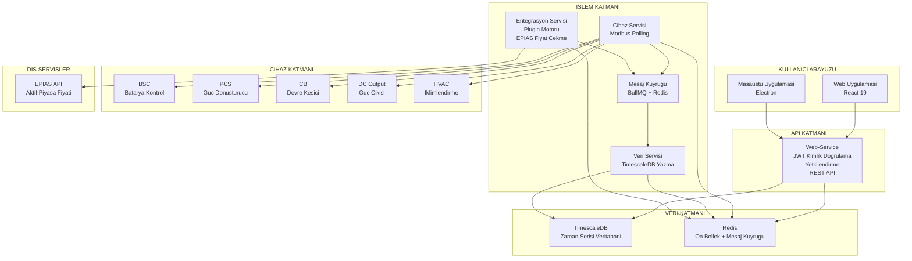

# Enerji Depolama Sistemi (EDS) Izleme, Kontrol ve Yonetim Yazilimi

## Proje Tanitim Raporu

**Versiyon:** 1.0  
**Tarih:** Temmuz 2026  
**Hazirlayan:** Yazilim Gelistirme Ekibi

---

## 1. Proje Tanimi ve Amac

Bu yazilim, enerji depolama santrallerinin (Batarya Enerji Depolama Sistemi - BESS) tum yonetim, izleme ve kontrol sureclerini tek bir platform uzerinden yurutmek uzere gelistirilmis bir enerji yonetim sistemidir (EYS). Sistem; batarya kontrol uniteleri (BSC), guc donusturuculeri (PCS), DC cikis uniteleri, devre kesiciler (CB) ve iklimlendirme uniteleri (HVAC) gibi saha ekipmanlarini tek merkezden izler ve yonetir.

### Temel Hedefler

| Hedef | Aciklama |
|:------|:---------|
| **Protokol Bagimsizligi** | Modbus TCP, CANbus, MQTT gibi farkli endustriyel haberlesme protokollerini tek bir altyapi uzerinde destekler. Yeni bir protokol eklendiginde mevcut kod degismez. |
| **Donanim Bagimsizligi** | Farkli ureticilerin (LG, CATL, Pomega vb.) cihazlari, sadece konfigurasyon dosyasi degistirilerek sisteme entegre edilir. Yazilim kodu projeden projeye tekrar yazilmaz. |
| **Proje Olceginden Bagimsiz** | 2 BSC'li kucuk bir santral de, 50 BSC'li buyuk bir santral de ayni yazilim altyapisi ile yonetilir. Olcek sadece konfigurasyon ile belirlenir. |
| **TEIAS Uyumlulugu** | TEIAS Sebeke Baglanti ve Uyum Kriterleri'ne uygun test, izleme ve raporlama altyapisi. |
| **Dusuk Kodlu Platform** | v2.0 hedefi: Kullanicilarin yazilim bilgisine ihtiyac duymadan tek hat semalari olusturabilecegi, gosterge panolari tasarlayabilecegi ve manevra tanimlayabilecegi bir platform. |

### Uygulama Seviyeleri

Yazilim, ayni temel altyapi uzerinde iki ayri seviyede calisacak sekilde tasarlanmistir:

**Seviye 1 — Saha Terminali (Mevcut `web` Uygulamasi):** Su anda calisan surum, sahadaki bir konteyner icindeki bilgisayardan gosterilen terminal seviyesi SCADA arayuzudur. Bu uygulama, o sahaya ait tum cihazlarin anlik durumunu, tek hat semasini ve kontrol panelini sunar. Saha personeli bu ekran uzerinden tum cihazlari izler ve yonetir.

**Seviye 2 — Merkezi Yonetim (Gelistirme Asamasinda):** Ayni konfigurasyon altyapisi uzerinde, birden fazla sahada bulunan birden fazla konteyneri tek merkezden gosterecek yonetim surumu gelistirilmektedir. Bu surum, saha karsilastirmasi, toplu raporlama ve merkezi manevra yonetimi saglayacaktir. Temel kod aynidir; sadece olcek ve gosterim katmani genislemektedir.

### Cozumledigi Problemler

Mevcut durumda enerji depolama santrallerinde karsilasilan temel sorunlar:

1. **Her projede yazilimin bastan yazilmasi:** Farkli santral topolojileri icin yazilim ekibinin her seferinde kod gelistirmesi gerekir. Bu yazilimda konfigurasyon dosyasi degistirmek yeterlidir.
2. **Farkli cihaz protokollerinin ayri yazilimlarla yonetilmesi:** BSC ayri, HVAC ayri, CB ayri — tumu tek sistemde birlestirilmistir.
3. **Test ve kabul sureclerinde veri eksikligi:** TEIAS ve EPDK'nin talep ettigi test verileri (1 saat sarj-desarj, SoC 0%'dan 100%'e tam cevrim) otomatik kayit altina alinir ve raporlanabilir.
4. **AUX tuketiminin ayri izlenememesi:** OG hucresinden alinan AUX tuketim verileri, ana olcumle birlikte ayni platformda goruntulenir.

---

## 2. Sistem Mimarisi

Sistem, endustride referans kabul edilen iki buyuk olcekli platformun mimari yaklasimlarini temel alir, ancak enerji depolama alanina ozel iyilestirmelerle bu platformlarin eksiklerini giderir:

**EdgeX Foundry Referansi:** EdgeX, Linux Foundation tarafindan yonetilen ve Schneider Electric, Intel, Dell gibi firmalarin katkida bulundugu acik kaynakli bir endustriyel IoT platformudur. Cihaz soyutlama katmani yaklasimiyla her cihaz tipi icin standart bir arayuz tanimlar; cihazin marka, model veya protokolunden bagimsiz olarak sistem ayni sekilde haberlesir.

*EdgeX'e Gore Arti Yonlerimiz:*
- EdgeX sadece bir IoT ara katmanidir; uzerine ayrica on yuz ve kontrol yazilimi gelistirmek gerekir. Bu sistem **cihazdan ekrana uc uca tam cozum** sunar ve ek bir yazilim gelistirmeye ihtiyac duymaz.
- EdgeX konfigurasyonu icin Docker ve Kubernetes gibi altyapi bilgisi gerekir; bu sistemde **sadece bir JSON dosyasi duzenlemek yeterlidir.** Bir elektrik muhendisi, cihazin uretici dokumanindaki register adreslerini konfigurasyon dosyasina yazarak cihazi sisteme ekleyebilir.
- EdgeX jenerik cihaz tanimi yapar; bu sistem **enerji depolamaya ozel** alan modelleriyle (SoC, SoH, C-rate, ChargeStatus) gelir. Cihaz tipleri, alarm kurallari ve manevra senaryolari enerji sektoru terminolojisine gore hazirdir.

**Grafana Referansi:** Grafana, dunya capinda 20 milyondan fazla kullanicisi olan acik kaynakli bir izleme ve gozlemleme platformudur. Widget tabanli gosterge panosu yaklasimiyla kullanicilar surukle-birak yontemiyle ekranlar olusturabilir.

*Grafana'ya Gore Arti Yonlerimiz:*
- Grafana salt izleme (monitoring) platformudur, cihazlara komut gonderemez. Bu sistem **tam kontrol** sunar: sarj, desarj, acil durdurma, manevra zincirleri, read-back dogrulamasi.
- Grafana'da gosterge panosu olusturmak icin SQL sorgulari ve veri tabani yapisi bilgisi gerekir. Bu sistemin v2.0 surumunde **surukle-birak SCADA ekran tasarimi** ile herhangi bir sorgu yazmadan ekran olusturulabilecektir.
- Grafana'nin **2B/3B tek hat semasi cizme** kabiliyeti yoktur. Bu sistemde PixiJS (2B) ve Three.js (3B) motorlari ile sahanin fiziksel yerlesimi birebir gorsellestirilir.
- Grafana enerji depolama kavramlarini (BSC, PCS, SoC, SoH, C-rate) dogal olarak anlamaz — tum veriler jenerik sayisal degerlerdir. Bu sistem **alana ozel** olcum ve kontrol bilgisine sahiptir; ornegin bir BSC rafinda kac hucre oldugunu, hangi alarm durumlarinin kritik oldugunu ve sarj/desarj sirasinda hangi guvenlik kontrollerinin yapilmasi gerektigini bilir.

### Mimari Katmanlar

### Veri Akisi

1. **Cihaz Servisi**, konfigurasyon dosyalarinda tanimlanan araliklarla (ornegin 2 saniyede bir) sahadaki cihazlardan Modbus TCP uzerinden olcum degerlerini okur.
2. Okunan veriler **Redis mesaj kuyruguna** yazilir. Bu kuyruk, sistemin farkli bilesenleri arasinda guvenli veri tasimasi saglar.
3. **Veri Servisi**, kuyruktaki verileri alip **TimescaleDB** zaman serisi veritabanina kaydeder. TimescaleDB, saniyede milyonlarca olcum noktasini depolayabilecek sekilde PostgreSQL uzerine insa edilmis ozel bir veritabanidir.
4. **Web Servisi**, kaydedilen verileri REST API uzerinden on yuze sunar. Es zamanli olarak **WebSocket** uzerinden canli veri akisi saglar.
5. On yuz, hem gecmise donuk (ornegin son 1 aylik) hem de anlik (saniye bazinda) verileri gorsellestirir.
6. **Entegrasyon Servisi**, bagimsiz bir mikroservis olarak calisir; EPIAS API'den periyodik fiyat verilerini ceker, Redis kuyruguna yazar ve plugin mimarisi uzerinden istege bagli modullerle genisletilebilir.

### Servis Mimarisi (Docker Konteyner Yapisi)

| Servis | Gorev | Teknoloji |
|:-------|:------|:----------|
| **device-service** | Cihazlarla Modbus TCP uzerinden haberlesir, olcum okur, komut gonderir | BullMQ · jsmodbus |
| **data-service** | Verileri TimescaleDB'ye yazar | BullMQ · PostgreSQL |
| **web-service** | Kullanici yetkilendirme, REST API, canli veri akisi | Fastify · JWT · WebSocket |
| **integration-service** | Dis servis entegrasyonlari; EPIAS fiyat cekme, plugin motoru, arbitraj hesaplama | BullMQ · Plugin SDK |
| **timescaledb** | Zaman serisi veritabani | TimescaleDB (PostgreSQL) |
| **redis** | Mesaj kuyrugu ve on bellek | Redis 7 |
| **web** | Kullanici arayuzu | React 19 · Nginx |

Tum servisler Docker konteyner olarak calisir. Tek komutla (`docker compose up -d`) tum sistem ayaga kaldirilabilir.

### 2.4 Entegrasyon Servisi

Entegrasyon servisi, sisteme dis servis baglantilarini plugin'ler halinde ekleyen bir mikroservistir. Plugin'ler, ortak bir arayuz uzerinden calisir ve konfigurasyon dosyalariyla yapilandirilir.

**Varsayilan Plugin: EPIAS Fiyat Cekici**

Sistemle birlikte varsayilan olarak gelen EPIAS (Enerji Piyasalari Isletme A.S.) entegrasyonu, Seffaflik Platformu'ndan aktif piyasa elektrik fiyatlarini periyodik olarak ceker:

- **Veri kaynagi:** Gun Oncesi Piyasasi (GOP) Piyasa Takas Fiyati (PTF) ve saatlik fiyat verileri
- **Cekme sikligi:** Saat basi (yapilandirilabilir)
- **Arbitraj hesaplama:** Cekilen PTF degerleri ile bataryanin cevrim maliyeti ($/kWh) karsilastirilarak optimal sarj/desarj zamanlamasi hesaplanir
- **Karar destegi:** Fiyat farki belirli bir esigin uzerindeyse sisteme "arbitraj firsati" bildirimi gonderilir

**Ek Entegrasyon Plugin'leri**

Istenirse ayri bir kontrat kapsaminda sisteme yeni plugin'ler eklenebilir. Ornegin:

- **ML tabanli tahmin modelleri:** PTF ve yuk tahmini icin makine ogrenmesi destekli plugin'ler
- **Ek piyasa entegrasyonlari:** GIP, DGP, Yan Hizmetler piyasalari

Plugin'ler konfigurasyon dosyasi olarak sisteme yuklenir; mevcut yazilim kodunda degisiklik gerekmez.

---

## 3. Konfigurasyon Odakli Tasarim: Ayni Kod, Farkli Proje

Bu yazilimin en onemli farki, projeye ozel tum davranisin **konfigurasyon dosyalari** uzerinden tanimlanmasidir. Yazilim kodu hic degismez; sadece JSON formatindaki konfigurasyon dosyalari degistirilerek farkli santral topolojileri, farkli cihazlar ve farkli olcum noktalari yonetilir.

### Ornek 1: Iki BSC Cihazinin Yapilandirilmasi

Bir santralde iki adet BSC (Batarya Sistem Kontrolcusu) oldugunu dusunelim: BSC-1 ve BSC-2. Her ikisi de ayni marka/model (ornegin LG BSC-2000), ayni register haritasina sahiptir. Tek farklari:

| Parametre | BSC-1 | BSC-2 |
|:----------|:------|:------|
| Cihaz Kodu | BSC-1 | BSC-2 |
| Modbus TCP Port | 502 | 504 |
| IP Adresi | 127.0.0.1 (ornek) | 127.0.0.1 (ornek) |

Iki cihaz icinde **tek satir yazilim kodu yazilmaz.** Sadece asagidaki gibi iki ayri konfigurasyon dosyasi olusturulur:

- `bsc-1.json`: port=502, deviceId="BSC-1"
- `bsc-2.json`: port=504, deviceId="BSC-2"

Yazilim bu dosyalari otomatik olarak okur, iki ayri Modbus TCP baglantisi acar ve her ikisini de es zamanli olarak izlemeye baslar.

### Ornek 2: Farkli Cihaz Tipleri

Ayni yazilim altyapisi, birbirinden tamamen farkli dort cihaz tipini yonetir:

| Cihaz Tipi | Register Tipi (Okuma) | Register Tipi (Yazma) | Ornek Veri | Cihaz Dokumanindaki Karsiligi |
|:-----------|:----------------------|:----------------------|:-----------|:------------------------------|
| **BSC** | INPUT_REGISTER (salt okunur analog olcum) | HOLDING_REGISTER (okunabilir/yazilabilir parametre) | Voltaj, Akim, SoC, Sicaklik | Uretici dokumanindaki "System SOC (30055)", "Average DC Voltage (30059)", "Total DC Current (30061)" adresleri |
| **HVAC** | INPUT_REGISTER (salt okunur durum/olcum) | HOLDING_REGISTER (setpoint, komut) | Donus Sicakligi, Fan Hizi, Kompresor Durumu | Uretici dokumanindaki "Current Temp (4200)", "Return Humidity (4204)", "Remote On/Off (8)" adresleri |
| **Devre Kesici (CB)** | DISCRETE_INPUT (dijital giris — salt okunur kontak) | COIL (role cikisi — yazilabilir dijital sinyal) | Kapali/Acik, Acma Korumasi Aktif | Uretici dokumanindaki "Is Closed (DI-0)", "Trip Status (DI-1)", "Open Command (CO-0)", "Close Command (CO-1)" kontaklari |
| **DC Cikis** | DISCRETE_INPUT (dijital giris) | COIL (role cikisi) | Cikis Aktif, Ariza Durumu, Gerilim, Akim | Uretici dokumanindaki "Is On (DI-0)", "Actual Voltage (IR-0)", "On Command (CO-0)" |

**Onemli Not:** Her cihaz tipi icin konfigurasyon dosyasinda tanimlanan register adresleri, cihazin uretici dokumanindaki Modbus register haritasindan birebir alinir. Yazilim, bu adreslere gidip veriyi okur, tanimlanan olcek (scale) ve birim (unit) degerleriyle carparak muhendislik birimine (V, A, kW, %) cevirir ve gosterir.

### Register Okuma ve Olcekleme

Bir ornekle aciklamak gerekirse:

- BSC cihazinin dokumaninda **30055 adresindeki INPUT_REGISTER** degerinin "System SOC" oldugu ve ham degerin 100 ile carpilmis olarak geldigi yazar (ornegin 8250 ham degeri = %82.50). Konfigurasyon dosyasinda bu register icin `scale: 0.01` tanimlanir. Yazilim ham degeri okur, 0.01 ile carpar ve kullaniciya `%82.50` olarak gosterir.
- Ayni cihazin **30059 adresindeki INPUT_REGISTER** "Average DC Voltage" degeridir ve ham deger mikrovolt cinsinden gelir. Konfigurasyonda `scale: 0.0001` tanimlanir. Ham deger 5.231.000 ise, yazilim bunu `523.1 V` olarak gosterir.
- CB cihazinin **0 numarali DISCRETE_INPUT** kontagi "Is Closed" sinyalidir. Bu bir Boolean (mantiksal) degerdir: `true` = kapali, `false` = acik. Olceklemeye gerek yoktur, yazilim dogrudan true/false olarak okur.

### Konfigurasyon ile Yapilabilen Islemler (Kod Degismeden)

| Yapilandirilabilir Ozellik | Etkisi |
|:---------------------------|:-------|
| Cihaz sayisi | Konfigurasyon dosyasi ekleyerek sisteme yeni cihaz eklenir (ornegin 3. bir BSC, 9. bir HVAC) |
| Okuma araligi | Her cihaz icin bagimsiz `pollIntervalMs` tanimlanabilir (ornegin CB icin 2000ms, BSC icin 5000ms) |
| Olcek ve birim | Her register icin `scale`, `offset`, `unit` degerleri tanimlanabilir |
| Register adresleri | Cihazin uretici dokumanindaki adresler konfigurasyona yazilir |
| Komut tanimlari | Her cihaz icin `commands` bolumunde komut isimleri, yazilacak register'lar ve validasyon kurallari tanimlanir |
| Parametre sablonlari | `{{powerKw}}` gibi sablonlarla komutlara kullanicidan parametre alinir |
| Bit alani cozumleme | Tek bir register icindeki bit alanlari (ornegin ChargeStatus, alarm flag'lari) ayri ayri tanimlanip okunabilir |
| Simulator baglama | Gercek cihaz yokken test amaciyla `simulator.type` tanimlanarak yazilim simulatoru kullanilabilir |

---

## 4. Komut ve Manevra Sistemi

Sistem, cihazlara komut gondermek icin iki seviyeli bir yapi sunar:

### 4.1 Cihaz Komutlari

Her cihaz icin konfigurasyon dosyasinda tanimlanan komutlar, kullanicinin cihaza dogrudan talimat gonderebilmesini saglar. Komut akisi:

1. Kullanici on yuzden komutu secer (ornegin BSC-1 icin "Sarj").
2. Kullanici gerekli parametreleri girer (ornegin "Guc: 500 kW").
3. Sistem, konfigurasyon dosyasindaki komut tanimina bakar:
   - Hangi register'a yazilacagini (`Command Request` registerina 2 degeri),
   - Hangi parametre degerinin nereye yazilacagini (`Charge Power Setpoint` registerina `{{powerKw}}` yerine 500),
   - Yazma sonrasi hangi register'in okunup dogrulanacagini (`Request Acknowledge` registerinin 2 degeri ile karsilastirilmasi)
4. Tum yazma islemleri atomik (atomik: ya hepsi basarili olur ya da hicbiri uygulanmaz) olarak gerceklestirilir.
5. Yazma sonrasi dogrulama yapilir: Sistem belirtilen registeri tekrar tekrar okur, beklenen deger gelene kadar bekler. Timeout suresi asilirsa hata dondurur.

Bu yaklasim, ozellikle TEIAS kabul testlerinde onemlidir: Cihaza gonderilen komutun gercekten uygulandigi, geri okuma (read-back) ile teyit edilir.

### 4.2 Manevralar (Coklu Cihaz Komut Zincirleri)

Manevralar, birden fazla cihazi iceren komut zincirleridir. Ornegin bir "Acil Durdurma" manevrasi sirasiyla su adimlari icerir:

1. BSC-1 ve BSC-2'ye "Durdur" komutu
2. DC-1 ve DC-2'ye "Kapat" komutu
3. CB-1 ve CB-2'ye "Ac" komutu

Bu adimlar sirali (`sequential`) modda calistirilir: Once BSC'ler durdurulur, basarili olursa DC cikislar kapatilir, onlar da basarili olursa devre kesiciler acilir. Bir adim basarisiz olursa sonraki adimlar calistirilmaz (`onFailure: "stop"`).

Buna karsilik "Sistem Baslatma" manevrasi tum adimlari paralel (`parallel`) calistirir: CB'ler, BSC'ler ve DC cikislar ayni anda acilir.

Bu manevralar, **konteyner tipi enerji depolama sistemleri** icin gelistirilmis olup; BSC, DC cikis, devre kesici ve HVAC uniteleri arasindaki guvenlik siralamasini ve isletme mantigini icerir. Manevra sistemi, farkli donanim konfigurasyonlari icin **teknik olmayan kullanicilar tarafindan da** gorsel arayuz uzerinden (v2.0) tasarlanabilecek ve konfigurasyon dosyasi olarak sisteme eklenecek (plugin) sekilde genisletilebilir bir mimariye sahiptir. Ornegin bir projeye ozel "Bakim Modu" veya "Saha Testi" manevrasi, yazilim ekibine ihtiyac duymadan saha muhendisi tarafindan olusturulup sisteme yuklenebilecektir.

Sistemde su anda 18 adet on tanimli manevra bulunmaktadir. Bunlar FL-01'den FL-11'e kadar olan akis diyagramlarindan turetilmistir ve asagidaki senaryolari kapsar:

| Manevra | Senaryo | Mod |
|:--------|:--------|:----|
| FL-01: Sistem Baslatma | Tum sistemi baslatir (CB ac, BSC baslat, DC ac) | Paralel |
| FL-02: AUX Kaybi | Yardimci guc kaybinda guvenli kapatma | Sirali |
| FL-03: Acil Durdurma | Acil stop butonu ile tum sistemi kapatir | Sirali |
| FL-04: Kalibrasyon | 0.25C ile sarj ve desarj donguleri | Paralel |
| FL-05: TMS | HVAC unitelerini sogutma/isitma moduna zorlar | Paralel |
| FL-06: On Kontrollu Isletme | CB kapat → BSC sarj/desarj | Sirali |
| FL-07: Kapi Acik Guvenligi | Kapi acildiginda sistem durdurma | Paralel |
| FL-08: DC Ariza | DC arizada koruma kapatmasi | Paralel |
| FL-09: Iletisim Kaybi | Iletisim kesildiginde sistem durdurma | Paralel |
| FL-10: Bakim Modu | Guvenli kapatma (BSC durdur → CB ac) | Sirali |
| FL-11: Toprak Direnci Hatasi | Topraklama hatasinda guvenli kapatma | Sirali |

---

## 5. TEIAS Uyumluluk ve Test Altyapisi

### 5.1 TEIAS Sebeke Baglanti ve Uyum Kriterleri

Yazilim, TEIAS'in yayimladigi Sebeke Baglanti ve Uyum Kriterleri'nde belirtilen asagidaki gereklilikleri karsilayacak altyapiya sahiptir:

**Reaktif Guc Takibi:**
- PCS uzerinden `ReactivePower` (reaktif guc) ve `ActivePower` (aktif guc) degerleri anlik olarak okunur.
- Tesis lisans gucunun %40'i kadar reaktif guc destegi saglanabilirligi, surekli izlenen reaktif/aktif guc orani uzerinden takip edilir.
- Ileride TEIAS'in reakif guc destegini yan hizmet olarak satin almasi durumunda, sistem bu hizmetin verilip verilmedigini dogrulayacak veri altyapisini saglar.

**Sarj/Desarj Testi (1 Saat Tam Kapasite):**
- EPDK ve TEIAS tarafindan santral kabulunde istenen tam kapasite testi (SoC %0'dan %100'e sarj, %100'den %0'a desarj) sirasinda tum degerler otomatik kaydedilir.
- Test sonuclari, gorsel grafiklerle raporlanabilir.

**AUX Tuketim Takibi:**
- OG hucresinden alinan AUX transformator tuketim verisi ayri bir olcum noktasi olarak sisteme eklenebilir.
- AUX tuketimi ile ana santral uretimi/tuketimi ayni gosterge panosunda goruntulenebilir.

**Gerilim Dengesizligi Izleme:**
- BSC seviyesinde anlik voltaj degerleri surekli izlenir.
- Voltaj dengesizligi durumunda (ozellikle lisans gucune yakin kurulumlarda PCS'in guc dusmesine neden olan durum) erken uyari uretilebilir.

**Frekans ve RoCoF Tepkisi (Planlanan):**
- RoCoF (Rate of Change of Frequency — Frekans Degisim Hizi) olcumleri ve tepki suresi takibi icin veri altyapisi hazirdir.
- TEIAS'in yakin zamanda RoCoF tepkilerini santral kabulunde zorunlu tutacagi bilgisi dogrultusunda, bu olcumlerin sisteme entegrasyonu planlanmistir.

### 5.2 Batarya Performans Takibi

| Parametre | Olcum Noktasi | Kullanimi |
|:----------|:--------------|:----------|
| SoC (State of Charge) | BSC — her rack icin ayri | Sarj/desarj derinligi takibi, hucre dengeleme |
| SoH (State of Health) | BSC — her rack icin ayri | Batarya omru ve kapasite kaybi takibi |
| Voltaj (DC) | BSC — sistem ve rack seviyesi | Gerilim dengesizligi tespiti |
| Akim (DC) | BSC — sistem seviyesi | Sarj/desarj hizi (C-rate) takibi |
| Sicaklik | BSC — her rack icin ayri | Termal yonetim, HVAC kontrolu |
| C-rate (Sarj/Desarj Hizi) | Hesaplanan deger (Akim / Nominal Kapasite) | Batarya sagligi ve performans optimizasyonu |

---

## 6. Guvenlik ve Kod Kalitesi

### 6.1 Mimari Standartlar

Sistem, uluslararasi kabul gormus asagidaki yazilim mimarisi standartlarina uygun olarak gelistirilmistir:

- **Hexagonal Mimari (Ports & Adapters):** Buyuk olcekli kurumsal yazilim projelerinde kullanilan bu mimari yaklasim sayesinde, veritabani veya haberlesme protokolu gibi dis bilesenler degistiginde is kurallari ve is akislari etkilenmez. Sistemin cekirdegi dis etkenlerden bagimsiz calisir.
- **SOLID Prensipleri:** Her yazilim bileseni tek bir sorumluluga sahiptir; degisime acik, bozulmaya kapalidir.
- **Clean Architecture:** Katmanlar arasi bagimliliklar tek yonlu olup, dis katmanlar ic katmanlara bagimlidir — tersi mumkun degildir. Bu sayede sistemin herhangi bir parcasini, diger parcalari etkilemeden degistirmek mumkundur.

### 6.2 Konfigurasyon Odakli Genisletilebilirligin Mimarisi

Sistemin en onemli mimari ozelligi, tum bilesenlerin standart arayuzler (interface) uzerinden haberlesmesidir. Bu arayuzler, bir bilesenin "ne yapabildigini" tanimlayan sozlesmelerdir — "nasil yaptigi" ile ilgilenmez.

Ornegin sistem, "bir cihazdan veri oku" islemi icin `IDevice` adinda bir arayuz tanimlar. Bu arayuzu Modbus cihazlari icin ayri, CANbus cihazlari icin ayri, MQTT cihazlari icin ayri gercekleyen (implement eden) bilesenler yazilir. Sistem, hangi protokolu kullandigina bakmaksizin bu arayuz uzerinden tum cihazlarla ayni sekilde konusur.

Ayni prensip; veritabani (TimescaleDB, InfluxDB), mesaj kuyrugu (BullMQ, RabbitMQ), kullanici dogrulama (JWT, LDAP) gibi tum bilesenler icin gecerlidir. Sonuc olarak sistem **konfigurasyon tabanli genisletilebilir** hale gelir: yeni bir protokol, veritabani veya cihaz tipi eklendiginde mevcut kod degismez, sadece ilgili arayuzu gercekleyen yeni bir bilesen yazilir.

### 6.3 OWASP Guvenlik Kriterleri

Sistemin guvenlik katmani, dunya capinda en yaygin kabul goren web uygulamasi guvenlik standardi olan **OWASP Top 10** kriterlerine uygun olarak insa edilmistir. Bu kapsamda uygulanan onlemler:

- **Kimlik dogrulama ve yetki kontrolu:** Tum API erisimleri JWT (JSON Web Token) tabanli kimlik dogrulamadan gecirilir. Uc kullanici rolu (Admin, Teknik, Misafir) ile rol tabanli erisim kontrolu (RBAC) uygulanmistir. Yetkisiz islemler daha islenmeden reddedilir.
- **Guvenli sifre yonetimi:** Sifreler endustri standardi `bcrypt` algoritmasi ile ozetlenir. Veritabaninda hicbir zaman acik metin halinde saklanmaz.
- **Girdi dogrulama (Input Validation):** Kullanicidan gelen tum veriler (giris bilgileri, komut parametreleri, sorgu filtreleri) Zod semalari ile dogrulanir. Gecersiz veya kotu amacli girdiler sistemin ic katmanlarina ulasmadan reddedilir.
- **Guvenli iletisim:** WebSocket baglantilari token bazli kimlik dogrulamadan gecirilir; baglanti omru izlenir ve kopuk baglantilar otomatik temizlenir.
- **Yetki eskalasyonu onleme:** Her kullanici yalnizca rolunun izin verdigi islemleri gerceklestirebilir. Admin islemleri (kullanici ekleme/silme) sadece admin rolune sahip kullanicilara aciktir.
- **Hata yonetimi:** Sistem hatalari kullaniciya detayli bilgi vermez; dahili sistem yapisi disariya sizdirilmaz. Tum hatalar merkezi gunluk kayitlarina (log) yazilir.

---

## 7. Olceklenebilirlik

Tum sistem bilesenleri — zaman damgali veri tabani (TimescaleDB), on bellek ve mesaj kuyrugu (Redis), cihaz ve servis konfigurasyonlari — Docker konteyner yapisi sayesinde tek komutla (`docker compose up -d`) ayaga kaldirilir. Bu sayede sistem **donanimdan bagimsiz** calisir; ister sahadaki bir mini PC'ye, ister bulut sunucusuna, ister gelistirme bilgisayarina ayni sekilde kurulur. Docker, ayrica CI/CD (Surekli Entegrasyon / Surekli Dagitim) otomasyonu ile her guncellemenin test edilip hatasiz sekilde yayinlanmasini, konteyner izolasyonu ile de her servisin birbirinden ve isletim sisteminden bagimsiz ve guvenli calismasini saglar. Sistem su anda 14 cihaz ve 2000'in uzerinde olcum noktasi ile sahada sorunsuz calismaktadir; ayni yapi 50+ cihazli projelere hicbir mimari degisiklik olmadan olceklenebilir. Yeni bir cihaz eklemek icin sadece bir JSON konfigurasyon dosyasi olusturmak yeterlidir — yazilim kodunda hicbir degisiklik gerekmez.

---

## 8. v2.0 Yol Haritasi

Sistem iki fazda gelistirilmektedir:

### Faz 1 (Mevcut — v1.x): Temel Izleme, Kontrol ve Veri Altyapisi

Faz 1 kapsaminda tamamlananlar:
- Coklu cihaz tipi destegi (BSC, HVAC, CB, DC Cikis)
- Modbus TCP uzerinden cihaz haberlesmesi
- Zaman serisi veri tabani (TimescaleDB) ve mesaj kuyrugu (Redis + BullMQ)
- WebSocket ile canli veri akisi
- Kullanici yetkilendirme (JWT + RBAC)
- Manevra sistemi (18 on tanimli manevra)
- Cihaz simulatorleri (gercek donanim olmadan test imkani)
- 2B PixiJS grafik motoru ile BSC ve TMS gorsellestirmesi
- Docker Compose ile 7 servisli konteyner mimarisi
- SCADA Editor (temel seviye — cihaz yerlestirme ve proje kaydetme)
- Entegrasyon servisi (EPIAS fiyat cekme plugin'i — varsayilan)

### Faz 2 (Planlanan — v2.0): Dusuk Kodlu SCADA/EMS Platformu

Faz 2 kapsaminda hedeflenenler:

**Dusuk Kodlu Ekran Olusturma (En Kritik):**
- Kullanicilarin surukle-birak ile SCADA ekranlari ve tek hat semalari olusturabilmesi
- Widget tabanli gosterge panosu tasarimi (gauge, grafik, log terminali, cihaz durumu)
- Kaydedilen ekranlarin canli veri ile calisan bir goruntuleyici (runtime) tarafindan render edilmesi
- Editor uzerinde olusturulan cihaz yerlesimlerinin otomatik olarak live SCADA grafiklerine donusmesi

**Konfigurasyon Editoru Genisletmesi:**
- Register haritasi editoru: Cihaz dokumanindaki register adreslerinin gorsel arayuzle tanimlanmasi
- Editor uzerinde yapilan konfigurasyonlarin dogrudan cihaz servisine deploy edilmesi
- Gorsel manevra olusturucu: Adim surukleme, parametre tanimlama, validasyon ekleme

**3 Boyutlu Grafik Destegi:**
- Three.js altyapisi ile 3B batarya odasi ve saha goruntuleme
- 3B cihaz modelleri (batarya raflari, HVAC uniteleri, panel kartlari)
- Kamera kontrolleri (orbit, zoom, pan) ve isiklandirma

**Alarm ve Olay Sistemi:**
- Alarm degerlendirme motoru: Tanimlanan esik degerlerine gore otomatik alarm uretimi
- Alarm gosterge paneli: Aktif alarmlar, alarm detayi, alarm kabul etme (acknowledge)
- Alarm gecmisi ve analizi

**Protokol Genisletmesi:**
- Gercek CANbus adaptoru (SocketCAN + DBC dosya yorumlayici)
- Gercek MQTT adaptoru (topic bazli veri okuma/yazma)
- OPC-UA, IEC 61850 gibi endustriyel standart protokoller icin altyapi hazirligi

**Entegrasyon Servisi Genisletmesi:**
- Ek entegrasyon plugin'leri: GIP, DGP, Yan Hizmetler piyasalari
- ML tabanli plugin'ler: PTF ve yuk tahmini modelleri

**Raporlama ve Enerji Analizi:**
- Rapor sablonlari ve ozel tarih araligi karsilastirmasi
- Enerji hesaplamalari (kWh toplamlari, maliyet analizi, verimlilik)
- PDF/CSV/Excel formatinda disa aktarim

**Coklu Saha / Site Yonetimi:**
- Lokasyon ve site hiyerarsisi (ornegin: Santral A > Bina 1 > BSC-1)
- Her site icin ayri gosterge panosu
- Siteler arasi toplu karsilastirma

---

## 9. Sonuc

Bu yazilim, enerji depolama santralleri icin gelistirilmis, asagidaki fark yaratan ozelliklere sahip bir enerji yonetim sistemidir:

1. **Konfigurasyon odakli tasarim:** Proje degistikce yazilim kodu degismez. Tum cihaz tanimlari, olcum noktalari ve komutlar konfigurasyon dosyalari uzerinden yonetilir. Entegrasyon servisi sayesinde yeni dis servis baglantilari (EPIAS, GIP, DGP) plugin olarak eklenebilir. Bu sayede farkli santral projelerine ayni gun icinde adapte olunabilir.

2. **Iki seviyeli uygulama mimarisi:** Ayni temel kod, hem sahadaki konteyner terminali olarak (web) hem de merkezi yonetim platformu olarak calisabilir. Sistem sadece konfigurasyon ve gosterim katmani genisletilerek olceklenir.

3. **Referans platformlara gore ustunluk:** EdgeX'in yalnizca IoT ara katmani olma ve Grafana'nin yalnizca izleme yapabilme kisitlarini asar; cihazdan ekrana uc uca tam cozum sunar. Alana ozel enerji depolama modelleriyle (SoC, SoH, C-rate, manevra senaryolari) hazir gelir.

4. **TEIAS uyumlu:** TEIAS Sebeke Baglanti Kriterleri'ne uygun test, izleme ve raporlama altyapisi. 1 saat tam kapasite sarj/desarj testi, reaktif guc takibi, AUX tuketim izleme ve gerilim dengesizligi takibi hazir olarak gelir.

5. **Protokol ve donanimdan bagimsiz:** Modbus TCP (aktif), CANbus ve MQTT (gelistirme asamasinda) protokolleri ayni altyapi uzerinde desteklenir. Yeni bir cihaz marka/modeli sadece konfigurasyon dosyasi gerektirir.

6. **Olceklenebilir:** 2 cihazli bir demo kurulumdan 50+ cihazli buyuk olcekli bir santrale kadar ayni yazilim kullanilabilir. Mikroservis mimarisi sayesinde sistem kaynaklari ihtiyaca gore artirilabilir.

7. **Guvenli ve uluslararasi standartlarda:** OWASP Top 10 guvenlik kriterleri, Hexagonal Mimari, SOLID ve Clean Architecture gibi kurumsal yazilim standartlari uygulanmistir. Kod kalitesi ve guvenlik, projenin ilk gununden itibaren onceliklendirilmistir.

8. **Dusuk kodlu gelecek:** v2.0 ile birlikte, yazilim bilgisi olmayan elektrik muhendisleri dahi kendi SCADA ekranlarini olusturabilecek, manevra tanimlayabilecek ve rapor uretebilecektir.

---

## Ek A: Referans Dokumanlar

| Dokuman | Aciklama |
|:--------|:---------|
| TEIAS Sebeke Baglanti ve Uyum Kriterleri | Turkiye Elektrik Iletim A.S. — Santral Sebeke Baglanti Kriterleri Yonetmeligi |
| EdgeX Foundry | Linux Foundation — Open-source IoT edge platform (device abstraction) |
| Grafana | Grafana Labs — Open-source observability platform (widget-based dashboards) |
| OWASP Top 10 | Open Web Application Security Project — En kritik 10 web guvenlik acigi ve onlemleri |
| Hexagonal Architecture (Alistair Cockburn) | Ports & Adapters mimarisi — kurumsal yazilim standardi |
| SOLID Prensipleri (Robert C. Martin) | Nesne yonelimli yazilim tasariminin bes temel prensibi |
| Clean Architecture (Robert C. Martin) | Katmanli ve bagimsiz yazilim mimarisi standardi |
| Modbus TCP/IP Specification | Modbus Organization — Modbus Messaging on TCP/IP Implementation Guide |

## Ek B: Kisaltmalar

| Kisaltma | Aciklama |
|:---------|:---------|
| BESS | Battery Energy Storage System (Batarya Enerji Depolama Sistemi) |
| BMS | Battery Management System (Batarya Yonetim Sistemi) |
| BSC | Battery System Controller (Batarya Sistem Kontrolcusu) |
| PCS | Power Conversion System (Guc Donusturucu Sistem) |
| CB | Circuit Breaker (Devre Kesici) |
| HVAC | Heating, Ventilation, Air Conditioning (Iklimlendirme) |
| EYS / EMS | Enerji Yonetim Sistemi / Energy Management System |
| SoC | State of Charge (Sarj Durumu) — % |
| SoH | State of Health (Saglik Durumu) — % |
| AUX | Auxiliary (Yardimci guç — yardimci sistemlerin enerji tuketimi) |
| OG | Orta Gerilim |
| AG | Alcak Gerilim |
| FAT | Factory Acceptance Test (Fabrika Kabul Testi) |
| SAT | Site Acceptance Test (Saha Kabul Testi) |
| JWT | JSON Web Token (kimlik dogrulama belirteci) |
| RBAC | Role-Based Access Control (rol tabanli erisim kontrolu) |
| OWASP | Open Web Application Security Project (web guvenligi standartlari) |
| JSON | JavaScript Object Notation (yapilandirma dosyasi formati) |
| EPIAS | Enerji Piyasalari Isletme A.S. (enerji piyasasi isletmecisi) |
| PTF | Piyasa Takas Fiyati (Gun Oncesi Piyasasi'nda olusan saatlik fiyat) |
| GOP | Gun Oncesi Piyasasi |
| GIP | Gun Ici Piyasasi |
| DGP | Dengeleme Guc Piyasasi |
